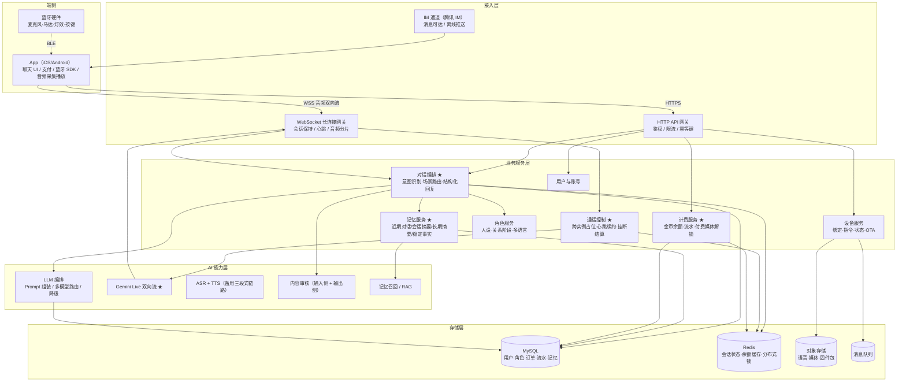

# 08｜情感交互产品与实时语音

> **本文件用法**：25 分钟读完，读完要能「主动跟面试官聊业务」——前六节是谈资和技术视角（扫读表格 + 记住话术），第七节是直接可背的话术，第八节是展示风险意识的加分项；**带 ★ 的段落是你真实做过、必须能展开讲的部分**。

---

## 一、赛道与产品认知（用来展示业务理解）

### 1.1 品类与形态

| 形态 | 典型代表 | 交互入口 | 变现主逻辑 |
| --- | --- | --- | --- |
| AI 陪伴 App（角色聊天） | Character.AI、Replika、Talkie、星野、筑梦岛 | 文字 + 语音条 + 实时通话 | 订阅 + 角色/剧情解锁 + 抽卡 |
| AI 智能玩具 / 机器人 | BubblePal、Ropet、珞博 Fuzozo、汤姆猫 AI 童伴 | 语音（无屏或小屏） | 硬件差价 + 内容订阅 |
| 虚拟角色 UGC 平台 | 星野、Character.AI 社区 | 文字为主 | 创作者分成 + 内购 |
| **成人智能硬件 + 虚拟角色** | **LoveSpouse 所属细分** | **App 文字/语音 + 蓝牙玩具** | **金币计费 + 媒体解锁 + 会员** |

> 说明：以上公司/产品名属公开行业信息，但赛道变化极快，**面试时只聊品类和产品思路，不要点名评述具体公司**——说错了比不说更减分。

**这类产品的共同结构**：一个「角色」+ 一段「关系」+ 一套「让关系变深的付费点」。技术上是"对话为核心链路的长连接业务"。

### 1.2 核心指标（后端要知道每个指标对应什么工程动作）

| 指标 | 意义 | 直接影响的工程决策 |
| --- | --- | --- |
| 次日 / 7 日 / 30 日留存 | 产品生死线 | 记忆质量、主动触达（召回推送） |
| 人均日会话轮次、单次会话时长 | 使用深度 | 对话链路稳定性、上下文预算 |
| 首响延迟（TTFT）/ 语音首包延迟 | 体验第一感知 | 流式、流式 TTS、就近接入 |
| 付费转化率 / ARPPU / LTV | 商业健康度 | 付费点埋设位置、计费链路成功率 |
| **单会话 AI 成本** | **直接决定毛利** | **Prompt 长度、记忆召回条数、模型路由** |
| 角色亲密度 / 关系等级 | 留存与付费的中间变量 | 亲密度算法、解锁配置化 |
| 通话时长 / 通话成功率 | 实时语音核心 | 跨实例控制、断线重连、余额校验 |

### 1.3 用户为什么会付费

- **情感依赖**：深夜时段、独居、社交焦虑人群；付费动机是"关系不能断"，不是"功能好用"。
- **角色养成**：亲密度、等级、解锁专属台词/称呼，进度条本身就是付费点。
- **剧情解锁**：分支剧情、剧情卡，本质是内容消费（一次性买断）。
- **语音与媒体内容**：语音时长、实时通话、私密媒体解锁——**客单价最高的部分**。
- **会员/订阅**：每日金币、免等待、专属角色。

### 1.4 这类产品的技术特点（面试可直接讲的五条）

1. **长连接为主**：消息必须可达，IM/WebSocket 是主链路，HTTP 是旁路。
2. **对话是核心链路**：一次对话会串联 意图识别 → 记忆召回 → 模型 → 审核 → 计费 → 推送，任何一环抖动都是用户可感知的。
3. **实时性要求高**：文字首 token 要快，语音端到端要"像对话"。
4. **AI 成本占比大**：token / TTS 字符 / 音频时长都按量计费，**成本是一等设计指标**。
5. **内容安全极敏感**：成人向 + 情感诱导 + 未成年人风险叠加，审核不是可选项。

### 1.5 展示认知的话术

> 我理解这类产品的本质，是**用 AI 把「陪伴」做成一件可持续、可付费的事**。它的商业逻辑是：情感依赖带来高频和高时长，然后从关系深度上做付费——亲密度、剧情、语音通话。所以服务端不能只当功能实现，有两个指标要当成一等公民：一个是延迟，因为陪伴场景里用户对"回复慢"的容忍度极低；另一个是**单次会话的 AI 成本**，它直接决定毛利，Prompt 多塞 1000 token、记忆多召回 5 条，乘以日活就是真金白银。我在 LoveSpouse 做记忆分层和计费的时候，就是被这两个指标倒逼着做设计的。
>
> （如果面试官接话，可以补一句）所以我会特别关注**成本可计量**这件事——每次模型调用、每分钟语音都要能归因到用户和会话，否则优化没有依据。

---

## 二、AI 情感交互产品的服务端架构（推演 + LoveSpouse 结合）

> ⚠️ 下面这套架构是**基于 LoveSpouse 和我做过的项目推演出的通用形态**，不是这家公司的真实架构。面试时讲成"我会这么设计"，不要讲成"我知道你们是这样"。

### 2.1 分层架构与核心链路

**核心链路（文字）**：
`用户发消息 → 接入层鉴权/幂等 → 加载会话上下文 → 意图识别 → 场景路由（闲聊/剧情/付费引导/工具） → 记忆召回 → Prompt 组装 → 模型流式调用 → 后处理（结构化/审核） → 落库 → 计费 → 推送`

**核心链路（语音）**：见第三节。

### 2.2 架构图（★ 为候选人真实负责的部分）

### 2.3 关键设计点（每条都能展开 1 分钟）

| 设计点 | 做法 | 为什么 |
| --- | --- | --- |
| **会话状态管理** | 状态放 Redis（`session:{uid}:{roleId}`，含最近 N 轮、当前场景、情绪值），MySQL 存全量历史 | 长连接可能落在任意实例，状态必须外置；重连能恢复 |
| **角色配置化** | 人设、开场白、场景、付费点全部走配置表/配置中心，不发版 | 运营要能快速调角色、A/B 人设，改一次 Prompt 就发一次版不可接受 |
| **多语言** | 角色人设按语言出多份 Prompt 模板；记忆与摘要按语言隔离存储 | 直接翻译人设会丢失语气；摘要混语言会污染后续召回 |
| **A/B 与 Prompt 版本管理** | 每条会话记录 `prompt_version` / `persona_version`；灰度按 uid 哈希分流；效果指标回流 | 没有版本号就无法归因"效果变差是哪次改动导致的" |
| **幂等** | IM 回调 / 客户端重试带 `request_id`，唯一索引兜底 | 消息重复推送在这类产品里是常态 |
| **降级** | 模型超时 → 备用模型 → 静态兜底话术；实时语音失败 → 降级到文字 + 语音条 | 陪伴产品"没回应"比"回应质量差"伤害更大 |

---

## 三、实时语音链路（★ 重点，你做过 Gemini Live）

### 3.1 传统三段式：ASR → LLM → TTS

| 环节 | 典型耗时（量级） | 说明 |
| --- | --- | --- |
| 上行采集 + 编码 | 20~50 ms | 20ms 一帧 |
| VAD 判停 | 300~800 ms | **最容易被忽略的延迟大户**，等静音确认 |
| ASR 流式识别 | 200~500 ms | 出最终文本 |
| LLM 首 token | 300~800 ms | 与上下文长度强相关 |
| TTS 首包 | 200~500 ms | 流式 TTS 可边生成边出 |
| **端到端合计** | **1.5~3 s** | 用户感知为"机器人、要等" |

> 人类对话轮换间隔约 200ms，业界普遍认为**超过 1s 就不再像对话**（量级参考，别当精确结论引用）。

### 3.2 端到端方案：Gemini Live / OpenAI Realtime

| 维度 | 三段式拼接 | 端到端 Live API |
| --- | --- | --- |
| 延迟 | 1.5~3s | 明显更低（推测可到 1s 内，取决于网络与区域） |
| 情感/语气 | ASR 后丢失，TTS 靠参数模拟 | 原生保留语调、停顿、情绪 |
| 打断（Barge-in） | 自己要实现，链路长 | 协议层原生支持 |
| 可控性 | **每一步都能插审核/改写** | 音频直进直出，**中间很难插入内容审核** |
| 模型选择 | 任意组合 | 绑定该家模型 |
| 成本 | 可控（文本计价） | 按音频 token 计价，**通常更贵**（推测） |
| 网络可达性 | 自建可控 | 海外 API 有区域/网络限制（推测） |
| 上下文 | 自己管 | 有 session 概念，需按其语义管理 |

> **结论话术**：我会把 Live API 当"体验优先路径"，把三段式当"可控与降级路径"——两条链路并存，按场景和地区路由。

### 3.3 WebSocket 双向流的关键点

- **上行**：客户端按帧上传音频（20ms/帧），二进制帧优于 base64（省 33% 体积和编解码开销）。
- **VAD**：客户端做初判（省流量、响应快），服务端做二次确认（防误触发）；触发点 = "用户开始说话" → 立刻上行 `SpeechStart`。
- **下行**：音频分片 + 同步文本转写（transcript）+ `TurnComplete` 标记；**文本转写是刚需**——聊天记录、审核、上下文都靠它。
- **会话恢复**：心跳 + 断线重连；重连后要能恢复上下文（至少恢复最近 N 轮），不能"失忆"。
- **背压**：下行音频堆积时要能丢帧或降码率，不能把连接拖死。

### 3.4 打断（Barge-in）：客户端与服务端如何配合

**客户端侧**（本地 VAD 检测到用户开口）：
1. 立即停止播放并**清空本地播放缓冲**（否则已缓冲的 200ms 还会继续播，听感像"没打断成功"）；
2. 上行 `interrupt` 信号，携带已播放到的位置。

**服务端侧**（收到 interrupt）：
1. 取消/丢弃当前模型的未完成输出，停止下发后续音频帧；
2. **记录"实际播放到哪"**——这是计费与上下文一致性的关键；
3. 决定被中断内容的归属：已播出的写入会话历史，**未播出的不写入**（否则角色会"记得"自己没说出口的话，人设会崩）（推演）；
4. 释放该会话的生成锁，准备接收新一轮输入。

**计费的坑**：预扣是按预估时长扣的，打断后必须按实际时长结算并退还差额，否则用户投诉"没说完就扣完了"。

### 3.5 音频编解码与带宽

| 项 | PCM 16bit | Opus |
| --- | --- | --- |
| 采样率/声道 | 16 kHz / 单声道 | 同 |
| 码率 | 16000 × 2B = **32 KB/s ≈ 256 kbps** | **16~32 kbps** |
| 20ms 帧大小 | 640 B | 约 40~80 B |
| 延迟 | 无编解码延迟 | 需一帧缓冲（20ms 量级） |
| 结论 | 上行首选（省延迟） | 网络差时启用（省带宽，约为 PCM 的 1/8~1/16） |

**双向通话粗算**：PCM 双向约 512 kbps/路；1000 路并发 ≈ 512 Mbps 出口带宽——**这就是为什么要用 Opus 或者让端侧直连模型服务**（重要成本项）。

### 3.6 延迟优化清单（按收益排序）

1. **缩短 VAD 判停阈值**（800ms → 300ms 左右），收益最大、最容易被忽略；
2. **就近接入**（边缘节点/区域化部署），跨洋 RTT 是硬伤；
3. **流式 TTS 边生成边下发**，不要等整段合成；
4. **连接预热**：进入聊天页就建好 WS + 完成鉴权，用户按麦克风时零握手；
5. **音频 jitter buffer 调小**（代价是抗抖动，要按网络质量自适应）；
6. **控制上下文长度**：历史越长首 token 越慢，靠摘要 + 稳定事实压 token。

### 3.7 成本控制

- 实时语音通常**按音频输入/输出 token 或时长计费**，明显高于纯文本（推测）；**上线前必须自己按分钟算清单位成本**。
- 手段：用户静音时不上行（VAD 门控）、空闲自动断连（如 30s 无交互）、单次通话时长上限、按套餐/金币限流、海外区域路由选择更便宜的模型。

### 3.8 ★ 结合 LoveSpouse 讲（面试主答，务必用你真实实现替换细节）

**三个必答点，按这个顺序讲**：

**① 为什么服务端代理 Gemini Live，而不是 App 直连**
> 我们没有让客户端直连模型服务，而是在服务端做了一层代理/桥接。原因有三个：一是 API Key 不能下发到客户端；二是**通话要在服务端可见才能计费**——通话时长、开始结束时间必须由我们自己的时钟说了算；三是跨实例的通话状态要统一管理，客户端直连的话这些状态就散在端上了。

**② 金币计费怎么和实时通话结合**
> 通话是**预扣 + 结算**：发起通话时先校验余额并按预估时长预扣一笔金币，通话过程中按心跳/分钟粒度持续扣减，余额耗尽自动挂断并给出提示；正常结束或异常断开都走结算，按实际时长多退少补。整条链路上 `request_id` 做幂等，避免重连时重复扣费。

**③ 跨实例通话控制（我认为这块最有含金量）**
> 用户可能在多台设备、或多个 App 实例上发起通话，也可能网络抖动后重连到另一台服务实例上。所以"某用户对某角色正在通话"这个状态不能放进程内存，我们把它外置到 Redis：**通话建立时抢占一个带 TTL 的占位键（本质是分布式锁 + 心跳续约），续约失败或超时就认为通话已死并释放**；新通话请求先查占位，命中则拒绝或踢掉旧连接。这样任意实例都能看到一致的通话状态，也不会出现一路通话被扣两次费。

> **如果被追问「你怎么保证抢占是原子的」**：`SET key value NX PX ttl` 单命令原子；释放时要校验 value（自己的 token）避免误删别人的锁，或用 Lua 脚本保证"比较 + 删除"原子。

---

## 四、情感交互的特有技术点

### 4.1 角色人设一致性

| 手段 | 做法 |
| --- | --- |
| 人设卡 | 姓名/年龄/身份/背景故事/性格/说话风格/口头禅/禁忌话题/与用户的关系设定 |
| Prompt 分层（从硬到软） | 安全规则 → 角色人设 → 关系状态（亲密度/阶段） → 记忆 → 本轮场景 → 用户输入 |
| **风格锁定** | **few-shot 示例对话是最有效的手段**，比形容词描述管用；再加长度约束和禁用词表 |
| 一致性校验 | 用另一个模型/规则做人设偏离检测（推演）；线上用人工抽查 + 用户举报 |

> 冲突时的优先级要明确：**安全规则 > 人设 > 用户要求**。用户说"你骂我"，角色也不能照做。

### 4.2 情感识别与情感化回复

- **文本侧**：情感分类（正/负/中性）或效价-唤醒度（valence-arousal）两维打分；识别出"用户情绪低落"就切换安慰场景。
- **语音侧**：端到端实时语音接口能直接从音频感知语气（这是 Live API 相对三段式的优势之一）；三段式链路只能从文本和声学特征（音高/能量/语速）间接推断。
- **回复的"人味"**：短句、口语化、反问、语气词、偶尔不完美；**明确禁止"作为一个 AI 助手我很乐意帮您"这类客服腔**——这是人设崩塌的头号杀手。
- **情绪状态**（推演）：给角色维护一个情绪值，影响本轮回复风格，让角色"有脾气"而不是永远顺从。

### 4.3 长期关系的技术支撑

| 支撑点 | 技术实现 | 你有的经历 |
| --- | --- | --- |
| 记忆 | 分层记忆：近期对话 / 会话摘要 / 长期摘要 / 稳定事实；按 token 预算召回 | ★ 你亲手做的 |
| 称呼 | 用户昵称 + 角色对用户的专属称呼，作为稳定事实存 | 对应你的"稳定事实"层 |
| 纪念日 | 认识第 N 天、生日、上次通话时间；定时任务触发 | 与主动触达联动 |
| 关系阶段 | 亲密度阈值 → 阶段（陌生→熟悉→亲密）；阶段决定解锁内容与称呼 | 配置化设计 |

**记忆的两个难点（面试可主动提）**：
1. **写入时机**：不是每句话都值得记，要靠事件抽取（"用户说他养了一只猫"）才写入长期层，否则记忆库会被噪声淹没。
2. **冲突消解**：用户改口说"我搬家了"，旧事实要失效——需要给稳定事实加时间戳/置信度，召回时取最新（推演）。

### 4.4 主动触达（App 与硬件联动的关键）

- **场景**：早/晚安问候、久未上线召回、纪念日、剧情更新提醒、余额不足提醒。
- **技术要点**：定时任务 + **用户时区**（跨时区产品最容易踩的坑）+ **频控**（一天最多 N 条，否则变骚扰）+ 推送通道（APNs/FCM/厂商通道）+ **内容个性化**（用记忆生成，不能是群发模板，否则一眼假）。
- **硬件联动**：设备端无屏，主动触达可能表现为设备灯效/语音播报（如设备端唤醒后播报角色留言）（推测）。

---

## 五、付费与商业化（★ 你做过金币计费）

### 5.1 付费点设计

| 付费点 | 形态 | 技术要点 |
| --- | --- | --- |
| 消息条数 | 免费用户每日 N 条 | 配额计数（Redis 计数器 + 日切） |
| **语音时长/通话** | **金币按分钟扣** | **预扣 + 结算 + 余额不足挂断（★ 你做过）** |
| 剧情解锁 | 剧情卡/分支买断 | 权益记录 + 配置化剧情树 |
| **媒体内容** | **付费后解锁图片/语音/视频（★ 你做过）** | **权限记录 + 签名 URL 防盗链** |
| 会员/订阅 | 每日金币、免等待 | 订阅状态机 + 续费回调幂等 |
| 亲密度加速/道具 | 送礼涨亲密度 | 与亲密度算法联动，注意数值平衡 |

### 5.2 计费系统的技术要点（高频考点）

| 要点 | 做法 |
| --- | --- |
| **余额一致性** | MySQL 存权威余额，Redis 做缓存；**一切扣减以 DB 为准**，缓存只用于展示和预校验 |
| **并发扣减** | 单条原子 SQL：`UPDATE account SET balance = balance - ? WHERE uid = ? AND balance >= ?`，影响行数 0 即余额不足；避免"先查后改" |
| **幂等** | `request_id` / `order_id` 建唯一索引，重复请求返回首次结果；IM 回调必做 |
| **预扣-结算-退款** | 三段式状态机：预扣（冻结）→ 确认（按实际消费结转）→ 取消/退还；任何一步失败都有补偿 |
| **流水与对账** | `account_log` 记每一笔变动（含业务类型、关联单号、变动前后余额）；定时任务核对"流水累计 == 余额"，不一致告警 |
| **防刷** | 限频、设备指纹/IP 风控、扣费前置校验（不先扣再校验权限） |
| **事务边界** | 跨服务的"扣费 + 发货"不做强事务，用本地消息表 + 补偿达到最终一致 |

### 5.3 ★ 结合 LoveSpouse 讲

> 我负责的是金币计费和付费媒体解锁。金币这条线是**流水驱动的**：每次变动都写一条 `account_log`，余额由 DB 权威维护，Redis 只做加速和预校验，扣减走单条带 `balance >= ?` 条件的原子 UPDATE，保证不会扣成负数。通话场景用**预扣 + 结算**——开始通话先扣一笔，结束按实际时长多退少补，中途余额耗尽自动挂断。所有入口用 `request_id` 做幂等，因为 IM 消息和客户端重试都可能重复。
>
> 付费媒体解锁走的是**另一条线**：它不是扣钱，是**记权限**。用户付费成功后写一条解锁记录，后续每次拉取媒体都校验权限 + 下发有时效的签名 URL，媒体文件本身不暴露真实地址——这样既防盗链，也不用把解锁状态塞进每次的支付流程里。

---

## 六、硬件联动（岗位职责第 3 条，按「了解级」处理）

### 6.1 硬件在产品里的角色

- **语音入口**：无屏设备上语音是唯一交互方式（含离线唤醒词检测）。
- **触觉反馈**：马达强度/节奏模式随剧情或角色情绪变化（推测：成人向硬件的核心体验之一）。
- **氛围灯与动作**：灯效、舵机动作做"角色在场感"。
- **按键**：物理交互兜底（切换模式/停止）。

### 6.2 App / 硬件 / 云的分工

| 层 | 放什么 | 理由 |
| --- | --- | --- |
| **端侧（硬件）** | 唤醒词检测、按键响应、震动/灯效执行、传感器采集、OTA 引导 | 实时性要求高、隐私敏感、断网也要可用 |
| **App** | UI、账号、支付、**BLE 桥接（硬件↔云的中转）**、媒体播放 | 手机算力/网络都比设备强 |
| **云** | 对话与 AI、记忆、计费、内容、角色配置、OTA 包管理与灰度 | 需要全局状态与算力 |

**常见连接形态**（推测）：硬件多为 BLE 直连 App，由 App 做网关把指令转成 HTTPS/WSS 上云——因为给玩具挂 Wi-Fi/4G 会增加成本、功耗和配网复杂度。也有设备直连 Wi-Fi 的形态，取决于产品定位。

### 6.3 后端在硬件链路上的职责（面试可以主动说这几条）

1. **设备注册与绑定**：设备号、用户-设备关系、一机一密（密钥下发）。
2. **指令下发协议**：帧格式（命令字 + 序列号 + 载荷 + 校验），要有 **ACK/重传**，否则蓝牙丢包会让人以为设备坏了。
3. **状态同步**：电量、固件版本、当前模式上报并落库；离线时的指令队列（重连后补发）。
4. **OTA**：固件包版本管理（对象存储 + 上报 MD5/签名）、灰度策略、断点续传、失败回滚。
5. **日志与排查**：设备侧日志上报，出问题能定位是"端侧没执行"还是"云端没下发"。

---

## 七、面试话术集

### 7.1 「你怎么看 AI 情感陪伴这个方向」

> 我分三层看。
> **第一层是需求**：陪伴需求长期存在，AI 第一次让"随时在线、永远有耐心、永远记得你"变得可能——这是人力陪伴做不到的，所以它不是伪需求。
> **第二层是商业**：情感依赖天然带来高频和高时长，付费点可以从关系深度上做——亲密度、剧情、语音通话，而不是只能卖广告。这个模型我认为是成立的。
> **第三层是技术**：它是典型的**AI 成本敏感型业务**，毛利直接取决于单次会话的 token 和语音成本。所以服务端不能只做功能，得把成本和延迟当成一等指标。我在 LoveSpouse 做记忆分层就是这个体感——多召回几条记忆，体验会好一点，但成本是线性涨的，必须有个预算边界。
> 至于风险，我觉得主要是两块：内容安全合规，和"用户过度依赖"的伦理问题，这两个是这类产品必须提前设计的，不是出了事再补。

### 7.2 「如果让你从 0 设计我们的服务端，你会怎么做」

**先反问三个问题**（这一步本身就是加分项）：
1. 用户量级和并发峰值大概什么水平？是 App 为主还是有硬件放量？
2. 模型能力是接国内还是海外的？有没有实时语音的规划？
3. 付费模型是订阅制还是消耗制？

**然后给框架**：

> 我会分四层：接入层（HTTP 网关 + 长连接网关）、业务层（对话编排、角色、记忆、计费、设备）、AI 能力层（模型路由、实时语音、审核）、存储层（MySQL 权威 + Redis 状态 + 对象存储 + 消息队列）。
> **但架构不是重点，我会优先做对三件事**：
> ① **对话链路可观测**——每一次模型调用的耗时、token、成功失败都要能归因到会话和用户，否则后面优化没有依据；
> ② **成本可计量**——每分钟语音、每千 token 都要能算到用户头上，这是这类产品的毛利命门；
> ③ **长连接的状态与可达性**——会话状态外置到 Redis，消息幂等 + 失败重试，保证"用户说话一定有回应"。
> **演进路径**上，20-99 人的规模我不会一上来就拆微服务，先把对话服务做成独立模块、边界划清楚，等计费和 AI 调用量真的成为瓶颈再拆——过早拆分会把联调成本吃满。

### 7.3 「你在 LoveSpouse 里最有成就感的技术点是什么」

> 我选**跨实例的通话控制 + 计费**这一块，因为它同时踩了并发、状态一致性和真金白银三个点。
> **问题**是：用户可能在多设备、多实例上发起实时语音通话，网络抖动后还会重连到另一台实例；而通话是**按分钟扣金币**的，一旦状态不一致，要么出现同一路通话被扣两次费，要么用户余额不足还在白嫖。
> **我的做法**是把通话状态从进程内存里拿出来，外置到 Redis：用带 TTL 的占位键做抢占，通话期间持续心跳续约，续约断了就认为通话已死并释放占位；配合 `request_id` 幂等在入口兜住重复请求。
> **结果**上，任何实例都能看到一致的通话状态，跨实例切换不会掉线也不会重复计费。
> 这件事让我最深的体会是：**涉及钱的状态，绝对不能放在进程内存里**。

### 7.4 反问面试官（挑 3 个问就行）

1. 目前产品的核心指标优先级，是留存/时长还是付费转化？这决定了我后面优化的重点放在哪。
2. 对话链路现在是自研为主，还是大量依赖第三方？实时语音这块有规划吗？
3. 硬件和 App 的连接形态是 BLE 转 App 上云，还是设备直连？（能展示你理解端侧约束）
4. 团队现在服务端几个人？和 App、硬件、算法的协作方式是怎样的？
5. 内容安全这块是自建审核还是接第三方？成人向内容的分级和地区合规是怎么处理的？

---

## 八、内容安全与合规（这类产品的敏感点，展示你有意识）

### 8.1 必答的几块

| 维度 | 要点 |
| --- | --- |
| **未成年人保护** | 年龄门槛声明 + 实名/支付校验；未成年人模式强制拦截成人向内容；这是这类产品的**第一红线** |
| **输入侧审核** | 违规意图识别、Prompt 注入防御（用户试图让角色跳出人设/绕过限制） |
| **输出侧审核** | 模型输出过审核 API + 关键词/正则兜底；不通过则替换为安全话术，**不能直接把违规内容发出去** |
| **内容分级与地区合规** | 不同应用商店/地区政策不同，功能要做开关（**上架策略直接影响产品设计，后端要支持按地区/渠道功能开关**）（推测） |
| **数据隐私** | 聊天记录加密存储、最小化收集、注销即删、**日志脱敏（绝不把对话原文和用户隐私写进日志）** |
| **语音数据** | 是否存储、存多久、是否用于训练都必须明示同意；传输全程 WSS/TLS；存储加密 |
| **支付合规** | 虚拟货币的退款政策、诱导消费限制、未成年人退款通道 |

### 8.2 展示话术

> 内容安全在这类产品里不是"加个审核接口"就完了，我会按**分层防御**来做：输入侧挡住违规意图和 Prompt 注入，模型侧用系统 Prompt 划死边界（安全规则优先级高于人设），输出侧再过一道审核，最后留人工复审队列兜底。另外两条我会特别在意：一是**未成年人保护**——年龄校验和成人向内容拦截必须是硬开关，不能靠用户自觉；二是**数据最小化**——对话原文、语音这类数据敏感度极高，日志里绝对不能出现明文，存储要能按用户删除，这是 GDPR 和国内个保法都绕不开的。

---

## 附：本文件速记（进面试前 3 分钟看这一段）

- **赛道**：情感陪伴 = 高频高时长 + 从关系深度付费；后端两个一等指标 = **延迟 + AI 成本**
- **架构**：接入层 / 业务层（对话·记忆·计费·通话）/ AI 能力层 / 存储层；★ 我负责对话编排、记忆、计费、通话控制、Gemini Live 接入
- **实时语音**：三段式 1.5~3s vs Live API；VAD 判停是延迟大户；打断要"停播 + 清缓冲 + 上行 interrupt + 按实际时长结算"；PCM 256kbps vs Opus 16~32kbps
- **LoveSpouse 三个杀手锏**：① 服务端代理 Live（Key 不下发 + 计费可见 + 状态统一）② 金币预扣-结算-幂等 ③ 跨实例通话占位 + TTL 心跳续约
- **一句收尾**：涉及钱和状态的东西，绝不放在进程内存里。
