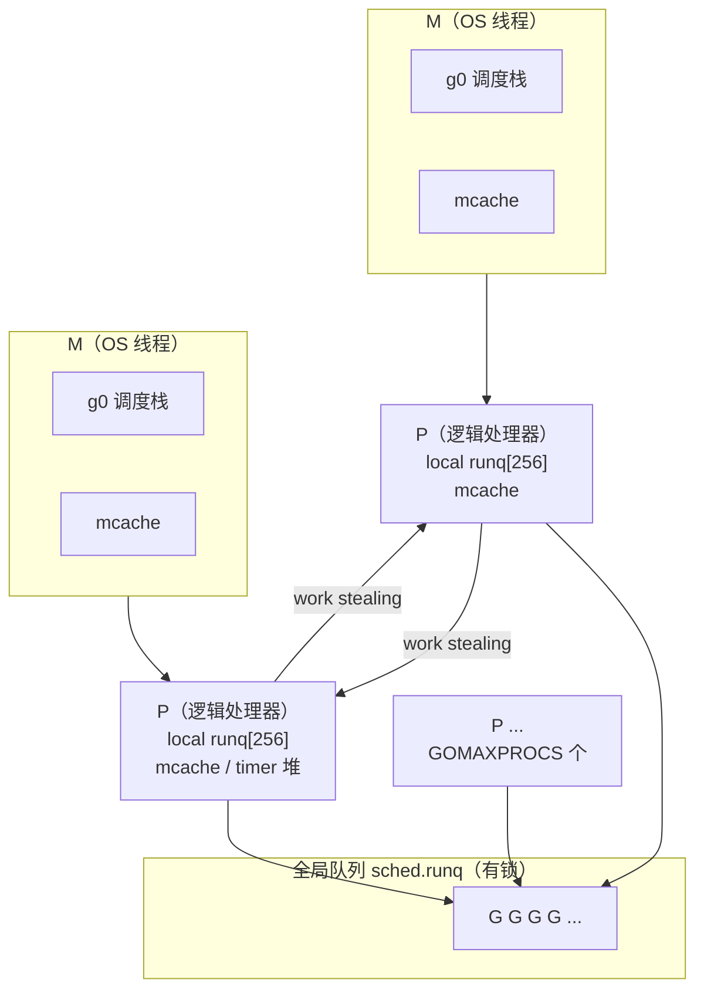

# 模块 02：Go 语言核心

> **本模块与岗位的关系**
>
> 岗位标签第一条就是「Golang」，任职要求写的是"**熟练掌握 Go 语言，能够运用其进行高性能、高并发的系统开发**"。
> 客户服务系统 / OA 系统的典型特征是：**长连接多、并发请求量大、接口 QPS 峰值明显（早会前后、月末审批高峰）、单次请求链路长（网关 → 服务 → DB/缓存/IM/RPC）**。
> 这意味着面试官不会停留在"你会不会写 Go"，而会往下钻三层：
>
> 1. **语言层**：slice/map/channel 的底层行为是否清楚（决定你会不会写出隐性 bug）；
> 2. **并发层**：GMP、锁、context 是否理解（决定你能不能扛住高并发）；
> 3. **工程层**：GC 调优、pprof 定位线上问题、框架源码（决定你能否处理生产事故）。
>
> 岗位职责第 3 条明确写了"**负责生产环境线上问题的定位和解决**"，所以 **pprof / 内存泄漏 / goroutine 泄漏**这一块是必考且是加分项，一定要能讲出完整的排查步骤。
>
> **本模块的使用建议**：每个知识点按「原理 → 源码要点 → 面试 Q&A → 项目话术」四段组织。时间紧张时，优先背 **2.2 GMP、2.3 channel/context、2.4 GC、2.5 pprof、2.7 高频题**这五块，它们覆盖了 80% 的面试提问。

---

## 2.0 本模块速查地图

| 知识点 | 面试出现频率 | 难度 | 你的掌握度目标 | 可关联项目 |
|---|---|---|---|---|
| slice 扩容 / 共享底层数组 | ★★★★★ | 中 | 能画图 + 写出陷阱代码 | POS 数据中台批量处理 |
| map 底层 / 并发安全 | ★★★★★ | 中 | 讲清 hmap/bmap + 扩容 | 本地缓存、路由表 |
| interface / 反射 | ★★★★☆ | 中 | 讲清 iface/eface + nil 陷阱 | GORM、JSON 序列化 |
| goroutine / GMP | ★★★★★ | 高 | 能画 GMP 图 + 讲 work stealing | 所有高并发服务 |
| 抢占式调度 | ★★★☆☆ | 高 | 讲清 1.14 信号抢占 | 长循环导致调度延迟 |
| channel 底层 | ★★★★★ | 高 | 讲清 hchan + 关闭规则 | LoveSpouse 跨实例通话 |
| select 原理 | ★★★★☆ | 中 | 随机化 + lockorder | 对话流程编排 |
| context | ★★★★★ | 中 | 源码结构 + 最佳实践 | 全链路超时控制 |
| sync.Mutex 饥饿模式 | ★★★★☆ | 高 | 讲清 state 位 + 1ms 阈值 | 跨实例通话控制 |
| WaitGroup / Once / Cond | ★★★☆☆ | 中 | 会用 + 知道坑 | 并行调用下游 |
| 逃逸分析 | ★★★★☆ | 中 | 能说清 5 个逃逸场景 | 内存优化 |
| GC 三色标记 + 写屏障 | ★★★★★ | 高 | 能完整讲出混合写屏障 | 长连接服务调优 |
| GOGC / GOMEMLIMIT | ★★★★☆ | 中 | 会算目标堆大小 | 容器内存限制 |
| 内存泄漏排查 | ★★★★★ | 中 | 完整排查步骤 | 线上问题定位 |
| sync.Pool | ★★★★☆ | 中 | victim cache 机制 | 消息缓冲复用 |
| 内存对齐 | ★★★☆☆ | 中 | 能手动重排结构体 | 大结构体优化 |
| 零拷贝 | ★★★★☆ | 中 | sendfile/splice 区别 | 文件下载 |
| pprof 实操 | ★★★★★ | 中 | 能说出完整排查流程 | 线上问题定位 |
| Gin 路由树 / 中间件 | ★★★★★ | 中 | 源码级 | 所有 Gin 项目 |
| go-zero 组件 | ★★★★☆ | 中 | 熔断 + 服务治理 | POS 数据贯通 |

---

## 2.1 语言基础

### 2.1.1 slice：底层结构与扩容机制

#### 原理讲解

slice 在运行时是一个 24 字节（64 位）的结构体 `runtime.slice`：

```go
// runtime/slice.go
type slice struct {
    array unsafe.Pointer // 指向底层数组的指针
    len   int            // 长度
    cap   int            // 容量
}
```

注意：**slice 本身是值类型**，函数传参是拷贝这 24 字节。但因为 `array` 是指针，所以函数内修改元素会影响到外部——这是"看起来像引用类型"的根本原因。**但 `len`/`cap` 的修改不会同步出去**，这是很多 bug 的来源。

#### 扩容规则（源码 `runtime/slice.go` 的 `growslice`）

Go 1.18 之后（含 1.18～1.22+）的扩容公式：

```go
// runtime/slice.go growslice（简化）
const threshold = 256
newcap := oldCap
doublecap := newcap + newcap          // 2 倍
if newLen > doublecap {
    // 情况 1：需要的容量已经超过 2 倍，直接用需要的容量
    newcap = newLen
} else {
    if oldCap < threshold {
        // 情况 2：老容量 < 256，直接翻倍
        newcap = doublecap
    } else {
        // 情况 3：老容量 >= 256，按 1.25 倍左右增长，直到 >= newLen
        for 0 < newcap && newcap < newLen {
            newcap += (newcap + 3*threshold) >> 2   // 约等于 newcap * 1.25
        }
        if newcap <= 0 {
            newcap = newLen
        }
    }
}
// 最后一步：内存对齐，向上取整到 size class
newcap = roundupsize(newcap, et)
```

**关键点，面试时必须说出来：**

1. **Go 1.18 是个分水岭**。1.17 及以前阈值是 1024，且增长公式是 `newcap += newcap/4`；1.18 改成 256，公式改成 `newcap += (newcap + 3*256) >> 2`。为什么改？因为大 slice 从 1024 开始 1.25 倍增长，导致小 slice 增长太快浪费内存；而新公式使增长曲线更平滑（约 1.25 倍，但有个 +768/4 的补偿项，让曲线过渡更自然）。
2. **`roundupsize` 会做内存对齐**，实际容量往往比计算的 `newcap` 大。例如 `[]int{}` append 到需要 5 个元素，计算 newcap=5，但 int 占 8 字节，5*8=40 字节，会向上取整到 48 字节（Go 的 size class），所以最终 cap=6。这就是为什么面试问你"`cap` 为什么是 6 不是 5"。
3. **扩容会重新分配底层数组并拷贝数据**，`runtime.memmove`，这是 O(n) 的。

#### 共享底层数组陷阱（超高频）

**陷阱一：append 覆盖相邻 slice**

```go
s := []int{1, 2, 3, 4, 5}
a := s[:2]      // a = [1 2], len=2, cap=5（注意 cap 是 5！）
b := s[2:4]     // b = [3 4], len=2, cap=3

a = append(a, 100) // a 的 cap 还有 3，不触发扩容 → 直接写 s[2]
fmt.Println(a)  // [1 2 100]
fmt.Println(b)  // [100 4]   ← b 被污染了！
fmt.Println(s)  // [1 2 100 4 5]
```

**陷阱二：append 触发扩容后与原 slice 脱钩**

```go
s := make([]int, 2, 2) // len=2 cap=2
a := s
a = append(a, 3)       // cap 不够，重新分配
a[0] = 100
fmt.Println(s) // [0 0]    ← s 没变，因为 a 已经指向新数组
fmt.Println(a) // [100 0 3]
```

**解决方案：三索引切片（full slice expression）**

```go
s := []int{1, 2, 3, 4, 5}
a := s[:2:2]     // [low:high:max] → len=2, cap=2
a = append(a, 100) // cap 不够 → 扩容 → 不污染 s[2]
fmt.Println(s)   // [1 2 3 4 5]  ✅ 安全
```

**标准库中的真实案例**：Go 官方 `bytes.Buffer` 的 `Bytes()` 方法早期就踩过这个坑——返回底层数组的 slice，用户 append 后污染 buffer 的后续写入。后来通过 `b.off` 偏移量来管理读取位置规避。

#### 代码示例：扩容行为观测

```go
package main

import "fmt"

func main() {
    // 观测扩容曲线
    var s []int
    prev := 0
    for i := 0; i < 2000; i++ {
        s = append(s, i)
        if cap(s) != prev {
            fmt.Printf("len=%d cap=%d (增量 %d)\n", len(s), cap(s), cap(s)-prev)
            prev = cap(s)
        }
    }
    // 输出（Go 1.18+）：
    // len=1   cap=1
    // len=2   cap=2
    // len=3   cap=4
    // len=5   cap=8
    // len=9   cap=16
    // len=17  cap=32
    // ...
    // len=257 cap=512      ← 阈值 256 之后，增长变慢
    // len=513 cap=848      ← 512 * 1.25 ≈ 640，对齐后 848
    // len=849 cap=1280
    // len=1281 cap=1792
}
```

**性能实践：预分配**

```go
// 差：零值 slice，反复扩容 + 拷贝
var result []User
for _, id := range ids {
    result = append(result, query(id))
}

// 好：已知规模，一次性分配
result := make([]User, 0, len(ids))
for _, id := range ids {
    result = append(result, query(id))
}
```

#### 面试 Q&A

**Q1：slice 扩容是怎么扩的？Go 1.18 前后有什么区别？**

> **参考回答**：扩容在 `runtime.growslice`。分三档：
> 第一，如果 `newLen > 2*oldCap`，直接用 `newLen`，因为一次 append 多个元素时 2 倍可能都不够；
> 第二，如果 `oldCap < 256`，直接翻倍；
> 第三，否则以 `newcap += (newcap + 3*256) >> 2` 的公式循环增长，大约是 1.25 倍。
> 最后还会调用 `roundupsize` 按 Go 的内存规格（size class）向上取整，所以实际 cap 常常比算出来的大，比如 `[]int` 需要 5 个元素时 cap 会是 6。
>
> Go 1.18 之前阈值是 1024、公式是 `newcap += newcap/4`，改的原因是原公式在小 slice 阶段增长太激进而大 slice 阶段又偏保守，新公式的曲线更平滑，能减少内存碎片和拷贝次数。

**Q2：`s := make([]int, 5)` 和 `s := make([]int, 0, 5)` 有什么区别？**

> **参考回答**：前者 len=5、cap=5，已经填了 5 个零值，`append` 会从第 6 位开始写，而且 `s[0]` 可以直接访问；
> 后者 len=0、cap=5，底层数组已分配但逻辑上没元素，必须 `append` 才能加数据。
> 实践中第二个更常用——预分配容量避免扩容，同时不会带出多余的零值元素。这也是 `make([]T, 0, n)` 作为"推荐写法"的原因。

**Q3：函数传 slice 能修改里面的元素吗？**

> **参考回答**：能。slice 是值传递 24 字节（指针 + len + cap），但 `array` 指针指向同一块内存，所以 `s[0] = x` 会影响调用方。
> **但 `append` 不一定**：如果触发扩容，函数内 slice 指向新数组，调用方完全感知不到；即使没扩容，函数内 `len` 变了也不会同步回去。所以如果要让调用方看到长度变化，必须返回新的 slice——这也是标准库所有 `append` 用法都写 `s = append(s, x)` 的原因。

**Q4：为什么 `a := s[:2]` 之后 append 会污染原数组？怎么避免？**

> **参考回答**：因为切片操作不复制数据，`s[:2]` 的 cap 是从 `low` 到原数组末尾，也就是 5，所以 append 还有空间，直接往 `s[2]` 写。
> 避免办法有三个：
> 1. 用**三索引切片** `s[:2:2]` 把 cap 限制成 2，强制 append 扩容；
> 2. 用 `slices.Clone()`（Go 1.21+）或者 `append([]int(nil), s[:2]...)` 显式拷贝；
> 3. 如果只是想读，不要 append。

#### 项目话术提示

> **可结合「POS 数据贯通」项目作答**：
> "在 POS 数据贯通里，我要把 RabbitMQ 消费到的销售流水做批量整理再上传。最开始是零值 slice 一点点 append，一条流水一个时间点，量大的时候扩容拷贝占了不少 CPU。后来我改成先根据消息里的条数 `make([]SalesRecord, 0, batchSize)` 预分配，同时把跨产品线的字段适配结果也预分配好。压测的时候批处理那段的内存分配次数和 GC 次数都明显下降。
> 另外我们有一条产品线的数据是**共享底层数组**的——上游把一个大 batch 切成几段分发，我在其中一段上 append 过，结果把相邻段的数据覆盖了，线上出现流水金额错乱。排查后我用三索引切片 `batch[i:j:j]` 把 cap 卡死，问题就没了。这个坑之后我在团队里专门做了一次分享。"

---

### 2.1.2 map：底层实现与并发安全

#### 原理讲解

Go 的 map 是**哈希表 + 拉链法**的变体，核心结构在 `runtime/map.go`：

```go
// runtime/map.go
type hmap struct {
    count     int            // 元素个数（len(m) 返回这个）
    flags     uint8          // 状态位：iterator / oldIterator / hashWriting / sameSizeGrow
    B         uint8          // bucket 数量的对数，bucket 数 = 2^B
    noverflow uint16         // 溢出桶的大概数量
    hash0     uint32         // 哈希种子（随机化，防哈希碰撞攻击）
    buckets    unsafe.Pointer // 指向 bucket 数组，长度 2^B
    oldbuckets unsafe.Pointer // 扩容时的旧 bucket 数组
    nevacuate  uintptr        // 已搬迁的 bucket 数量（进度）
    extra *mapextra          // 溢出桶的元信息
}

// 一个 bucket（桶）存 8 个键值对
type bmap struct {
    tophash [8]uint8  // 每个 key 的哈希高 8 位（用来快速比对）
    // 后面跟着编译期确定的内存布局：
    // keys   [8]keyType
    // values [8]elemType
    // overflow *bmap   // 溢出桶指针
}
```

**关键设计点，面试一定要讲出来：**

1. **每个 bucket 固定存 8 个 KV**，而不是链表挂一个节点。这样一次内存访问能预取多个 key，CPU 缓存友好。
2. **`tophash` 加速比对**：存 key 哈希值的**高 8 位**。查找时先比 `tophash[i] == hash>>56`，不匹配直接跳过，避免昂贵的 key 比较（尤其是 string key）。
   - 定位 bucket 用哈希的**低位**（`hash & (2^B - 1)`），桶内比对用**高位**，高低位分离，互不干扰。
3. **溢出桶（overflow bucket）**：8 个位置满了之后挂一个溢出桶，形成链表。
4. **`hash0` 随机种子**：每次创建 map 随机生成，使哈希值不可预测，防止攻击者构造大量冲突 key 把 map 退化成链表（HashDoS）。这也是为什么 map 的遍历顺序是随机的（外加遍历起始 bucket 用 `fastrand` 随机）。

#### 扩容机制（两种）

```go
// 触发条件（runtime/map.go 的 mapassign 中）
// 条件 1：装载因子超阈值，翻倍扩容
if !h.growing() && (h.count+1) > bucketCnt*loadFactorNum/loadFactorDen*h.B {
    // loadFactorNum/loadFactorDen = 13/2 = 6.5
    hashGrow(t, h)  // 2 倍扩容，sameSizeGrow = false
}
// 条件 2：溢出桶太多，等量扩容（整理碎片）
if h.B > 15 && h.noverflow >= 1<<15 ||
   h.B <= 15 && h.noverflow >= 1<<uint(h.B) {
    hashGrow(t, h)  // sameSizeGrow = true，容量不变只重组
}
```

| 类型 | 触发条件 | bucket 数量变化 | 目的 |
|---|---|---|---|
| 翻倍扩容 | 装载因子 > 6.5（即 `count > 6.5 * 2^B`） | 2^B → 2^(B+1) | 元素太多，散列不够 |
| 等量扩容 | 溢出桶数量 ≥ 2^B（B≤15） | 2^B → 2^B（不变） | 解决大量删除后的碎片，重新紧凑排列 |

**为什么装载因子是 6.5？** 每个 bucket 有 8 个槽位，6.5 意味着平均 81% 满。取值过大会让溢出桶变多、查找变慢；过小会浪费内存。6.5 是实测的平衡点。

**渐进式扩容（incremental / 懒加载）**：这是重点。Go 不会在扩容时一次性搬迁所有数据（那会导致长时间 STW），而是：

```go
// 每次 mapassign / mapdelete 都会尝试搬迁
func mapassign(...) {
    ...
    if h.growing() {
        growWork(t, h, bucket)  // 搬迁 1~2 个 bucket
    }
}

func growWork(t *maptype, h *hmap, bucket uintptr) {
    // 1. 优先搬迁当前要操作的 bucket（确保本次操作能看到最新的数据）
    evacuate(t, h, bucket&h.oldbucketmask())
    // 2. 如果还在扩容中，再搬迁一个
    if h.growing() {
        evacuate(t, h, h.nevacuate)
    }
}
```

`evacuate` 把老 bucket 里的 8 个 KV 分流到两个新 bucket（`x` 部分留在低半区，`y` 部分去高半区），因为扩容是 2 倍，key 的新位置要么在原位置，要么在 `原位置 + 2^B`，只取决于哈希的**第 B 位**。

**这个设计导致的行为特征**：扩容期间 map 内存占用是双份的，而且查找要**先查 oldbuckets 再查 buckets**（`mapaccess` 里判断 `h.growing()`）。所以扩容中的 map 读写会变慢，且老 bucket 标记成 `evacuatedX/evacuatedY/evacuatedEmpty`。

#### 并发安全：为什么 map 不是并发安全的

Go 在 `mapassign` / `mapaccess` 里用 `flags` 的 `hashWriting` 位做**检测**（而不是加锁）：

```go
func mapassign(t *maptype, h *hmap, key unsafe.Pointer) unsafe.Pointer {
    ...
    if h.flags&hashWriting != 0 {
        fatal("concurrent map writes")   // 直接崩溃，无法 recover！
    }
    h.flags ^= hashWriting
    ...
}
```

**注意**：`fatal` 是 `throw` 级别的，**`defer recover()` 捕获不到**，整个进程直接挂掉。这是生产事故的高发点。

而且这种检测是**尽力而为**的——它只在恰好撞上时才报错，没撞上就静默产生数据竞争（race）。所以 `go test -race` 是必需的。

**三种解决方案对比：**

| 方案 | 适用场景 | 原理 | 性能 |
|---|---|---|---|
| `sync.Mutex` + `map` | 写多、key 少、逻辑复杂 | 粗粒度锁 | 中等，可接受 |
| `sync.RWMutex` + `map` | **读多写少**，key 相对稳定 | 读写锁 | 读并发好 |
| `sync.Map` | **读极多写极少**，key 基本不变 | read/dirty 双 map + 原子操作 | 读无锁，写很慢 |
| 分片锁（sharded map） | 高并发读写 | 按 key 哈希到 N 个分片，各自加锁 | 好，工程常用 |

#### `sync.Map` 源码要点

```go
// sync/map.go
type Map struct {
    mu     Mutex
    read   atomic.Pointer[readOnly] // 只读快照，读走这里，无锁
    dirty  map[any]*entry           // 包含 read 中所有 + 新增的
    misses int                      // read 未命中计数
}

type readOnly struct {
    m       map[any]*entry
    amended bool // dirty 中是否有 read 没有的 key
}

type entry struct {
    p atomic.Pointer[any] // 指向实际值；被删除时置为 nil 或 expunged
}
```

**读路径（快路径）**：`read.m[key]` 直接命中，**完全无锁**，只用原子操作。

**写路径**：发现 key 不在 read 里 → `misses++` → 加锁 → 如果 `misses > len(dirty)` 就把 dirty 提升为 read（dirty→read 晋升）；否则把 key 加到 dirty。

**这就是它"只适合读多写少"的原因**：一旦写频繁，`misses` 快速增长触发 dirty 重建（O(n) 拷贝），写性能急剧下降。官方文档和源码注释都明确写了：

> `// Map is like a Go map[any]any but is safe for concurrent use by multiple goroutines without additional locking or coordination. ... The Map type is optimized for two common use cases: (1) when the entry for a given key is only ever written once but read many times ... (2) when multiple goroutines read, write, and overwrite entries for disjoint sets of keys.`

#### 其他 map 细节（高频追问）

**Q：为什么 `m[k] = v` 这种写法不能取地址？**
A：因为 map 在扩容时会搬迁数据，key 的内存地址会变。所以 `&m[k]` 编译报错，必须 `v := m[k]; &v`。

**Q：`map` 的 key 有什么要求？**
A：必须是 **comparable** 类型。slice、map、func 不能做 key（编译报错）。struct 可以做 key，但字段里不能有不可比较类型。浮点类型可以做 key 但 `NaN != NaN`，所以拿 NaN 当 key 取不出来。

**Q：遍历 map 能边遍历边删吗？边遍历边加呢？**
A：**删是安全的**（spec 明确允许）。**加不保证**——新加的元素可能被遍历到也可能不被遍历到，每次结果都不同。

**Q：`len(m)` 是 O(1) 吗？**
A：是，`hmap.count` 直接返回。

#### 代码示例：分片锁 map（生产常用）

```go
package shardmap

import "sync"

const shardCount = 32

type Shard[K comparable, V any] struct {
    mu sync.RWMutex
    m  map[K]V
}

type Map[K comparable, V any] struct {
    shards [shardCount]*Shard[K, V]
}

func New[K comparable, V any]() *Map[K, V] {
    m := &Map[K, V]{}
    for i := range m.shards {
        m.shards[i] = &Shard[K, V]{m: make(map[K]V)}
    }
    return m
}

func (m *Map[K, V]) shard(key K) *Shard[K, V] {
    // 简单哈希：用 any 的 hash 或用泛型 constraint 提供 Hash 方法
    // 生产可用 fnv / maphash
    return m.shards[uintptr(any(key).(interface{ Hash() uint32 }).Hash())%shardCount]
}
```

> 实际工程更推荐用成熟的库，如 `github.com/orcaman/concurrent-map/v2`。**面试时提到"分片锁"这个概念本身就是加分项**——说明你理解锁竞争的本质是"不同 key 争同一把锁"。

#### 面试 Q&A

**Q1：map 的底层结构是怎样的？**

> **参考回答**：map 由 `hmap` 和一个 bucket 数组构成。`hmap` 里有 `B`（bucket 数量的对数，bucket 数 = 2^B）、`hash0` 哈希种子、`buckets` 指针、`oldbuckets`（扩容时用）、`count` 等。
> 每个 bucket 是 `bmap`，固定存 8 个 KV，结构是「8 个 tophash + 8 个 key + 8 个 value + 一个 overflow 指针」。tophash 存哈希的高 8 位，查找时先比 tophash 快速过滤，命中再比完整 key。
> 定位 bucket 用哈希低位（`hash & (2^B-1)`），桶内过滤用哈希高位，这样高低位不冲突。
> 8 个槽位满了挂溢出桶形成链表。装载因子 6.5 就触发翻倍扩容，溢出桶过多触发等量扩容。扩容是渐进式的，每次写操作搬迁 1~2 个 bucket。

**Q2：map 扩容为什么要"渐进式"？**

> **参考回答**：因为如果一次性搬迁所有数据，大 map 会有几百毫秒的停顿，这期间整个进程的读写都被阻塞，对高并发服务是不可接受的。
> 渐进式的做法是：扩容时先分配新的 bucket 数组，把 `oldbuckets` 挂上，然后**每次 mapassign/mapdelete 时调用 `growWork` 搬迁 1~2 个 bucket**，同时读操作发现还在扩容就先去 oldbuckets 查。这样把 O(n) 的成本摊薄到每次写操作上，没有集中停顿。
> 副作用是扩容期间内存占用是双份的，查找也要多一次判断。

**Q3：map 为什么并发读写会 panic？怎么解决？**

> **参考回答**：严格说不是 panic，是 `fatal error: concurrent map writes`，走的是 `throw` 而不是 `panic`，**`recover` 抓不住**，进程直接退出。
> 原理是 `hmap.flags` 里有个 `hashWriting` 位，写操作进来先检查这个位，发现已被置位就说明有并发写。
> 而且这个检测是概率性的——它只在真撞上时才报，没撞上就静默产生数据竞争，所以生产必须用 `-race` 跑测试。
> 解决方案按场景选：
> - 写多的用 `sync.Mutex` 包一层；
> - 读多写少的用 `sync.RWMutex`；
> - 读极多、写极少、key 基本固定的用 `sync.Map`，它读路径是无锁的（read-only 快照 + 原子操作）；
> - 高并发读写的用**分片锁**，按 key 哈希到 N 个 shard，每片独立加锁，把锁竞争降低到 1/N。

**Q4：`sync.Map` 和 `map + RWMutex` 怎么选？**

> **参考回答**：关键看读写比和 key 的稳定性。`sync.Map` 的读路径是原子的、无锁的，所以读性能非常好；但它的写路径很重——如果 key 不在 read 快照里，会 `misses++`，misses 累积超过 dirty 的长度就要重建 dirty（O(n)），写性能会崩。
> 所以：
> - key 只写一次然后一直读（比如配置、路由表、连接元数据）→ `sync.Map` 最优；
> - 多个 goroutine 操作**不相交的 key 集合**（比如按用户分片）→ `sync.Map` 也合适；
> - key 频繁增删改 → 用 `RWMutex + map`，行为可预测；
> - 追求极致 → 分片锁。

**Q5：`map` 遍历为什么是随机的？**

> **参考回答**：两个原因。一是 `hash0` 每次创建 map 都随机，key 落在哪个 bucket 是不确定的；二是 `mapiterinit` 里显式用了 `fastrand()` 随机选择起始 bucket 和起始 cell。
> 加随机的目的是**防止业务代码依赖遍历顺序**——Go 团队认为依赖 map 顺序是错误用法，所以从语言层面强制随机化。如果确实需要有序，得自己排序 key 或用 `maps.Keys` + `slices.Sort`。

**Q6：`map` 的删除是怎么做的？会有内存泄漏吗？**

> **参考回答**：`mapdelete` 把 value 位置清零、tophash 置为 `emptyOne`，元素并不真正"移除"，bucket 数组也不会收缩——**map 只会涨不会缩**。
> 如果曾经放过超大 map（比如百万级 key）然后删光了，内存不会归还，这是常见的内存泄漏场景。解决办法是定期**重建 map**（`m = make(map[...])`）或者换成能收缩的结构。
> 另外如果 value 是指针类型，删除后指针会被清零，对象可以被 GC 回收，这部分没问题。但如果 key 或 value 是大结构体，bucket 数组本身占的内存不会释放。

#### 项目话术提示

> **可结合「LoveSpouse 数字人」的连接路由作答**：
> "LoveSpouse 里我维护了一个『用户 ID → 当前实例连接』的路由表，用来做跨实例通话控制。这个表是典型的高频读、低频写——每个消息都要查一下对端在不在本实例，但连接建立/断开才写一次。
> 一开始我用的是 `map + RWMutex`，压测时发现在 5000+ 连接的场景下读锁的竞争已经成了瓶颈。后来换成 `sync.Map`，读路径完全无锁，QPS 提升很明显，写入频率低所以 dirty 重建的代价可以忽略。
> 另外有一点我特别注意：因为 map 并发写是 `fatal error` 抓不住，所以所有写操作我都收敛到一个 goroutine 里通过 channel 串行处理，避免了任何并发写的可能。"

> **可结合「POS 数据贯通」作答**：
> "数据中台里我有一份产品线配置的映射表——`产品线ID → 字段适配规则`。这个表是启动时从 DB 加载、运行期只读的，我用的就是 `sync.Map`。但它有个坑：**配置热更新**的时候我直接 `Store` 覆盖，读方可能拿到新旧混合的状态。后来我改成整表替换 + `atomic.Pointer` 持有，读方一次性拿到一致快照。"

---

### 2.1.3 interface 与反射

#### 原理讲解

Go 的 interface 在运行时有两种形态：

```go
// runtime/runtime2.go

// 空接口 interface{} / any：任意类型
type eface struct {
    _type *_type         // 动态类型信息
    data  unsafe.Pointer // 指向实际数据
}

// 非空接口：带方法集
type iface struct {
    tab  *itab          // 类型 + 方法表
    data unsafe.Pointer // 指向实际数据
}

// 接口的方法表
type itab struct {
    inter *interfacetype // 接口类型自身（方法签名列表）
    _type *_type         // 动态类型
    hash  uint32         // _type.hash 的副本，用于类型断言时快速比较
    _     [4]byte
    fun   [1]uintptr     // 变长数组，存实际方法地址（按接口方法字典序排列）
}
```

**关键点：**

1. **`iface` 是两字宽（16 字节）**，`data` 是**指针**。所以把一个值放进 interface 会发生什么？
   - 如果值 ≤ 一个指针大小（8 字节）且是指针类形状，可能直接用 `data` 存值（runtime 的 `convT64` 等优化）；
   - 否则需要在**堆上分配**一份拷贝，`data` 指向它 —— 这就是 **"装箱/boxing"，是一次逃逸**。
2. **`itab.fun` 是方法地址数组**，接口方法调用是 `tab.fun[i]` 取地址再调用 —— 这是**动态派发**，比直接调用多一次间接寻址，且**无法内联**。所以在极致性能热路径上要避免接口调用。
3. **`itab` 有全局缓存**。`getitab` 先查 `itabTable`（一个开放寻址哈希表），未命中才现算。所以第一次接口转换有计算成本，之后很快。

#### 类型断言的两种形式

```go
var i interface{} = "hello"

// 形式 1：单返回值，失败直接 panic
s := i.(string)

// 形式 2：comma-ok，失败不 panic，ok=false
s, ok := i.(string)
if !ok {
    // 处理失败
}

// 类型 switch
switch v := i.(type) {
case string:
    fmt.Println("string:", v)
case int:
    fmt.Println("int:", v)
case nil:
    fmt.Println("nil")
default:
    fmt.Printf("unknown: %T\n", v)
}
```

**性能要点**：类型断言会比对 `itab.hash`（先把类型名哈希成整数），所以断言到具体类型比断言到接口快。另外 Go 编译器对 `case string` 这类会做优化，但整体上**断言比直接的类型比较贵**。

#### 经典陷阱：nil interface vs 含 nil 值的 interface

这是面试**必考**的坑：

```go
package main

import "fmt"

type MyError struct{ Msg string }

func (e *MyError) Error() string { return e.Msg }

func doSomething() error {
    var p *MyError = nil
    return p          // ← 关键：返回的是一个 iface{tab: *MyError, data: nil}
}

func main() {
    err := doSomething()
    fmt.Println(err == nil)  // false !!!
    if err != nil {
        fmt.Println("出错了")  // 会打印，虽然 p 是 nil
    }
}
```

**原因**：`err == nil` 比较的是 iface 的两个字段是否都为 nil。这里 `tab` 指向 `*MyError` 的 itab（非 nil），`data` 是 nil，所以整体不为 nil。

**正确写法**：

```go
func doSomething() error {
    var p *MyError = nil
    if p == nil {
        return nil        // 显式返回 nil，返回的是 eface{nil, nil}
    }
    return p
}
```

这个坑在 GORM、`errors.Is`、自定义错误包装里极其常见。**回答这类题时能举出具体代码就是加分。**

#### 反射三定律

```go
// 定律 1：反射可以将 interface 变量转换成反射对象
t := reflect.TypeOf(x)      // 类型信息
v := reflect.ValueOf(x)     // 值信息

// 定律 2：反射可以将反射对象还原成 interface 变量
i := v.Interface()

// 定律 3：要修改反射对象，其值必须可设置（addressable）
v := reflect.ValueOf(x)
// v.Set(...)  → panic: reflect: reflect.Value.Set using unaddressable value
// 必须传指针
v = reflect.ValueOf(&x)
v.Elem().Set(reflect.ValueOf(newVal))  // ✅
```

**核心 API 速查：**

```go
type User struct {
    Name string `json:"name"`
    Age  int    `json:"age"`
}

u := User{Name: "tom", Age: 18}
t := reflect.TypeOf(u)
v := reflect.ValueOf(u)

// 遍历字段
for i := 0; i < t.NumField(); i++ {
    f := t.Field(i)
    fmt.Printf("字段名=%s 类型=%s json标签=%s 值=%v\n",
        f.Name, f.Type, f.Tag.Get("json"), v.Field(i).Interface())
}

// 遍历方法（注意：值接收者的方法才在值类型上）
for i := 0; i < t.NumMethod(); i++ {
    fmt.Println(t.Method(i).Name)
}

// 动态创建
newUser := reflect.New(t).Elem()   // 新建一个 User 的 Value
newUser.FieldByName("Name").SetString("jerry")

// 动态调用
m := reflect.ValueOf(&u).MethodByName("Hello")
m.Call([]reflect.Value{reflect.ValueOf("world")})
```

**反射的性能代价（面试常问）：**

| 操作 | 相对开销 |
|---|---|
| 直接字段访问 | 1x |
| 反射 `Field(i)` 读取 | ~50-100x |
| 反射 `Set` 写入 | ~100-200x |
| 反射 `Method.Call` | ~100-500x |

原因：绕过编译期类型检查、每次都要做类型转换（`unsafe` 指针运算）、参数需要装箱成 `[]reflect.Value`（每次调用分配 slice）、无法内联。

**优化手段**：缓存反射结果（如 `sync.Map[reflect.Type]fieldIndex`）、用代码生成（`go generate` + `stringer`/`easyjson`）、用 unsafe 直接操作内存布局、用泛型替代。

#### 面试 Q&A

**Q1：`interface{}` 的底层是什么？把一个 int 放进 interface 会发生什么？**

> **参考回答**：空接口是 `eface`，两个字段：`_type` 指向类型信息，`data` 指向数据。
> 把 `int` 放进 interface 时，会发生**装箱**：runtime 调用 `convT64`（对 64 位以内的值）或 `convT`。对于小的、非指针类型的值，Go 会分配一块堆内存存放这个值的一份拷贝，`data` 指向它。**这就产生了一次逃逸和一次堆分配**。
> 所以在性能敏感路径上，`[]interface{}`、`map[string]interface{}` 这类结构开销很大——每次存取值都要分配 + 类型转换。可以用泛型或者具体类型替代。

**Q2：为什么 `err != nil` 有时会误判？**

> **参考回答**：这是经典的"nil interface 不等于 nil 值"问题。interface 在运行时是两个字（type + data），只有两个都是 nil 时才等于 nil。
> 如果函数签名返回 `error`，而实现里 `var e *MyError = nil; return e`，那么返回的 interface 的 type 字段是 `*MyError`（非 nil）、data 是 nil，所以 `err != nil` 为 true。
> 这个坑的典型场景是：函数里声明了一个自定义错误指针但没赋值，直接 return；或者用 `fmt.Errorf("%w", nil)` 之类包装。
> 规避方式是在返回前显式判断 `if e == nil { return nil }`。另外可以用 `errors.Is(err, nil)` 之类吗？不行，`errors.Is` 也是先比接口本身，所以还是要在源头处理。

**Q3：反射为什么慢？怎么优化？**

> **参考回答**：三个原因：
> 1. **绕过了编译期类型检查和静态派发**，所有操作都要在运行时通过 `_type` 做判断和转换；
> 2. **`reflect.Value` 本身是一个较重的结构体**（含 typ、ptr、flag 三个字段），每次取值都要构造和拆包；
> 3. **方法调用时参数要装箱成 `[]reflect.Value`**，这是一次堆分配；返回也是。而且反射调用无法被内联，也享受不到逃逸分析的优化。
>
> 优化手段按性价比排序：
> - 缓存反射结果（`reflect.Type`、`FieldByName` 的索引都可以缓存到 map 里，避免重复查找）；
> - 用**代码生成**代替运行时反射（如 easyjson、protobuf 生成代码、`go generate`）——这是收益最大的；
> - 用**泛型**替代部分反射场景（Go 1.18+），泛型是编译期实例化，没有反射开销；
> - 用 unsafe 手动做内存布局操作（如 GORM、json 库的内部实现）。

**Q4：`reflect.ValueOf(x)` 之后能改 x 吗？为什么？**

> **参考回答**：不能。`reflect.ValueOf(x)` 传的是 x 的**拷贝**，得到的 Value 是 unaddressable 的，调用 `Set` 会 panic。
> 要修改必须传指针：`reflect.ValueOf(&x).Elem()`，`Elem()` 解引用后得到的 Value 是 addressable 的（flag 里有 `flagAddr`），才能 Set。
> 这对应反射第三定律："要修改反射对象，其值必须可设置"。

#### 项目话术提示

> **可结合「POS 数据贯通」的多产品线适配作答**：
> "数据中台要适配好几条 POS 产品线，每条产品线的销售流水字段名和结构都不一样。我一开始想过用 `map[string]interface{}` 加反射做通用适配，但压测发现反射的解码性能很差——每条流水都要走一遍 `reflect.Value.Set`，QPS 上不去。
> 后来我改成两条路：**运行时用 `json.RawMessage` 延迟解析 + 每条产品线一个强类型 struct**，编译期就确定了字段；把配置类的、启动时加载一次的部分才用反射。这样热路径上完全没有反射。
> 顺带也踩过 nil interface 的坑：适配层有个函数返回 `error`，内部 `var e *AdaptError` 没赋值就 return，结果 `if err != nil` 判成 true，把正常数据当成失败拦下了。后来在函数出口统一加了 `if e == nil { return nil }`。"

---

### 2.1.4 指针与逃逸分析（详见 2.4.2）

这里只做概念铺垫，完整原理见 **2.4.2 逃逸分析**。

**一句话结论**：Go 的指针**不能做算术运算**（相比 C），但指针的存在会让编译器在**编译期**判断对象该分配在栈还是堆——这就是逃逸分析。逃逸了就走堆分配（有 GC 成本），没逃逸就栈分配（随函数返回自动回收，零成本）。

**面试时的一句话总结**：
> "Go 的指针是安全的（不能算数、GC 会管理），但代价是编译器必须做逃逸分析来决定分配位置。能栈上分配的对象完全不给 GC 添麻烦，所以高性能 Go 代码的核心技巧之一就是**想办法让对象不逃逸**。"

---

## 2.2 并发模型：goroutine 与 GMP 调度器

> 这是 Go 面试的**绝对核心**，几乎每场必问。要求：能画出 GMP 关系图、讲清 work stealing 和 hand off、说得出抢占式调度的演进。

### 2.2.1 goroutine 是什么

**goroutine 不是协程（coroutine）的简单实现，而是"用户态线程 + 由 runtime 调度"的组合。**

| 维度 | 线程（OS Thread） | goroutine |
|---|---|---|
| 栈初始大小 | 1~8 MB（固定） | **2 KB**（可增长） |
| 栈上限 | 固定 | 1 GB（64 位，`maxstacksize`） |
| 创建开销 | ~1μs~10μs（内核态） | ~0.2μs（用户态） |
| 切换开销 | 1~2 μs，涉及内核态、TLB 刷新 | ~100~200 ns，纯用户态 |
| 数量级 | 数千 | **数十万~百万** |
| 调度 | 内核抢占式 | runtime 调度 + 信号抢占 |
| 通信 | 共享内存 + 锁 | **channel（CSP 模型）** |

**goroutine 的栈是动态的**：

```go
// runtime/stack.go
const (
    _StackMin   = 2048          // 初始 2KB
    _StackGuard = 928           // 栈保护边界
)
// 64 位系统 maxstacksize = 1GB
```

栈增长机制：函数序言里会插入**栈边界检查**（`stack guard`，比较 SP 和 `g.stackguard0`）。如果空间不足，调用 `runtime.morestack` → `newstack` → 分配一块 2 倍大小的新栈 → **把旧栈内容整体拷贝过去** → **调整所有指向旧栈的指针**（这一步需要 runtime 的指针扫描和修正，是 Go 特有的工作）→ 继续执行。

> **面试细节**：因为要拷贝并修正指针，所以**取栈上变量的地址传给外部是危险的**（Go 用逃逸分析避免了这个问题——一旦取地址且会逃逸，就直接分配到堆上）。

### 2.2.2 GMP 模型详解



#### 三个角色的职责

**G（Goroutine）** —— `runtime/runtime2.go`：

```go
type g struct {
    stack       stack   // [stack.lo, stack.hi) 栈地址范围
    stackguard0 uintptr // 栈增长检查用（也用于抢占标记 stackPreempt）
    stackguard1 uintptr
    m         *m      // 当前绑定的 M
    sched     gobuf   // 保存的寄存器现场（SP/PC/BP 等），切换时用
    atomicstatus atomic.Uint32 // 状态：_Gidle/_Grunnable/_Grunning/_Gsyscall/_Gwaiting/_Gdead
    goid   uint64
    waitsince  int64  // 开始阻塞的时间（sysmon 判断死锁用）
    waitreason string
    startpc    uintptr // 入口函数
    timer      *timer
    // ... 还有 schedlink（队列链表）、lockedm 等
}
```

G 的状态机（面试常问）：

```
_Gidle → _Grunnable → _Grunning → _Gwaiting / _Gsyscall / _Gdead
              ↑            │           │
              └────────────┘           │
              ←────────────────────────┘
```

**M（Machine）**：对应一个 OS 线程。**M 必须绑定 P 才能执行 G 的代码**。

```go
type m struct {
    g0      *g      // 调度用的特殊 goroutine，栈是 OS 栈
    curg    *g      // 当前正在运行的 G
    p       puintptr // 当前绑定的 P
    nextp   puintptr // 唤醒时要用哪个 P
    spinning bool   // 是否在自旋找活干
    lockedg *g      // LockOSThread 用
    // ...
}
```

- `m.g0` 是**每个 M 自己的调度栈**，所有调度代码都跑在 g0 上（因为 G 的栈可能已经不够用了）；
- 除了绑定了 P 的 M，还有几种"特殊" M：`sysmon`（监控线程）、`forcegc`、`bgsweep` 等；
- M 的数量上限默认 10000（`runtime/debug.SetMaxThreads`）。

**P（Processor）**：逻辑处理器，**`GOMAXPROCS` 决定 P 的数量**（默认等于 CPU 核数）。

```go
type p struct {
    id          int32
    status      uint32  // _Pidle / _Prunning / _Psyscall / _Pgcstop / _Pdead
    link        puintptr
    schedtick   uint32  // 每调度一次 +1（用于判断是否需要从全局队列拿 G）
    syscalltick uint32
    m           muintptr // 反向指针
    mcache      *mcache  // P 私有的内存缓存（无需加锁分配小对象）
    pcache      pageCache
    // 本地运行队列：无锁，256 个槽位
    runqhead uint32
    runqtail uint32
    runq     [256]guintptr
    runnext  guintptr   // 下一个要跑的 G（优先于 runq）
    // timers, GC 相关字段 ...
}
```

> **P 存在的意义（面试必答）**：
> 1. **无锁的本地运行队列**——G 的入队/出队绝大多数时候不需要加锁，这是 Go 调度性能的关键；
> 2. **`mcache` 挂在 P 上**——小对象内存分配可以无锁完成（每个 P 有自己的内存缓存）；
> 3. **提供并行度的抽象**——`GOMAXPROCS` 控制的是 P 的数量，即真正并行执行的 goroutine 数。
>
> 一句话：**P 是"运行 goroutine 所需的资源（队列 + 内存缓存）"的抽象，M 是执行体。** P 的数量固定（= GOMAXPROCS），所以资源有限；M 可以按需创建。

#### 调度循环（schedule 函数）源码要点

```go
// runtime/proc.go 的核心调度循环（大幅简化）
func schedule() {
    ...
top:
    var gp *g
    // 1. 每 61 次调度，优先从全局队列拿一个，保证公平性
    if gp == nil {
        if _g_.m.p.ptr().schedtick%61 == 0 && sched.runqsize > 0 {
            lock(&sched.lock)
            gp = globrunqget(_g_.m.p.ptr(), 1)
            unlock(&sched.lock)
        }
    }
    // 2. 从 P 的本地队列拿
    if gp == nil {
        gp, inheritTime = runqget(_g_.m.p.ptr())
    }
    // 3. 本地队列也空了 → 去别处找
    if gp == nil {
        gp, inheritTime = findrunnable()  // 阻塞直到找到可运行的 G
    }
    execute(gp, inheritTime)
}
```

**注意第 1 点：每 61 次调度从全局队列拿一次。** 61 是个质数，目的是让"从全局队列取"和"从本地队列取"的节奏错开，避免饥饿，同时不引入随机数开销。**这个细节能答出来是很强的加分项。**

#### work stealing（工作窃取）

`findrunnable` 是调度器的核心，找 G 的顺序（**面试要按顺序答**）：

```
findrunnable() 依次尝试：
  1. 本地队列 runqget
  2. 全局队列 globrunqget(p, 0)   ← 从全局队列批量拿，拿 min(len/2, 1/4 GOMAXPROCS 相关) 个
  3. netpoll（非阻塞检查网络 IO 就绪的 G）  ← 每次都检，保证网络 IO 低延迟
  4. work stealing：遍历所有 P，从别人队列尾部偷一半
  5. 再检查一次全局队列
  6. netpoll（阻塞版，带超时）
  7. 实在没有 → stopm() 睡眠，等待被唤醒
```

**work stealing 的细节：**

```go
// runtime/proc.go runqsteal
func runqsteal(pp, p2 *p, stealRunNextG bool) *g {
    // 从受害者 p2 的队列"尾部"偷一半
    n := runqgrab(p2, &pp.runq, ...)
    // ...
}

// 从受害者尾部偷，自己从头部取 → 减少缓存冲突和锁竞争
func runqgrab(pp *p, batch *[256]guintptr, batchHead uint32, stealRunNextG bool) uint32 {
    for {
        h := atomic.LoadAcq(&pp.runqhead)
        t := atomic.LoadAcq(&pp.runqtail)
        n := t - h
        n = n - n/2          // ← 偷一半
        // ...
    }
}
```

- **偷一半**而不是全偷，是为了让受害者还有活干，避免"刚偷完受害者又去偷回来"的抖动；
- **从尾部偷**（受害者从头部取），减少原子操作的争用；
- 最多尝试 4 次（`stealTries = 4`），失败就休眠；
- 随机起点遍历所有 P，避免所有空闲 P 都去偷同一个受害者的队列头部。

#### hand off（移交）

当 M 因为**系统调用**（syscall）阻塞时：

```go
// runtime/proc.go entersyscall / exitsyscall
func entersyscall() {
    // 把 P 的状态置为 _Psyscall，但先不释放
    // ...
}

// 关键在 reentersyscall 后的 sysmon 或 entersyscallblock：
// 如果阻塞时间较长，会调用 handoffp
func handoffp(pp *p) {
    // 如果本地队列非空，或者还有自旋的 M 在找活
    // → 直接把 P 交给一个空闲/自旋的 M（或新建一个 M）
    if !runqempty(pp) || sched.nmspinning.Load()+sched.npidle.Load() == 0 {
        startm(pp, false, true)
        return
    }
    // 否则把 P 放回 idle 列表
    pidleput(pp)
}
```

**为什么要 hand off？** 因为 P 的数量固定（= GOMAXPROCS）。如果 M 陷入系统调用时还占着 P，那么 P 上排队等待的 G 就全被卡住了——可用的并行度白白损失。

**hand off 的过程**：
1. M 进入系统调用（如 `read()` 阻塞）；
2. runtime 调用 `handoffp`，**把 P 与 M 解绑**；
3. P 交给一个空闲的 M，或者新建/唤醒一个 M 来接管；
4. P 上的其他 G 继续被调度；
5. **原 M 从系统调用返回**时调用 `exitsyscall`，尝试重新获取一个 P：
   - 拿得到 → 继续执行原来的 G；
   - 拿不到 → 把 G 置为 `_Grunnable` 放回全局队列，自己 `stopm` 睡眠。

> **面试延伸**：这也解释了为什么**阻塞式 syscall（比如没用 netpoller 的文件 IO）会创建大量 M**。Go 的 netpoller 把网络 IO 做成了非阻塞（epoll/kqueue），网络读写不会阻塞 M，所以**网络密集型服务不会有这个问题；但磁盘 IO 和 cgo 调用会**。这就是 Go 官方建议"避免阻塞式 syscall"和"cgo 调用代价高"的本质原因。

#### 抢占式调度

**Go 1.14 之前的协作式抢占：**

抢占点只有两处：
1. **函数调用时的栈增长检查**（`morestack` 里检查 `stackguard0 == stackPreempt`）；
2. `runtime.Gosched()` 主动让出。

**问题**：如果一个 goroutine 跑一个**没有函数调用的死循环**：

```go
for i := 0; i < 1e18; i++ {
    x++          // 没有函数调用 → 没有抢占点
}
```

那么它会一直占着 P，其他 G 全部饿死，`GOMAXPROCS=1` 时连 GC 的 STW 都进不去。

**Go 1.14 引入基于信号的异步抢占：**

```go
// runtime/signal_unix.go
// sysmon 检测到某个 G 运行超过 10ms，就发信号
const forcePreemptNS = 10 * 1000 * 1000 // 10ms

func sysmon() {
    for {
        // ...
        if idle == 0 { // 连续空闲次数
            delay = 20  // 20us
        } else if idle > 50 {
            delay *= 2
        }
        if delay > 10*1000 { // 最多 10ms
            delay = 10 * 1000
        }
        usleep(delay)

        // 抢占长时间运行的 G
        if now - sched.lastpoll ... {
            for i := 0; i < len(allp); i++ {
                pp := allp[i]
                if pp.status == _Prunning {
                    // 距离上次被抢占超过 10ms
                    if now - pp.schedtick ... {
                        if preemptone(pp) {  // → signalM(m, sigPreempt)
                            // 发送 SIGURG 信号
                        }
                    }
                }
            }
        }
    }
}
```

**工作原理：**
1. `sysmon` 是**独立于 GMP 之外的一个 OS 线程**（不占用 P），后台循环运行；
2. 它扫描所有 P，发现某个 P 上的 G 运行超过 10ms，就调用 `preemptone`；
3. `preemptone` 把 `gp.stackguard0` 设为 `stackPreempt`，并向对应的 M 发送 **`SIGURG` 信号**（选 SIGURG 是因为它在 Go 程序里通常不被使用，且不影响调试器）；
4. M 收到信号，进入信号处理函数 `sigtramp`，在信号栈上调用 `runtime.asyncPreempt`；
5. `asyncPreempt` 用汇编**保存当前所有寄存器到 `g.sched`**，然后把 G 置为 `_Gwaiting`（原因 `waitReasonPreempted`），插入全局队列；
6. 调度器切到下一个 G。**被抢占的 G 下次被调度时，从 `asyncPreempt2` 恢复寄存器继续执行。**

**注意「异步抢占」还是「有限制」的**：
- 在**汇编函数**、`runtime` 关键代码段、持有某些锁的临界区，抢占会被延迟（`g.preemptStop` 等标记）；
- 抢占不是立刻生效，有信号传递延迟，所以实测"最多 ~20ms 才会被切走"；
- 用户可通过 `runtime.GOMAXPROCS` 之外没有直接的开关，但可以用 `GODEBUG=asyncpreemptoff=1` 关闭。

#### 面试 Q&A

**Q1：Go 的 GMP 模型是什么？为什么需要 P？**

> **参考回答**：G 是 goroutine（用户态协程），M 是 OS 线程，P 是逻辑处理器，数量由 `GOMAXPROCS` 决定，默认等于 CPU 核数。
> **M 必须持有 P 才能运行 G**，调度就是「P 从队列里取 G 交给 M 执行」。
> P 的存在有三个核心价值：
> 1. **本地运行队列（256 槽）** —— G 的入队出队绝大多数时候无锁，这是调度性能的关键；如果直接用全局队列，多核场景下锁竞争会非常严重（这正是 Go 1.1 之前的问题）；
> 2. **`mcache` 挂在 P 上** —— 小对象内存分配可以不走全局锁；
> 3. **P 是并行度的抽象** —— 控制并行度就是控制 P 的数量，而 M 的数量可以按需伸缩。
> 一句话：**P 是"执行 G 所需的资源"，M 是"执行体"，资源有限而执行体可伸缩。**

**Q2：work stealing 是怎么工作的？**

> **参考回答**：当一个 P 的本地队列空了，它会依次尝试：
> 1. 从**全局队列**拿一批（`globrunqget`）；
> 2. 检查 **netpoll**，看有没有网络 IO 就绪的 G；
> 3. **work stealing**：随机遍历其他 P，从受害者队列的**尾部偷一半**（`runqgrab` 里 `n = n - n/2`）；
> 4. 如果还是找不到，检查全局队列和 netpoll（阻塞版）；
> 5. 都没有就 `stopm` 睡眠，把 P 放回 idle 列表。
>
> 几个设计细节：
> - **偷一半而不是全偷**，是为了让受害者还有活干，避免刚偷完对方又回来偷的抖动；
> - **从尾部偷**（受害者从头部取），减少对同一位置的原子操作争用；
> - **最多 4 次尝试**（`stealTries`）；
> - 遍历顺序是随机的，避免所有空闲 P 都去偷同一个受害者。

**Q3：为什么每 61 次调度要从全局队列拿一次？**

> **参考回答**：这是调度公平性的保障。G 大部分都进入 P 的本地队列，全局队列用得少，如果完全不闻不问，全局队列里的 G 可能长时间得不到执行（饥饿）。
> `schedule()` 里判断 `schedtick%61 == 0` 时优先从全局队列取一个，保证全局队列里的 G 能定期被调度到。
> 用 61 这个质数是刻意的——质数能让"取全局"和"取本地"的节奏错开，分布更均匀，同时避免了取随机数的开销。这是个很典型的用简单算术换性能的设计。

**Q4：M 阻塞在系统调用上会发生什么？**

> **参考回答**：会发生 **hand off**。因为 P 的数量固定，如果 M 陷入系统调用还占着 P，P 上排队的 G 就都卡住了，可用并行度会损失。
> 具体流程是：M 进入系统调用时，runtime 把 P 的状态改为 `_Psyscall`；如果阻塞时间较长（或者此时有自旋的 M 在找活干），`handoffp` 会把 **P 与 M 解绑，交给一个空闲的 M 或新建一个 M** 来接管，P 上的其他 G 继续被调度。
> 原 M 从系统调用返回时走 `exitsyscall`，尝试拿一个新的 P：拿到就继续跑原来的 G；拿不到就把 G 放回全局队列，自己 `stopm` 睡下。
> **延伸**：正因为这个机制，**Go 的网络 IO 不会造成 M 爆炸**，因为 netpoller 把网络 fd 设成非阻塞，网络读写不阻塞 M，由 epoll 统一管理。但**磁盘 IO 和 cgo 调用是阻塞式 syscall**，会导致大量 M 创建（线程数上限默认 10000），这是 Go 服务里需要警惕的点。

**Q5：Go 1.14 之前的抢占有什么问题？现在怎么解决的？**

> **参考回答**：1.14 之前是**协作式抢占**，抢占点只有两个：函数调用时的栈增长检查，以及主动 `runtime.Gosched()`。
> 问题是**没有函数调用的死循环抢占不了**——它会一直占着 P，其他 G 全部饿死，甚至连 GC 的 STW 都进不去（GC 需要所有 G 停下来）。历史上就出现过"死循环导致 GC 卡住、整个进程 hang 住"的真实事故。
> 1.14 引入了**基于信号的异步抢占**：
> - `sysmon` 这个独立的监控线程扫描所有 P，发现某个 G 运行超过 10ms 就发起抢占；
> - `preemptone` 把 G 的 `stackguard0` 设为 `stackPreempt`，并向对应 M 发 **`SIGURG`** 信号；
> - M 在信号处理函数里调用 `runtime.asyncPreempt`，用汇编把当前寄存器现场保存到 `g.sched`；
> - G 被置为可运行、放入队列，调度器切走。恢复时从 `asyncPreempt2` 继续。
> 选 SIGURG 是因为它在用户程序里一般不用，也不影响调试器。局限是**汇编代码和 runtime 关键临界区里抢占会被延迟**，实测最坏要 ~20ms 才切走。

**Q6：`GOMAXPROCS` 设多少合适？**

> **参考回答**：默认是 CPU 核数，这通常是正确的。几个调整场景：
> 1. **容器里 CPU limit 和宿主机核数不一致**时，Go 1.25 之前的老版本读的是宿主机核数，会导致 P 太多、上下文切换开销大、GC 压力大。老版本要显式设 `GOMAXPROCS`，或者用 `automaxprocs` 库按 cgroup quota 自动设置。**Go 1.25 起 runtime 已经原生识别 cgroup 限制**，可以不用手动设了。
> 2. **IO 密集型服务**可以适度调大，超过核数，以提高 IO 等待时的并行度（虽然有 netpoller 后收益有限）。
> 3. **CPU 密集型**（如加解密、图像处理）设成核数或略少，减少上下文切换。
> 4. 可以用 `runtime.GOMAXPROCS(n)` 动态调整，Go 1.25 起这个调用还会触发 STW 让配置在各 P 间同步生效。
> 实践中我们是通过压测找拐点的，一般不会凭感觉调。

#### 项目话术提示

> **可结合「LoveSpouse 数字人」的长连接服务作答**：
> "LoveSpouse 后端要同时维护几千到上万条 WebSocket 长连接，同时还有 Gemini Live 的实时语音流。这类服务主要是 IO 密集型，G 的数量远超 P 的数量，所以对调度器压力很大。
> 我在压测时用 `go tool pprof` 的 goroutine profile 看过，峰值有 3 万多 goroutine。因为大部分时间在等网络 IO，netpoller 会正确处理，不会导致 M 膨胀。但我踩过一个坑：**语音流的数据落盘用了阻塞式文件 IO**，那段时间 M 的数量暴涨到几百，调度延迟明显上升。后来我把落盘改成异步的（单独 goroutine + channel 缓冲批量写），M 数量就稳定在几十了。
> 另外 `GOMAXPROCS` 我们是按容器 CPU limit 显式设的，因为当时用的是老版本 Go，不设的话它会读宿主机核数，容器里只给了 4 核但设成了 32，P 太多反而 GC 和上下文切换的开销上去了。"

---

## 2.3 并发原语

### 2.3.1 channel：底层结构

#### 原理讲解

```go
// runtime/chan.go
type hchan struct {
    qcount   uint           // 当前缓冲区中的元素个数
    dataqsiz uint           // 环形缓冲区的大小（cap(ch)）
    buf      unsafe.Pointer // 指向环形缓冲区（大小 dataqsiz * elemsize）
    elemsize uint16         // 元素大小
    closed   uint32         // 关闭标记
    elemtype *_type         // 元素类型
    sendx    uint           // 发送游标（环形缓冲区的写位置）
    recvx    uint           // 接收游标（环形缓冲区的读位置）
    recvq    waitq          // 等待接收的 goroutine 队列（sudog 双向链表）
    sendq    waitq          // 等待发送的 goroutine 队列
    lock     mutex          // 全局互斥锁（channel 的所有操作都要加这个锁）
}

type waitq struct {
    first *sudog
    last  *sudog
}

// sudog 是对"阻塞在 channel 上的 goroutine"的封装
type sudog struct {
    g *g
    next *sudog
    prev *sudog
    elem unsafe.Pointer  // 数据存放地址（关键！）
    // ...
    isSelect bool  // 是否在 select 里
    success bool
}
```

**几个必须理解的设计点：**

1. **channel 是"环形缓冲区 + 两个等待队列"**。
   - `dataqsiz == 0` → 无缓冲 channel，`buf == nil`，发送必须等到有接收方；
   - `dataqsiz > 0` → 有缓冲 channel，用环形数组，`sendx`/`recvx` 取模实现循环。
2. **`sudog.elem` 是一个"数据存放地址"**。这是 Go channel 高性能的关键设计——**发送/接收时不需要经过缓冲区中转，直接内存拷贝**。

#### 发送流程（`chansend` 源码要点）

```go
func chansend(c *hchan, ep unsafe.Pointer, block bool, callerpc uintptr) bool {
    lock(&c.lock)   // ← 全程持锁

    // ① 有等待的接收者？直接把数据拷贝给它，不经过 buf
    if sg := c.recvq.dequeue(); sg != nil {
        send(c, sg, ep, func() { unlock(&c.lock) }, 3)
        return true
    }

    // ② 缓冲区还有空间？写入环形缓冲区，返回
    if c.qcount < c.dataqsiz {
        qp := chanbuf(c, c.sendx)    // 定位到 sendx 槽位
        typedmemmove(c.elemtype, qp, ep)  // 拷贝数据
        c.sendx++
        if c.sendx == c.dataqsiz { c.sendx = 0 }  // 环形回绕
        c.qcount++
        unlock(&c.lock)
        return true
    }

    // ③ 缓冲区满了 → 阻塞
    gp := getg()
    mysg := acquireSudog()       // 从 P 的 sudog cache 取（避免每次都分配）
    mysg.elem = ep               // 记录数据地址
    mysg.g = gp
    gp.waiting = mysg
    c.sendq.enqueue(mysg)
    gopark(chanparkcommit, ...)  // 挂起当前 G，状态改为 _Gwaiting
    // ... 被唤醒后继续
}
```

**接收流程（`chanrecv`）**对称，但多一种情况：

```go
func chanrecv(c *hchan, ep unsafe.Pointer, block bool) (selected, received bool) {
    lock(&c.lock)

    // ① 有等待的发送者？
    if sg := c.sendq.dequeue(); sg != nil {
        // 分两种情况：
        //   - 无缓冲：直接从 sudog 拷数据
        //   - 有缓冲且缓冲已满：先从 buf 头部取一个给接收者，
        //     再把发送者的数据放进 buf 尾部（保持 FIFO 顺序！）
        recv(c, sg, ep, func() { unlock(&c.lock) }, 3)
        return true, true
    }

    // ② 缓冲区有数据？
    if c.qcount > 0 {
        qp := chanbuf(c, c.recvx)
        typedmemmove(c.elemtype, ep, qp)
        // 清空该槽位（帮助 GC）
        c.recvx++
        if c.recvx == c.dataqsiz { c.recvx = 0 }
        c.qcount--
        unlock(&c.lock)
        return true, true
    }

    // ③ channel 已关闭 → 返回零值
    if c.closed != 0 {
        unlock(&c.lock)
        return true, false
    }

    // ④ 阻塞
    // ... gopark
}
```

> **面试加分细节**：在第 ① 种"有缓冲且缓冲已满"的情况下，Go 的做法是**先把缓冲头部的元素给接收者，再把发送者的元素放到缓冲区尾部**——这样保持了 FIFO 语义。如果直接"发送者 → 接收者"就破坏顺序了。这个细节能讲出来是非常强的信号。

**注意：`chanrecv` 里的 `typedmemmove` 之后还会清空槽位**。为什么要清？因为缓冲区是复用的，如果不清空，指向的对象无法被 GC 回收 —— 这是 `runtime.typedmemclr` 的用途。**这也是一个内存泄漏相关的小细节。**

#### 为什么 channel 慢？

1. **全程持 `hchan.lock`**（一把互斥锁），高并发下锁竞争严重；
2. **`sudog` 的 acquire/release**，虽然有 P 级缓存但仍有开销；
3. **`gopark`/`goready`** 涉及 G 状态切换、调度器介入；
4. **`typedmemmove`** 是运行时的通用内存拷贝，不是编译期优化的。

**实践结论（面试可以主动提，很加分）**：
> "channel 适合做**控制流**（信号、编排、取消），不适合做**高频数据通道**。如果 QPS 上到十万级、单条数据很小，用 channel 传递会比 mutex + 环形数组慢好几倍。我们在 LoveSpouse 里高频的消息分发就是自己实现的分片队列，channel 只用来做 goroutine 之间的控制信号。"

#### channel 关闭规则（必考）

| 操作 | nil channel | 已关闭 channel | 正常 channel |
|---|---|---|---|
| **发送** `ch <- x` | **永久阻塞** | **panic** | 成功或阻塞 |
| **接收** `<-ch` | **永久阻塞** | 立即返回**零值**，`ok=false` | 成功或阻塞 |
| **关闭** `close(ch)` | **panic** | **panic** | 成功 |
| `len(ch)` | 0 | 剩余元素数 | 缓冲区元素数 |
| `cap(ch)` | 0 | 缓冲区大小 | 缓冲区大小 |

**记忆口诀**：
- **写 nil 阻塞、读 nil 阻塞、关 nil panic**；
- **写已关 panic、读已关拿零值、关已关 panic**。

**"谁发送谁关闭"原则**：因为向已关闭的 channel 发送会 panic，所以**关闭权必须归发送方**。如果多个发送方，需要额外的协调机制（如 `sync.Once` 或单独的关闭信号 channel）。

**多发送方安全关闭的惯用法**：

```go
// 方案 1：用 close(stop) 广播，发送方自己退出（不关闭数据 channel）
stop := make(chan struct{})
data := make(chan int)

// 发送方
go func() {
    for {
        select {
        case <-stop:
            return
        case data <- gen():
        }
    }
}()

// 关闭：只关 stop，data 让它被 GC
close(stop)
```

```go
// 方案 2：用 sync.Once 保证只关一次
var once sync.Once
closeCh := func() { once.Do(func() { close(ch) }) }
```

```go
// 方案 3：用 WaitGroup + 独立的关闭 goroutine（扇入模式）
func fanIn(chs ...<-chan int) <-chan int {
    out := make(chan int)
    var wg sync.WaitGroup
    wg.Add(len(chs))
    for _, c := range chs {
        go func(c <-chan int) {
            defer wg.Done()
            for v := range c {
                out <- v
            }
        }(c)
    }
    go func() {
        wg.Wait()
        close(out)   // ← 只有一个 goroutine 关闭，安全
    }()
    return out
}
```

#### 代码示例：安全的广播关闭

```go
// 用一个 context 或 closed channel 做广播（关闭的 channel 读任意次都不阻塞）
func broadcast() {
    done := make(chan struct{})
    for i := 0; i < 10; i++ {
        go func(id int) {
            <-done         // 所有 goroutine 同时被唤醒
            fmt.Println("worker", id, "exit")
        }(i)
    }
    time.Sleep(time.Second)
    close(done)            // 一次性广播给所有接收者
    time.Sleep(time.Second)
}
```

> 这个「关闭 channel = 广播」的特性是所有 Go 取消/退出机制的基础，`context.Done()` 就是这么实现的。

---

### 2.3.2 select：原理

#### 原理讲解

`select` 在运行时是 `runtime.selectgo`（`runtime/select.go`）：

```go
func selectgo(cas0 *scase, order0 *uint16, pc0 *uintptr, nsends, nrecvs int, block bool) (int, bool) {
    // ── 阶段 1：准备阶段 ──
    // 把所有 case 里的 channel 加锁（按地址排序，避免死锁）
    // 同时生成两个顺序数组：
    //   pollorder —— 随机打乱，决定检查顺序
    //   lockorder —— 按 channel 地址排序，决定加锁顺序

    // ── 阶段 2：轮询阶段 ──
    // 按 pollorder 依次检查每个 case 是否就绪
    // 命中就返回（先解锁其他 channel）
    // 如果都不就绪：
    //   有 default → 走 default
    //   没 default → gopark 挂起到所有 channel 的等待队列上

    // ── 阶段 3：挂起 ──
    // 把当前 G 用 sudog 挂到所有 case 的 sendq/recvq 上（isSelect = true）
    // 任何一个就绪就会唤醒它
    // 唤醒后要竞争重新加锁，确认自己真的抢到了（success 标记）
}
```

**三个关键设计（面试必须说出来）：**

**① 随机化（pollorder）**

```go
// 随机打乱 pollorder，用 cheaprand 而不是 rand
norder := 0
for i := range scases {
    cas := &scases[i]
    if cas.c == nil { continue }
    j := cheaprandn(uint32(norder + 1))
    pollorder[norder] = pollorder[j]
    pollorder[j] = uint16(i)
    norder++
}
```

为什么随机？**防止饥饿**。如果固定顺序，那么当多个 case 同时就绪时，排在前面的永远赢，后面的永远拿不到执行机会。

**② 加锁顺序（lockorder）**

```go
// 按 channel 的地址排序后再依次加锁
sort.Sort(casesById(scases))
for i := range lockorder {
    c := scases[lockorder[i]].c
    lock(&c.lock)
}
```

为什么按地址排序？**为了死锁预防**。如果两个 goroutine 的 select 涉及相同的两个 channel 但顺序不同，就可能在加锁时形成循环等待（A 持有 ch1 等 ch2，B 持有 ch2 等 ch1）。**统一按地址排序 = 全局一致的加锁顺序 = 不会死锁。**

**③ 唤醒后的确认机制**

一个挂起的 G 可能被多个 channel 同时唤醒（比如两个 channel 同时可写）。被唤醒后它需要：
1. 重新竞争加锁；
2. 检查 `sg.success`，如果已经被别人抢走了就继续挂起。

**这个机制保证了一个 select 只会执行一个 case。**

**其他要点：**

| 写法 | 行为 |
|---|---|
| `select {}` | 永久阻塞，runtime 会检测到并报 `fatal error: all goroutines are asleep - deadlock!`（如果所有 G 都睡着了） |
| `select { default: }` | 立即执行 default，**非阻塞** |
| `select { case <-nil: }` | nil channel 的 case **永远不就绪**（可用于开关某个分支） |
| `select` 里有 `break` | **只是跳出 select**，不是跳出外层循环（常见 bug！用标签或 return） |

**用 nil channel 做动态开关的技巧（很实用）：**

```go
// 通过置 nil 关掉某个分支，不用写 if 嵌套
func merge(a, b <-chan int, stop <-chan struct{}) <-chan int {
    out := make(chan int)
    go func() {
        defer close(out)
        for a != nil || b != nil {
            select {
            case v, ok := <-a:
                if !ok { a = nil; continue }   // 关掉 a 分支
                out <- v
            case v, ok := <-b:
                if !ok { b = nil; continue }   // 关掉 b 分支
                out <- v
            case <-stop:
                return
            }
        }
    }()
    return out
}
```

---

### 2.3.3 context：取消传播与源码要点

#### 原理讲解

```go
// context/context.go
type Context interface {
    Deadline() (deadline time.Time, ok bool)
    Done() <-chan struct{}
    Err() error
    Value(key any) any
}
```

**四个实现：**

```go
// ① emptyCtx —— Background() 和 TODO() 返回的就是它
type emptyCtx struct{}
func (emptyCtx) Deadline() (time.Time, bool) { return time.Time{}, false }
func (emptyCtx) Done() <-chan struct{}       { return nil }   // ← 返回 nil channel
func (emptyCtx) Err() error                  { return nil }
func (emptyCtx) Value(any) any               { return nil }

// ② cancelCtx —— WithCancel 的核心
type cancelCtx struct {
    Context                       // 内嵌父节点（形成链）
    mu       sync.Mutex
    done     atomic.Value          // chan struct{}，惰性创建
    children map[canceler]struct{} // ← 所有子节点，取消时向下传播
    err      error                 // 取消原因
    cause    error                 // Go 1.21+，WithCancelCause
}

// ③ timerCtx —— WithDeadline / WithTimeout
type timerCtx struct {
    cancelCtx                      // 内嵌 cancelCtx
    timer    *time.Timer           // 定时器
    deadline time.Time
}

// ④ valueCtx —— WithValue
type valueCtx struct {
    Context                        // 父节点
    key, val any
}
```

**关键源码：取消传播**

```go
func (c *cancelCtx) cancel(removeFromParent bool, err, cause error) {
    c.mu.Lock()
    if c.err != nil {
        c.mu.Unlock()
        return   // 已经取消过了，幂等
    }
    c.err = err
    c.cause = cause
    if c.done == nil {
        c.done = closedchan   // 共享的"已关闭 channel"单例，省内存
    } else {
        close(c.done)         // ← 关闭 = 广播给所有监听者
    }
    // ★ 递归取消所有子节点
    for child := range c.children {
        child.cancel(false, err, cause)
    }
    c.children = nil
    c.mu.Unlock()

    if removeFromParent {
        removeChild(c.Context, c)
    }
}
```

**必须理解的几点：**

1. **取消是深度优先的递归传播**：父取消 → 所有子取消 → 孙取消。而且是**同步**执行的（在持锁状态下递归）。所以**context 树的深度不宜过深**，深了取消会慢（而且都是持锁的）。
2. **`done` channel 是惰性创建的**。`Done()` 调用时才创建，如果用户从不调用 `Done()`，就不分配 channel。`closedchan` 是个共享单例，取消后直接指向它避免额外分配。**这是很漂亮的内存优化。**
3. **取消是幂等的**，重复 cancel 直接返回。
4. **`Value` 查找是链式的、O(深度) 的，且是线性的**：

```go
func (c *valueCtx) Value(key any) any {
    if c.key == key {
        return c.val
    }
    return value(c.Context, key)   // 沿父链向上找
}
```

**没有哈希表，就是链表遍历。** 所以：
- **不要在 context 里塞大量数据**（每次 Value 都是 O(n)）；
- **不要用 context 传业务参数**（应该用函数参数或 struct）；
- key 用**自定义的不可导出类型**，避免碰撞：

```go
// ✓ 正确：私有类型做 key，包外无法构造出同样的 key
type ctxKey struct{ name string }
var userIDKey = &ctxKey{"userID"}

ctx = context.WithValue(ctx, userIDKey, 12345)

// ✗ 错误：string 做 key，任何包都可能用 "userID" 覆盖你的值
ctx = context.WithValue(ctx, "userID", 12345)
```

**取消信号传递与 goroutine 的配合：**

```go
// ✓ 正确的用法：监听 Done 并退出
func worker(ctx context.Context) {
    for {
        select {
        case <-ctx.Done():
            return                    // 收到取消，退出
        case job := <-jobs:
            process(job)
        }
    }
}

// ✓ 用于 IO：把 ctx 传给下游
resp, err := http.NewRequestWithContext(ctx, "GET", url, nil)
// ctx 到期时，http 包会自动取消请求、关闭连接
```

#### 使用原则（面试高频）

官方文档给的几条，加上实践总结：

| 原则 | 说明 |
|---|---|
| 作为**第一个参数**，命名 `ctx` | `func Do(ctx context.Context, req *Req) error` |
| **不要存进 struct** | 会破坏生命周期语义，可能导致泄漏 |
| **不要传 nil** | 不知道用哪个就传 `context.TODO()` |
| **只用于请求域数据** | traceID、用户身份、超时；不要传业务参数 |
| **Value 的 key 用私有类型** | 避免包间冲突 |
| **谁创建谁 cancel** | `defer cancel()` 必须调用，否则 timerCtx 的定时器泄漏 |
| **不要用它做可选参数** | 用结构体参数 |

**`defer cancel()` 为什么必须有？** 因为：

```go
func WithTimeout(parent Context, timeout time.Duration) (Context, CancelFunc) {
    return WithDeadline(parent, time.Now().Add(timeout))
}

func WithDeadline(parent Context, d time.Time) (Context, CancelFunc) {
    // ...
    c := &timerCtx{cancelCtx: ..., deadline: d}
    c.cancelCtx.propagateCancel(parent, c)   // ★ 把自己注册到父节点
    dur := time.Until(d)
    if dur <= 0 {
        c.cancel(true, DeadlineExceeded, nil)
        return c, func() { c.cancel(false, Canceled, nil) }
    }
    c.mu.Lock()
    defer c.mu.Unlock()
    if c.err == nil {
        c.timer = time.AfterFunc(dur, func() {
            c.cancel(true, DeadlineExceeded, nil)
        })
    }
    return c, func() { c.cancel(true, Canceled, nil) }
}
```

不调用 cancel 有两个后果：
1. **父节点的 `children` map 里一直挂着这个子节点**，父不取消就永远不会释放 → **内存泄漏**（尤其父是 `context.Background()` 这种长生命周期的）；
2. `time.AfterFunc` 的**定时器一直存活**，到期前不会被回收。

所以在循环里创建带超时的 context 而不 cancel，是经典的内存泄漏场景。

#### Go 1.21+ 的新 API（能提到是加分项）

```go
// ① WithoutCancel —— 脱离父节点的取消链，但保留 Value
// 场景：异步任务在主请求结束后还要继续跑（如写日志、上报）
ctx = context.WithoutCancel(parentCtx)
context.AfterFunc(ctx, func() { log.Println("cleaned up") })

// ② WithCancelCause / Cause —— 带原因的取消
ctx, cancel := context.WithCancelCause(parent)
cancel(ErrQuotaExceeded)
err := context.Cause(ctx)   // 拿到 ErrQuotaExceeded，而不是笼统的 Canceled

// ③ WithDeadlineCause / WithTimeoutCause —— 超时时附带原因
ctx, cancel := context.WithTimeoutCause(parent, time.Second, ErrUpstreamSlow)

// ④ AfterFunc —— 取消时执行回调（不阻塞取消方）
stop := context.AfterFunc(ctx, func() { conn.Close() })
defer stop()
```

> **面试话术**："Go 1.21 补齐了 context 的几个短板：`WithoutCancel` 解决了『派生出去的异步任务被主请求取消牵连』的问题，`WithCancelCause` 让取消能带业务原因而不仅仅是笼统的 `Canceled`，排查线上问题时很有用。"

#### 代码示例：在 Gin 中贯穿全链路超时

```go
// 中间件：为每个请求注入超时 context
func TimeoutMiddleware(d time.Duration) gin.HandlerFunc {
    return func(c *gin.Context) {
        ctx, cancel := context.WithTimeout(c.Request.Context(), d)
        defer cancel()   // ★ 必须
        c.Request = c.Request.WithContext(ctx)
        c.Next()
        if ctx.Err() == context.DeadlineExceeded {
            // 注意：这里响应可能已经写出一部分了，要判断
            if !c.Writer.Written() {
                c.AbortWithStatusJSON(http.StatusGatewayTimeout, gin.H{
                    "code": 504, "msg": "请求超时",
                })
            }
        }
    }
}

// 下游调用：把 ctx 一路传下去，DB / Redis / RPC / HTTP 都原生支持
func (s *Service) Handle(ctx context.Context, id int64) (*User, error) {
    // GORM 支持
    var u User
    if err := s.db.WithContext(ctx).First(&u, id).Error; err != nil {
        return nil, err
    }
    // go-zero / gRPC 支持（ctx 是第一个参数）
    // Redis 支持
    val, err := s.rdb.Get(ctx, key).Result()
    return &u, err
}
```

---

### 2.3.4 sync.Mutex：正常模式与饥饿模式

#### 原理讲解

```go
// sync/mutex.go
type Mutex struct {
    state int32   // ★ 位图：低 3 位是标记，高位是等待者数量
    sema  uint32  // 信号量，用于唤醒阻塞的 goroutine
}

const (
    mutexLocked      = 1 << iota // 1: 锁已被持有
    mutexWoken                   // 2: 有 goroutine 已被唤醒
    mutexStarving                // 4: 处于饥饿模式
    mutexWaiterShift = iota      // 3: 等待者数量从第 3 位开始

    starvationThresholdNs = 1e6  // ★ 1ms —— 饥饿模式切换阈值
)
```

**`state` 一个 int32 承载了 4 种信息 —— 这个设计本身就是高频考点。**

#### 加锁流程（`Lock` 源码要点）

```go
func (m *Mutex) Lock() {
    // 快路径：无竞争时，一次 CAS 拿到锁（大部分情况走这里）
    if atomic.CompareAndSwapInt32(&m.state, 0, mutexLocked) {
        return
    }
    m.lockSlow()
}

func (m *Mutex) lockSlow() {
    var waitStartTime int64
    starving := false
    awoke := false
    iter := 0

    for {
        old := m.state
        // 判断能否进入自旋：❶ 锁已被持有但不是饥饿模式 ❷ 能自旋
        if old&(mutexLocked|mutexStarving) == mutexLocked && runtime_canSpin(iter) {
            // 自旋时顺便设置 mutexWoken 标记，避免唤醒其他等待者
            if !awoke && old&mutexWoken == 0 && old>>mutexWaiterShift != 0 &&
                atomic.CompareAndSwapInt32(&m.state, old, old|mutexWoken) {
                awoke = true
            }
            runtime_doSpin()
            iter++
            continue
        }

        new := old
        // ★ 饥饿模式下不去抢锁（让给队首）
        if old&mutexStarving == 0 {
            new |= mutexLocked
        }
        // 增加等待者计数
        if old&(mutexLocked|mutexStarving) != 0 {
            new += 1 << mutexWaiterShift
        }
        // 如果已经等了超过 1ms，切换到饥饿模式
        if starving && old&mutexLocked != 0 {
            new |= mutexStarving
        }
        // ...
        if atomic.CompareAndSwapInt32(&m.state, old, new) {
            if old&(mutexLocked|mutexStarving) == 0 {
                break   // 抢到锁了
            }
            // ★ 排队等待；如果之前在等，插到队首（FIFO 保证）
            queueLifo := waitStartTime != 0
            if waitStartTime == 0 {
                waitStartTime = runtime_nanotime()
            }
            runtime_SemacquireMutex(&m.sema, queueLifo, 1)

            // 被唤醒后判断是否已等待超过 1ms
            starving = starving || runtime_nanotime()-waitStartTime > starvationThresholdNs
            old = m.state
            if old&mutexStarving != 0 {
                // ★★ 饥饿模式：锁直接归我（队首），不竞争
                if old&(mutexLocked|mutexWoken) != 0 || old>>mutexWaiterShift == 0 {
                    throw("sync: inconsistent mutex state")
                }
                delta := int32(mutexLocked - 1<<mutexWaiterShift)
                if !starving || old>>mutexWaiterShift == 1 {
                    // ★ 我是最后一个等待者，或等待时间已不足 1ms → 退出饥饿模式
                    delta -= mutexStarving
                }
                atomic.AddInt32(&m.state, delta)
                break
            }
            awoke = true
            iter = 0
        }
    }
}
```

**两种模式的对比（面试核心）：**

| | 正常模式（normal） | 饥饿模式（starvation） |
|---|---|---|
| 行为 | 唤醒的 goroutine 需与**新来的** goroutine 竞争 | 锁**直接从解锁者移交给队首**，新来者不去抢 |
| 队列 | 新来的可能"插队"（因为新来的在 CPU 上跑着，有优势） | 严格 **FIFO** |
| 吞吐 | 高（减少上下文切换） | 低（每次都要唤醒等待者） |
| 公平性 | 差 | 好 |
| 进入条件 | 默认 | 等待时间 > **1ms** |
| 退出条件 | — | 成为队首且等待 < 1ms，或自己是最后一个等待者 |

**为什么要有饥饿模式？**
在正常模式下，被唤醒的 goroutine 需要重新参与竞争，但**它刚从睡眠中醒来，而新来的 goroutine 正在 CPU 上运行**——新来的赢得锁的概率很高。这会导致等待者反复被"插队"，极端情况下等待时间无上限（实测有 goroutine 等了 1 秒以上），这就是**饥饿**。

Go 1.9 引入饥饿模式解决这个问题。**1ms 这个阈值**是权衡：小到能保证公平，大到不影响正常场景的吞吐。

#### 自旋（spin）的条件

```go
// runtime/proc.go sync_runtime_canSpin
func sync_runtime_canSpin(i int) bool {
    if i >= active_spin || ncpu <= 1 || gomaxprocs <= sched.npidle.Load()+sched.nmspinning.Load()+1 {
        return false
    }
    if p := getg().m.p.ptr(); !runqempty(p) {
        return false   // 本地队列还有活干，别自旋浪费
    }
    return true
}
```

四个条件：**自旋次数 < 4**、**多核**、**有空闲的 P 可以帮忙**、**本地队列为空**。

**为什么自旋有上限？** 因为自旋是"用 CPU 时间换上下文切换开销"。如果临界区很短（几十纳秒），自旋几十次可能刚好等到锁释放，比睡眠+唤醒（涉及系统调用，~1μs）划算得多。但如果临界区长，自旋就是纯浪费。

#### 不可重入

```go
var mu sync.Mutex
func f() {
    mu.Lock()
    g()          // g 里又 Lock 同一个 mutex
    mu.Unlock()
}
func g() {
    mu.Lock()    // ★ 死锁！Go 的 Mutex 不可重入
    defer mu.Unlock()
}
```

**Go 为什么不做可重入锁？** 官方 FAQ 的回答（面试可引用）：
> "可重入锁会让人误以为可以在持有锁的情况下调用任意函数，而这会破坏锁的保护语义。Go 的设计哲学是：**锁的持有范围应该尽可能小，且不应该跨越函数边界。**如果需要重入，说明你的锁粒度设计有问题。"

**面试时可以补充**：如果确实需要重入语义（比如递归遍历树结构），应该**把加锁移到公开方法，内部用不加锁的私有方法**：

```go
type Tree struct {
    mu sync.Mutex
    root *Node
}

func (t *Tree) Insert(v int) {   // 公开方法加锁
    t.mu.Lock()
    defer t.mu.Unlock()
    t.root = t.insert(t.root, v)  // 内部用不加锁的版本
}

func (t *Tree) insert(n *Node, v int) *Node {  // 不加锁
    // 递归
}
```

#### 面试 Q&A

**Q1：`sync.Mutex` 的饥饿模式是什么？为什么需要它？**

> **参考回答**：`Mutex.state` 是个位图，其中一个位是 `mutexStarving`。
> 默认是**正常模式**：解锁时只唤醒一个等待者，被唤醒的 goroutine 要和新来的 goroutine**一起竞争**。问题是新来的正在 CPU 上跑着，缓存是热的，而刚醒的 goroutine 还要等调度，所以新来者赢的概率很高。极端情况下等待者会被反复插队，实测有 goroutine 等超过 1 秒，这就是饥饿。
> 为了解决它，Go 1.9 引入**饥饿模式**：当某个等待者等待超过 **1ms**（`starvationThresholdNs = 1e6`）时，把锁标记为饥饿状态。此时解锁**不唤醒等待者去竞争，而是直接把锁的所有权移交给队首**，新来的 goroutine 也不会去抢（`new |= mutexLocked` 那一步会跳过），严格 FIFO。
> 退出条件是：队首拿到锁后，如果它的等待时间已经不足 1ms，或者它是队列里最后一个等待者，就把 `mutexStarving` 清掉，回到正常模式。
> 本质上是**吞吐和公平的权衡**：正常模式上下文切换少、吞吐高；饥饿模式保证有界等待时间。用 1ms 做阈值，绝大多数短临界区根本不会进入饥饿模式。

**Q2：Mutex 的 `state` 字段是怎么设计的？**

> **参考回答**：一个 `int32` 拆成 4 部分：
> - bit 0 `mutexLocked`：锁是否被持有；
> - bit 1 `mutexWoken`：是否有等待者已被唤醒（用于避免重复唤醒）；
> - bit 2 `mutexStarving`：是否处于饥饿模式；
> - bit 3~31 `mutexWaiterShift`：等待者的数量。
> 这样一个 CAS 就能原子地同时更新"加锁状态"和"等待者计数"，避免了多字段分别维护的原子性问题。**busy-wait 时还能用一个 int32 的读取同时判断多个条件**。这是很经典的用位运算压缩状态的技巧。
> `sema` 是另一个字段，是信号量，通过 `runtime_SemacquireMutex` / `runtime_Semrelease` 做真正的睡眠和唤醒（底层是 futex）。

---

### 2.3.5 sync.RWMutex

#### 原理讲解

```go
// sync/rwmutex.go
type RWMutex struct {
    w           Mutex        // 互斥锁，用于写锁之间的互斥
    writerSem   uint32       // 写者等待的信号量
    readerSem   uint32       // 读者等待的信号量
    readerCount atomic.Int32 // ★ 读者数量（核心）
    readerWait  atomic.Int32 // ★ 写者需要等待的读者数量
}

const rwmutexMaxReaders = 1 << 30   // 读者数量上限
```

**核心技巧：`readerCount` 的符号实现"读写互斥"。**

```go
// RLock —— 读锁
func (rw *RWMutex) RLock() {
    if atomic.AddInt32(&rw.readerCount, 1) < 0 {
        // ★ readerCount < 0 说明有写者在等待或持有 → 读者阻塞
        runtime_SemacquireRWMutexR(&rw.readerSem, false, 0)
    }
}

func (rw *RWMutex) RUnlock() {
    if r := atomic.AddInt32(&rw.readerCount, -1); r < 0 {
        rw.rUnlockSlow(r)   // 唤醒等待的写者
    }
}

// Lock —— 写锁
func (rw *RWMutex) Lock() {
    rw.w.Lock()                                    // ① 先拿内部互斥锁，写写互斥
    r := atomic.AddInt32(&rw.readerCount, -rwmutexMaxReaders)  // ② ★ 减去 2^30
    // 此时 readerCount 变成负数（即使原来是 0，也变成 -2^30）
    // → 新的 RLock 看到负数就会阻塞
    if r != 0 && atomic.AddInt32(&rw.readerWait, r) != 0 {
        // ③ 还有读者没退出去 → 等
        runtime_SemacquireRWMutex(&rw.writerSem, false, 0)
    }
}

func (rw *RWMutex) Unlock() {
    r := atomic.AddInt32(&rw.readerCount, rwmutexMaxReaders)  // 恢复
    if r >= rwmutexMaxReaders {
        throw("sync: Unlock of unlocked RWMutex")
    }
    // 唤醒所有被阻塞的读者
    for i := 0; i < int(r); i++ {
        runtime_Semrelease(&rw.readerSem, false, 0)
    }
    rw.w.Unlock()
}
```

**关键设计点：**

1. **写锁通过"给 readerCount 减去 2^30"来把计数变成负数**，从而让后续的 `RLock` 看到负数就阻塞。这个技巧很巧妙——用**一个原子变量同时表达"读者数量"和"是否有写者"**。
2. **写者会阻塞后续读者**（`readerCount < 0` 时新读者阻塞），避免读请求源源不断导致写者饥饿。
3. **`readerWait` 记录写者需要等待的读者数量**，当最后一个读者 `RUnlock` 时 `readerWait` 减到 0，唤醒写者。

#### 三个必须知道的坑（面试高频）

**坑 1：不可递归读锁**

```go
var rw sync.RWMutex

rw.RLock()
rw.RLock()   // 如果没有写者在等 → 没事（readerCount 递增）
             // ★ 但如果有写者在等 → 第二个 RLock 会阻塞 → 死锁！
rw.RUnlock()
rw.RUnlock()
```

因为写者会阻塞后续读者，所以"递归读锁"在有写者等待时必然死锁。**这是 RWMutex 最危险的地方。**

**坑 2：`RLock` 和 `Lock` 不能混用解锁**

```go
rw.RLock()
rw.Unlock()   // ✗ panic: sync: Unlock of unlocked RWMutex
```

**坑 3：`RWMutex` 不一定比 `Mutex` 快**

`RWMutex` 的 `RLock`/`RUnlock` 也是原子操作，且有额外的 `readerWait` 维护、唤醒逻辑。如果**临界区非常短**（就几个内存操作），`RWMutex` 可能比 `Mutex` 还慢。而且 `RWMutex` 的写锁比 `Mutex` 重得多。

**实践判断标准**：
- 临界区执行时间 **> 几百纳秒**，且读写比 **> 10:1** → 用 `RWMutex`；
- 否则用 `Mutex` 更简单也更快；
- **永远先压测再决定。**

---

### 2.3.6 sync.WaitGroup

#### 原理讲解

```go
// sync/waitgroup.go（Go 1.20+）
type WaitGroup struct {
    noCopy noCopy
    state  atomic.Uint64   // 高 32 位 = counter（待完成任务数），低 32 位 = waiter（等待者数）
    sema   uint32          // 信号量
}
```

**为什么把 counter 和 waiter 塞进一个 uint64？** 因为 `Add` 和 `Wait` 需要原子地同时修改这两个值，用**一个 64 位原子操作**可以一次性 CAS 完成。如果分成两个字段，就会有窗口期竞态。

```go
func (wg *WaitGroup) Add(delta int) {
    state := wg.state.Add(uint64(delta) << 32)   // counter 在高于 32 位
    v := int32(state >> 32)
    w := uint32(state)
    if v < 0 { panic("sync: negative WaitGroup counter") }
    if v > 0 || w == 0 { return }
    // counter 归零且有等待者 → 唤醒所有
    for ; w != 0; w-- {
        runtime_Semrelease(&wg.sema, false, 0)
    }
}

func (wg *WaitGroup) Wait() {
    for {
        state := wg.state.Load()
        v := int32(state >> 32)
        w := uint32(state)
        if v == 0 { return }   // counter 已归零，直接返回
        // ★ CAS 增加 waiter 计数
        if wg.state.CompareAndSwap(state, state+1) {
            runtime_Semacquire(&wg.sema)   // 阻塞
            if wg.state.Load() != 0 {
                panic("sync: WaitGroup is reused before previous Wait has returned")
            }
            return
        }
    }
}
```

#### 三个经典坑

**坑 1：`Add` 必须在 `Wait` 之前调用**

```go
var wg sync.WaitGroup
go func() {
    wg.Add(1)      // ✗ 可能在 Wait 已经检查完之后才执行
    defer wg.Done()
    work()
}()
wg.Wait()          // 直接返回了，goroutine 没被等到
```

**正确写法**：在启动 goroutine **之前** `Add`。

```go
var wg sync.WaitGroup
wg.Add(1)
go func() {
    defer wg.Done()
    work()
}()
wg.Wait()
```

**坑 2：`Add` 的参数是负数导致 panic**

```go
wg.Add(-1)   // 如果 counter 已经是 0 → panic: sync: negative WaitGroup counter
```

**坑 3：`Wait` 返回前复用 `WaitGroup`**

```go
// 上一轮 Wait 还没返回，就 Add 了新任务 → panic: WaitGroup is reused before previous Wait has returned
```

#### Go 1.25 新增 `WaitGroup.Go`（能提到是加分项）

```go
// Go 1.25+
var wg sync.WaitGroup
for _, url := range urls {
    wg.Go(func() {          // 自动 Add(1) + defer Done()，彻底消除坑 1
        fetch(url)
    })
}
wg.Wait()
```

> **面试话术**："`WaitGroup.Go` 是 Go 1.25 加的，它把 `Add` 和 `go` 变成一个原子操作，从 API 层面消除了『Add 和 Wait 竞态』这个最常见的坑。如果团队还在用老版本，可以自己封装一个 `Go(wg, fn)` 的辅助函数达到类似效果。"

---

### 2.3.7 sync.Once

#### 原理讲解

```go
// sync/once.go
type Once struct {
    done atomic.Uint32   // 是否已执行（放第一个字段，为了在 32 位平台上保证 64 位对齐）
    m    Mutex
}

func (o *Once) Do(f func()) {
    // ★ 快路径：无锁，一次原子读
    if o.done.Load() == 0 {
        o.doSlow(f)
    }
}

func (o *Once) doSlow(f func()) {
    o.m.Lock()
    defer o.m.Unlock()
    // ★ 双重检查：可能已经有别的 goroutine 执行完了
    if o.done.Load() == 0 {
        defer o.done.Store(1)
        f()
    }
}
```

**设计要点**：
- **快路径无锁**：只有一个原子读，开销极小，所以 `Once` 用在高频路径上也不会成为瓶颈；
- **双重检查 + 加锁**：保证 `f` 只执行一次，且**所有调用者都能看到 `f` 的完整副作用**（`defer o.done.Store(1)` 在 `f()` 之后执行，且 Mutex 提供了内存屏障）；
- `done` 放在结构体第一个字段是为了**在 32 位平台上保证原子操作的对齐要求**（`atomic` 在 32 位平台要求 64 位对齐，而结构体首字段地址即结构体地址，Go 的分配器保证对齐）。**这个细节能答出来非常加分。**

#### 两个大坑

**坑 1：`f` panic 之后 `Once` 认为已完成**

```go
var once sync.Once
once.Do(func() { panic("boom") })   // panic 了
// 但 done 已经被 defer 置为 1
once.Do(func() { init() })          // ★ 不会执行！
```

因为 `defer o.done.Store(1)` 在 panic 时**依然会执行**。所以如果你的初始化函数可能 panic，`Once` 不会重试。

**规避**：如果初始化可能失败，应该用 `sync.Mutex + 状态变量` 自己管理，或者在 `f` 内部把错误存起来，让调用方检查。

**坑 2：递归调用 `Do` 会死锁**

```go
once.Do(func() {
    once.Do(func() { ... })   // ✗ 死锁
})
```

因为 `doSlow` 持有 `o.m`，递归进来时再去 `Lock` 同一把非重入锁。

#### 常见用法：单例 + 并发安全初始化

```go
type GeminiClient struct{ ... }

var (
    geminiOnce   sync.Once
    geminiClient *GeminiClient
    geminiErr    error
)

func GetGeminiClient() (*GeminiClient, error) {
    geminiOnce.Do(func() {
        geminiClient, geminiErr = newGeminiClient()   // 只执行一次
    })
    return geminiClient, geminiErr
}
```

---

### 2.3.8 sync.Cond

#### 原理讲解

```go
type Cond struct {
    noCopy noCopy
    L      Locker      // 关联的锁（通常是 *Mutex 或 *RWMutex）
    notify notifyList  // 等待队列
}

func (c *Cond) Wait() {
    t := runtime_notifyListAdd(&c.notify)   // ① 加入等待队列
    c.L.Unlock()                            // ② ★ 释放锁（否则别人无法 Signal）
    runtime_notifyListWait(&c.notify, t)    // ③ 挂起等待
    c.L.Lock()                              // ④ 被唤醒后重新加锁
}

func (c *Cond) Signal()    { runtime_notifyListNotifyOne(&c.notify) }   // 唤醒一个
func (c *Cond) Broadcast() { runtime_notifyListNotifyAll(&c.notify) }   // 唤醒所有
```

**`Wait` 的四步是关键**：加入队列 → **解锁** → 挂起 → 重新加锁。如果它不解锁，`Signal` 方永远拿不到锁去发信号，必然死锁。

#### 为什么必须用 `for` 而不是 `if` 检查条件（必考）

```go
// ✗ 错误写法
c.L.Lock()
if !condition {
    c.Wait()
}
// 假设条件成立了...  ← 危险！
c.L.Unlock()

// ✓ 正确写法
c.L.Lock()
for !condition {          // ★ 必须用 for
    c.Wait()
}
// 此时条件一定成立
c.L.Unlock()

// 通知方
c.L.Lock()
condition = true
c.L.Unlock()
c.Signal()
```

**为什么必须用 for？** 两个原因：
1. **虚假唤醒（spurious wakeup）**：条件变量在某些系统上可能无故返回；
2. **`Broadcast` 唤醒多个等待者，但只有第一个能拿到锁**，其他 goroutine 拿到锁时条件可能已经不成立了（比如队列又被别人取空了）。

**规则：`Wait` 必须在循环里，循环条件就是你要等的谓词。**

#### `Cond` vs `channel` 怎么选

| 维度 | `sync.Cond` | `channel` |
|---|---|---|
| 广播 | `Broadcast()` 原生支持 | 关闭 channel 实现 |
| 多条件等待 | 一把锁 + 多个 Cond | 需要多个 channel |
| 复杂度 | 高，容易写错 | 低，Go 风格 |
| 性能 | 略高（少一层 channel 结构） | 略低 |
| 组合性 | 差，不能 select | 好，能 select / 超时 |

**实践建议（面试可以说）**：
> "绝大多数场景用 channel 就够了，Go 社区也推崇 CSP 风格。`sync.Cond` 的典型场景是**『守卫一个共享状态 + 多个条件』**，比如连接池的『有空闲连接』和『连接数未达上限』两个条件，用一把锁 + 两个 Cond 表达比 channel 更自然。Go 标准库自己也在 `sync.WaitGroup` 和新版 `database/sql` 内部用了类似 notifyList 的机制。"

#### 代码示例：用 Cond 实现一个有界队列

```go
type BoundedQueue struct {
    mu       sync.Mutex
    notEmpty *sync.Cond
    notFull  *sync.Cond
    items    []int
    cap      int
}

func NewBoundedQueue(capacity int) *BoundedQueue {
    q := &BoundedQueue{cap: capacity, items: make([]int, 0, capacity)}
    q.notEmpty = sync.NewCond(&q.mu)
    q.notFull = sync.NewCond(&q.mu)
    return q
}

func (q *BoundedQueue) Push(v int) {
    q.mu.Lock()
    defer q.mu.Unlock()
    for len(q.items) == q.cap {   // ★ for，不是 if
        q.notFull.Wait()
    }
    q.items = append(q.items, v)
    q.notEmpty.Signal()
}

func (q *BoundedQueue) Pop() int {
    q.mu.Lock()
    defer q.mu.Unlock()
    for len(q.items) == 0 {       // ★ for，不是 if
        q.notEmpty.Wait()
    }
    v := q.items[0]
    q.items = q.items[1:]
    q.notFull.Signal()
    return v
}
```

---

### 2.3.9 并发原语选型速查表（面试总结用）

| 需求 | 首选 | 备选 | 说明 |
|---|---|---|---|
| 传数据 + 背压 | `channel`（有缓冲） | 自研队列 | channel 有锁开销，极高 QPS 慎用 |
| 只做信号/广播 | `close(ch)` 或 `context` | `sync.Cond.Broadcast` | 关闭的 channel 读无限次 |
| 保护共享状态 | `sync.Mutex` | `sync.RWMutex` | 临界区短就用 Mutex |
| 读多写少的缓存 | `sync.RWMutex` / `sync.Map` | 分片锁 | 看 key 稳定性 |
| 等一批任务完成 | `sync.WaitGroup` 或 `errgroup` | channel | errgroup 支持错误传播和 ctx |
| 只执行一次 | `sync.Once` | `init()` | Once 支持懒初始化 |
| 等条件成立 | `sync.Cond` | `channel` | 优先 channel |
| 超时/取消传播 | `context` | 自研 timer + channel | 跨层传递用 context |
| 限流 | `golang.org/x/time/rate` | 令牌桶自实现 | 底层是 mutex + timer |
| 单飞（防击穿） | `singleflight` | `sync.Once` + map | 标准库外的官方扩展 |
| 并发编排 | `errgroup.Group` | `WaitGroup` + channel | 生产推荐 |

**`errgroup` 示例（面试常被要求手写，值得记住）：**

```go
import "golang.org/x/sync/errgroup"

func fetchAll(ctx context.Context, urls []string) ([]string, error) {
    g, ctx := errgroup.WithContext(ctx)   // ★ 任一任务出错，ctx 会被取消
    results := make([]string, len(urls))

    for i, url := range urls {
        i, url := i, url
        g.Go(func() error {
            return fetch(ctx, url, &results[i])
        })
    }
    if err := g.Wait(); err != nil {
        return nil, err   // 返回第一个出错的
    }
    return results, nil
}

// 需要限制并发时用 SetLimit（比自己写信号量 channel 更清晰）
g.SetLimit(10)
```

> **项目话术**："LoveSpouse 里一次对话要并行做几件事——查记忆、调 IM 接口、算金币——我用 `errgroup` 做编排，`SetLimit` 限制并发，任意一个失败整批就取消。这比自己用 `WaitGroup + channel` 写要清晰很多，而且 ctx 取消是自动贯通的。"

---

### 2.3.10 并发原语 · 面试 Q&A 与项目话术

**Q1：channel 的底层结构是什么？发送和接收是怎么做的？**

> **参考回答**：channel 是 `hchan` 结构体，含一个环形缓冲区（`buf` + `dataqsiz` + `sendx`/`recvx` 游标）、两个等待队列 `recvq`/`sendq`、一把全局互斥锁 `lock`。
> **发送**分三种情况：① 有等待的接收者，直接把数据从发送方内存**拷贝到接收方的 `sudog.elem`**，完全不经过缓冲区；② 缓冲区还有空位，写进 `sendx` 位置并回绕；③ 都满了就构造 `sudog` 挂到 `sendq` 上，`gopark` 挂起。
> **接收**对称，但有个细节：如果有缓冲且缓冲已满、同时有等待的发送者，Go 会**先把缓冲区头部的元素给接收者，再把发送者的数据放到缓冲区尾部**——这样保持了 FIFO 顺序。另外 `recv` 之后会 `typedmemclr` 清空槽位，避免缓冲区持有对象导致无法 GC。
> 关键的性能结论：**channel 全程持锁 + sudog 分配 + gopark/goready 调度介入 + typedmemmove 通用拷贝**，所以它适合做控制流，不适合做超高频的数据通道。

**Q2：close 一个 channel 会发生什么？有哪些关闭规则？**

> **参考回答**：`closechan` 会把 `closed` 置 1，然后**唤醒 `recvq` 里所有等待的 goroutine**（它们会收到零值，`ok` 为 false），并**唤醒 `sendq` 里所有等待的 goroutine —— 这些会 panic"send on closed channel"**。
> 规则表：
> - 向 nil channel 发送/接收 → 永久阻塞；关闭 nil channel → panic；
> - 向已关闭 channel 发送 → panic；关闭已关闭 channel → panic；
> - 从已关闭 channel 接收 → 立即返回零值，`ok=false`；已关闭后还能读走缓冲区里的剩余数据。
> 实际原则是"**谁发送谁关闭**"，因为关闭权在发送方才能保证不向已关闭的 channel 写。多个发送方时要靠 `sync.Once` 或额外的退出信号 channel 协调。

**Q3：select 的随机性和加锁顺序是怎么实现的？**

> **参考回答**：`selectgo` 会生成两个顺序数组：
> - `pollorder`：用 `cheaprandn` 随机打乱，**轮询时按这个顺序检查**，目的是防止固定顺序导致前面的 case 永远赢、后面的饥饿；
> - `lockorder`：按 channel 的**地址排序**，加锁时按这个顺序。目的是**死锁预防**——如果两个 goroutine 的 select 涉及相同的两个 channel 但顺序不同，就可能循环等待；统一按地址排序等价于全局一致的加锁顺序。
> 另外如果所有 case 都不就绪，当前 G 会以 `isSelect=true` 的 sudog 挂到**所有** channel 的等待队列上，被任意一个唤醒后再竞争加锁，通过 `sg.success` 确认自己是否真的抢到了，保证只执行一个 case。

**Q4：context 的取消是怎么传播的？有哪些使用禁忌？**

> **参考回答**：`cancelCtx` 里维护了一个 `children map[canceler]struct{}`。创建子 context 时通过 `propagateCancel` 把子节点注册到父节点的 children 里；父节点 cancel 时遍历 children **递归地深度优先取消**，并 `close(c.done)` 来广播（关闭的 channel 读任意次都不阻塞，一次关闭唤醒所有监听者）。
> 几个源码细节：`done` channel 是**惰性创建**的，取消后指向共享的 `closedchan` 单例，省内存；`cancel` 是幂等的，重复调用直接返回；`WithValue` 的查找是**沿父链线性遍历**，没有哈希表。
> 使用禁忌：
> 1. **必须 `defer cancel()`** —— 否则父节点的 children 里一直挂着这个节点（内存泄漏），`timerCtx` 的定时器也不会释放；
> 2. 作为**第一个参数**、命名 `ctx`，**不要塞进 struct**；
> 3. **不要传 nil**，不确定就用 `context.TODO()`；
> 4. **不要用 context 传业务参数**，只放请求域数据（traceID、用户身份）；
> 5. **Value 的 key 用私有类型**，避免不同包用同一个 string key 互相覆盖；
> 6. **不要在热路径上频繁 WithValue**，因为 Value 是 O(链长) 的。

**Q5：`WaitGroup` 有哪些坑？**

> **参考回答**：三个：
> 1. **`Add` 必须早于 `Wait`**。如果在 goroutine 里 `Add`，可能在 `Wait` 已经检查完 counter 为 0 之后才执行，导致 `Wait` 直接返回。正确做法是在 `go` 之前 `Add`。
> 2. **counter 减到负数会 panic**（`sync: negative WaitGroup counter`），通常是 `Done` 调用多了。
> 3. **`Wait` 返回前复用会 panic**（`WaitGroup is reused before previous Wait has returned`）。
> 底层实现上，`counter` 和 `waiter` 被压缩在**一个 `uint64`** 里（高 32 位是 counter，低 32 位是 waiter），这样 `Add` 和 `Wait` 都能用**一次原子 CAS** 同时更新两个值，避免分成两个字段时的竞态窗口。
> Go 1.25 新增了 `wg.Go(fn)`，把 `Add(1) + go + defer Done()` 合成一个操作，从 API 层面消灭了第 1 个坑。

**Q6：`sync.Once` 的 `f` panic 了会怎样？**

> **参考回答**：`Once` 会认为"已完成"，后续的 `Do` **不会再次执行 `f`**。因为 `doSlow` 里是 `defer o.done.Store(1)`，panic 时 defer 依然执行。
> 所以如果初始化逻辑可能失败或 panic，不能用 `Once` 直接兜底。实践做法有两种：一是把错误存到包级变量里，让调用方检查；二是自己用 `Mutex + 状态位` 实现可重试的初始化。
> 另外 `Once.Do` **不能递归调用自己**，因为 `doSlow` 持有非重入的 `o.m`，会死锁。

#### 项目话术提示

> **可结合「LoveSpouse 数字人」的跨实例通话控制作答（channel + select + context 综合）**：
> "数字人通话有个需求：用户在 A 实例发起通话，但真正的语音链路可能在 B 实例，需要跨实例控制挂断和切换。我的设计是每个实例有一个**控制 channel**，跨实例通过 Redis Pub/Sub 投递控制指令，本实例收到后写进 channel，由通话管理 goroutine 统一消费。
> 这里有几个设计决策：
> 1. **所有状态变更都收敛到单个 goroutine 里串行处理**，通过 channel 收指令。这样通话状态机完全不用加锁，也不会出现并发写的 fatal error。
> 2. **用 select 同时监听控制指令、心跳 tick、context 取消**，任一触发就走对应的状态迁移。这里我特别注意了 select 的随机性——因为多个 case 可能同时就绪，我不依赖它们的执行顺序，任何状态依赖都放在 select 之后的统一处理逻辑里。
> 3. **每个通话有自己的 context**，用户挂断或超时的时候 cancel 一下，通话内部所有的 goroutine（收流、转发、计费）都能通过 `<-ctx.Done()` 感知并退出。这个设计让『挂断后 goroutine 泄漏』这个最容易出的问题从根上避免了。
> 4. 通话结束时的并发清理（保存记录、算金币、通知 IM）我用 `errgroup` 并行做，任意一个失败不影响其他，但会记录错误。"

> **可结合「LoveSpouse」的 IM 消息幂等作答（sync 包）**：
> "腾讯 IM 的消息回调会有重试，所以必须做幂等。我用的是 `Redis SETNX` 做分布式去重 + **本地 `sync.Map` 做单实例内的快速去重**——因为同一个消息在短时间内可能被推两次到同一实例，本地挡掉就不用走 Redis 了。另外初始化 Redis 客户端我用的是 `sync.Once`，避免多 goroutine 重复建连。
> 这里我踩过一个 `Once` 的坑：一开始初始化函数里如果建连失败会 panic，结果是 Once 认为已完成，后面永远拿不到客户端。后来改成把 error 存到包变量里，由调用方判断并重试。"

> **可结合「商云前台」的本地队列作答（sync.Cond 场景）**：
> "商云前台是离线优先的收银应用，网络断了要先把交易写到本地队列，联网后按序上传。这个队列我用的是 `sync.Cond` 实现——因为需要两个等待条件：『队列非空』给上传 goroutine 等，『队列未满』给收银主流程等。用一把锁 + 两个 Cond 表达比 channel 更自然，也不会有 channel 缓冲满时的额外阻塞语义。
> 关键点是**等待必须在 for 循环里**，我一开始写成 `if`，结果偶发地在队列空的时候还是取到了零值。原因是 `Broadcast` 唤醒多个等待者但只有一个能拿到锁，其他拿到锁的时候条件已经不成立了 —— 这就是为什么官方文档强调要用 for 循环。"

---

## 2.4 内存管理

### 2.4.1 栈与堆

#### 原理讲解

| 维度 | 栈（Stack） | 堆（Heap） |
|---|---|---|
| 归属 | 每个 goroutine 独立 | 全局共享 |
| 初始大小 | 2 KB（`_StackMin`） | — |
| 增长方式 | 按需 2 倍增长，最多 1 GB | 按需分配 span |
| 分配成本 | **极低**（一条 SP 减法指令） | 较高（size class 查找 + 可能需要 mheap 锁） |
| 回收 | 函数返回自动回收，**零 GC 成本** | 需要 GC |
| 生命周期 | 随函数栈帧 | 由逃逸分析决定 |

**Go 的内存分配分级（面试常问的"三级缓存"）：**

```
应用申请内存
   ↓
【mcache】每个 P 私有，无锁            ← 小对象（≤32KB）走这里，最快
   ↓（mcache 没有对应 size class 的 span）
【mcentral】每个 size class 一个，有锁   ← 补充 mcache
   ↓（mcentral 也空了）
【mheap】全局堆，有锁                   ← 向 OS 申请内存（mmap）
```

**对象按大小分三类：**

| 类别 | 大小 | 分配方式 |
|---|---|---|
| **tiny** | < 16 B 且**不含指针** | 从 tiny allocator 里切，多个小对象共享一个块 |
| **small** | 16 B ~ 32 KB | 按 size class（约 68 种）分配 |
| **large** | > 32 KB | 直接从 mheap 分配整页（span） |

**`mspan` 是内存管理的基本单位**：
- `mspan` 是一组连续的**页（page，8KB）**；
- 每个 size class 对应一种 `mspan`（如 size class 8 的 span 每页切出 8 个 1KB 的对象）；
- `mcache` 里每种 size class 缓存若干个 `mspan`。

> **面试话术**："Go 的内存分配设计目标是**避免锁竞争**。`mcache` 挂在 P 上，小对象分配完全无锁——这是 Go 高并发分配性能的关键，也是 P 存在的理由之一。"

**为什么 tiny allocator 要求"不含指针"？** 因为多个 tiny 对象会**共享同一块内存**，如果含指针，GC 在扫描时无法确定这个指针属于哪个对象，也无法正确回收。

---

### 2.4.2 逃逸分析

#### 原理讲解

逃逸分析是**编译期**的静态分析（`cmd/compile/internal/escape`），决定一个对象分配在栈还是堆。

**核心问题**：如果一个对象的生命周期可能超出当前函数栈帧，就必须放堆上（否则函数返回后栈被回收，指针就悬空了）。

#### 五种典型逃逸场景（必背）

```go
// ① 返回局部变量的指针
func f1() *int {
    x := 1
    return &x            // ★ 逃逸：x 的生命周期超出了 f1
}

// ② 被接口类型"装箱"
func f2() {
    var i interface{} = 42     // ★ 逃逸：int 装箱到堆
    _ = i
}

// ③ 大小在编译期不确定
func f3(n int) []int {
    return make([]int, n)      // ★ 逃逸：n 是变量，编译器不知道大小
    // 如果写成 make([]int, 10) → 不逃逸（可能栈上分配）
}

// ④ 被闭包捕获，且闭包生命周期更长
func f4() func() int {
    x := 1
    return func() int { return x }   // ★ 逃逸：闭包带走了 x
}

// ⑤ 发送到 channel / 存入全局变量 / 传给可能保存它的函数
var global *int
func f5() {
    x := 1
    global = &x          // ★ 逃逸
}

func f6(ch chan *int) {
    x := 1
    ch <- &x             // ★ 逃逸：编译期无法确定谁会接收
}
```

#### 怎么查看逃逸分析结果

```bash
# -m 打印逃逸分析决策
go build -gcflags="-m" ./...

# -m -m 打印更详细的原因
go build -gcflags="-m -m" ./...

# -l 禁用内联（内联会掩盖真实的逃逸情况）
go build -gcflags="-m -l" ./...

# 典型输出解读：
# ./main.go:10:2: moved to heap: x        ← x 逃逸到堆
# ./main.go:12:13: &x escapes to heap    ← &x 逃逸
# ./main.go:15:11: leaking param: p      ← 参数泄漏
# ./main.go:18:2: x does not escape      ← ✓ 没逃逸，栈分配
```

#### 优化实践

```go
// ✗ 每次调用都分配
func (s *Service) GetName(id int) string {
    u := s.find(id)
    return u.Name        // string 底层指针指向 u，u 逃逸
}
// 实际上：如果 u 是指针返回的，本来就是堆对象；如果是值返回，Name 会被拷贝

// ✗ 在循环里创建闭包捕获循环变量（Go 1.22 前）
for _, v := range items {
    go func() { process(v) }()   // Go 1.21 及以前：v 逃逸且共享，经典 bug
}
// Go 1.22 起每次迭代有独立变量，但闭包仍可能导致逃逸

// ✓ 用参数传递而非闭包捕获
for _, v := range items {
    v := v                       // Go 1.22 前需要这样
    go func(item Item) { process(item) }(v)
}
```

**Go 1.22 的循环变量语义变更（面试可能问到）**：
```go
// Go 1.21 及以前
for _, v := range items {
    go func() { fmt.Println(v) }()   // 所有 goroutine 打印同一个（最后的值）
}

// Go 1.22 起
// 每次迭代创建独立的 v，上面的代码是正确的
// 可以通过 GODEBUG=loopvar=0 回退到旧语义
```

---

### 2.4.3 GC：三色标记 + 混合写屏障

#### 原理讲解

Go 1.5 引入并发标记清除 GC，Go 1.8 引入**混合写屏障**，把 STW 时间压到了**亚毫秒级**（通常在 100μs 以内）。

#### 三色抽象

| 颜色 | 含义 | 数据结构 |
|---|---|---|
| **白** | 未被访问（**候选垃圾**） | 全部对象初始为白 |
| **灰** | 已访问，但其引用的对象还没扫描完 | 灰色队列（标记队列） |
| **黑** | 已访问且其所有引用都已扫描完 | — |

**GC 流程**：
1. 所有对象置白；
2. 从根对象（栈、全局变量、寄存器）出发，把直接可达的对象置灰；
3. 从灰色队列取一个置黑，把它引用的白色对象置灰；
4. 重复 3，直到灰色队列空；
5. 剩余的白色对象就是垃圾，清理掉。

**问题**：在第 3 步和第 4 步并发执行时，**用户程序（mutator）可能修改指针**，导致**黑色对象引用了白色对象，而这个白色对象没有其他灰对象引用它** → 这个白色对象会被错误回收！

这就是**"对象丢失"问题**。三色不变式：

- **强三色不变式**：黑色对象不能指向白色对象。（Dijkstra 插入屏障保证）
- **弱三色不变式**：黑色对象指向的白色对象，必须有灰对象（直接或间接）保护。（Yuasa 删除屏障保证）

#### 屏障机制

**① Dijkstra 插入屏障（Go 1.5~1.7）**

```go
// 伪代码：在 *slot = ptr 时执行
func writePointer(slot *unsafe.Pointer, ptr unsafe.Pointer) {
    shade(ptr)          // 把 ptr 指向的对象置灰
    *slot = ptr
}
```

- 优点：满足强三色不变式，**不需要在标记结束时 STW 重扫描栈**（实际上因为栈上对象不加屏障，还是需要）；
- **缺点：栈上的指针写入不加屏障**（因为栈上写入极其频繁，加了开销太大），所以必须在**标记终止阶段 STW 重新扫描所有 goroutine 的栈**。这会导致 STW 时间与 goroutine 数量成正比——**几十万 goroutine 时 STW 会到几十毫秒**。

**② Yuasa 删除屏障（Go 1.5~1.7 的备选）**

```go
// 在 *slot 被覆盖前执行
func writePointer(slot *unsafe.Pointer, ptr unsafe.Pointer) {
    if *slot != nil {
        shade(*slot)     // ★ 把"被删除的"老对象置灰
    }
    *slot = ptr
}
```

- 满足弱三色不变式，**对所有内存（含栈）都生效**，不需要重扫栈；
- 缺点：**精度低**，会保留一些实际已死的对象（浮动垃圾），下一轮才能回收。

**③ 混合写屏障（Go 1.8+，当前实现）**

Go 1.8 把两者**结合**起来：

```go
// runtime/mbarrier.go / writebarrier
// 混合写屏障的伪代码
func gcWriteBarrier(slot *unsafe.Pointer, ptr unsafe.Pointer) {
    shade(*slot)     // ★ 删除屏障：把老值置灰（Yuasa）
    shade(ptr)       // ★ 插入屏障：把新值置灰（Dijkstra）
    *slot = ptr
}
```

**混合写屏障的两个关键规则（面试必须背下来）：**

> **规则 1**：GC 开始时，**把每个 goroutine 栈上可达的对象全部标记为黑色**（注意是"栈上的对象"，不是栈本身）。这一步在 **STW 期间**完成，之后栈上对象就是安全的了。
>
> **规则 2**：GC 期间**任何新创建的对象，一律标记为黑色**。
>
> **规则 3**：被删除的老对象和新加的对象都**置灰**（屏障本身做的事）。

**为什么这样就安全了？**
- 因为栈上对象在 STW 期间全变黑了，之后栈上无论怎么改指针，新指向的对象也会被屏障置灰，而黑色对象指向的对象不会被错误回收；
- 因此**标记终止阶段不再需要 STW 重扫描栈**——这是混合写屏障最大的收益，STW 时间从"与 goroutine 数成正比"变成 **O(1)**（只跟 P 的数量有关）。

**代价**：混合写屏障对**所有内存的写操作**都生效（包括栈），所以有额外的性能开销（约 5%~10% 的写性能损失）。但因为每次写只是几次位运算和可能的入队，且只在 GC 活跃期间生效（`writeBarrier.enabled`），是可以接受的。

#### GC 的四个阶段

| 阶段 | 是否 STW | 说明 |
|---|---|---|
| **① Sweep Termination（清理终止）** | **STW**（很短） | 开启写屏障、准备标记状态 |
| **② Concurrent Mark（并发标记）** | 并发 | 从根出发标记，**占用 25% CPU**（可调） |
| **③ Mark Termination（标记终止）** | **STW**（很短） | 关闭写屏障、统计、决定下次 GC 时机 |
| **④ Concurrent Sweep（并发清理）** | 并发 | 回收白色对象到 mspan 的空闲列表 |

**注意顺序**：清理和标记是**交错的**——上一轮的清理和下一轮的标记可以重叠执行（`gcSweep` 与 `gcMark` 交错），这是 Go 提高 GC 吞吐的一个设计。

#### GC 的触发时机

```go
// runtime/mgc.go gcTrigger
type gcTriggerKind int
const (
    gcTriggerHeap  // ① 堆内存达到阈值（最主要的方式）
    gcTriggerTime  // ② 距离上次 GC 超过 2 分钟（forcegcperiod = 2 min）
    gcTriggerCycle  // ③ 手动调用 runtime.GC()
)
```

**① 堆阈值怎么算？**

```
目标堆大小 = 存活堆大小 × (1 + GOGC/100)

例如：上次 GC 后存活 10 MB，GOGC=100（默认）
      → 目标 = 10 × 2 = 20 MB
      → 当 heap_live ≥ 20 MB 时触发 GC
```

**这就是 GC 的"反馈循环"**：存活对象越多，下次触发越晚（因为基数大），所以 GOGC 是**百分比**而不是绝对值——这是它自适应的原因。

**② 辅助 GC（mutator assist）**

如果 GC 标记的速度赶不上应用分配的速度，runtime 会强制**正在分配的 goroutine 帮忙做标记**（"mutator assist"）。这是为了保证 GC 能在有限的堆增长内完成。

**表现形式**：`GODEBUG=gctrace=1` 里看到的 `assist` 时间、以及 pprof 里看到的 `runtime.gcAssistAlloc` 占用 CPU。

**③ 后台清理**

`sweep` 有专门的 goroutine（每 P 一个）在后台跑，不需要应用参与。

#### 观察 GC：`GODEBUG=gctrace=1`

```bash
GODEBUG=gctrace=1 ./app

# 输出示例：
# gc 1 @0.012s 2%: 0.018+0.42+0.008 ms clock, 0.14+0.31/0.42/0.71+0.064 ms cpu, 4->4->1 MB, 5 MB goal, 8 P
#  │     │      │   │       │              │              │   │  │      │
#  │     │      │   │       │              │              │   │  │      └─ P 的数量
#  │     │      │   │       │              │              │   │  └─ 下次 GC 的目标堆大小
#  │     │      │   │       │              │              │   └─ GC 结束时的堆大小
#  │     │      │   │       │              │              └─ GC 结束时的存活堆
#  │     │      │   │       │              └─ GC 开始时的堆大小
#  │     │      │   │       └─ CPU 时间：assist + background/空闲/GC 的拆分
#  │     │      │   └─ 时钟时间：STW(sweep term) + 并发标记 + STW(mark term)
#  │     │      └─ GC 占用 CPU 的百分比
#  │     └─ 从程序启动到现在的时间
#  └─ GC 轮次
```

**关注三个点**：
1. **`2%`** —— GC 占用的 CPU 总时间比例。超过 10%~20% 说明 GC 压力大；
2. **`0.018+0.42+0.008 ms clock`** —— 两个 STW 的耗时（第一个和最后一个数字）。超过 1ms 需要关注；超过 10ms 就是问题；
3. **`4->4->1 MB`** —— 堆大小变化。如果 `->1 MB` 的存活堆持续增长，说明有**内存泄漏**。

---

### 2.4.4 GC 调优：GOGC 与 GOMEMLIMIT

#### GOGC

```bash
# 默认 100：堆增长 100%（翻倍）时触发 GC
GOGC=100

# 关闭 GC（危险！只适合确定内存够的场景或极端性能场景）
GOGC=off

# 更激进（省内存，费 CPU）：50 → 堆增长 50% 就 GC
GOGC=50

# 更保守（费内存，省 CPU）：200 → 堆增长 200% 才 GC
GOGC=200
```

**权衡**：
- **GOGC 调小** → GC 更频繁 → 内存占用低，但 **CPU 开销高**（每次 GC 有固定成本，且辅助标记占用应用 CPU）；
- **GOGC 调大** → GC 更少 → CPU 省了，但**内存占用高**，且单次 GC 的**标记时间长**（存活对象多，STW 标记终止虽短但并发标记阶段的总工作量更大）。

**可以在运行时动态调整**：

```go
import "runtime/debug"

// 场景：服务启动预热阶段可以放宽，稳定后收紧
debug.SetGCPercent(200)

// 或者用环境变量在部署时配置
// GOGC=200 ./app
```

#### GOMEMLIMIT（Go 1.19+）

**背景**：GOGC 是**相对比例**，无法保证绝对内存上限。如果存活堆从 100MB 涨到 1GB，GOGC=100 意味着触发阈值从 200MB 涨到 2GB——**容器内存 limit 是 512MB 的话早就 OOM 了**。这是容器化部署的经典问题。

**GOMEMLIMIT 是软限制（soft limit）**：

```bash
# 设置为容器 limit 的 80% 左右，留出栈、GC 元数据、堆外内存的空间
GOMEMLIMIT=800MiB

# Go 1.19+ 支持的单位：B/KiB/MiB/GiB/TiB
```

**运行时 API**：

```go
import "runtime/debug"

// 动态设置（比如从 cgroup 读取 limit）
debug.SetMemoryLimit(800 << 20)

// 读取当前限制
lim := debug.SetMemoryLimit(-1)   // 传 -1 表示只读不改
```

**行为**：
- Go 会努力让总内存占用（`runtime.MemStats.Sys` 或 heap + 栈 + 其他）保持在 GOMEMLIMIT 之下；
- 如果内存接近限制，**GC 会变得非常频繁**（可能持续跑），以防止超限；
- 如果**存活堆本身就接近或超过限制**，GC 也无能为力 —— **这是软限制，不是硬保证**，最终还是会 OOM。所以设置时要有余量。

**推荐组合**：

```bash
# 推荐：两者配合使用
# GOGC 负责常态下的性价比，GOMEMLIMIT 负责兜底不 OOM
GOGC=100 GOMEMLIMIT=800MiB ./app

# 极端省 CPU 的玩法（延迟换吞吐）：关掉比例触发，只在接近 limit 时才 GC
GOGC=off GOMEMLIMIT=800MiB ./app
```

> **面试话术（很重要，能体现工程能力）**：
> "容器化部署 Go 服务时，单纯调 GOGC 是不够的，因为 GOGC 是相对比例，存活堆涨了以后触发阈值会跟着涨，很容易把容器打爆。
> 我们现在的做法是 **GOGC 保持 100，同时设 GOMEMLIMIT 为容器 limit 的 75%~80%**。这样常态下 GC 频率是 GOGC 决定的，性价比最优；一旦内存接近上限，GOMEMLIMIT 会接管，让 GC 变频繁来保命，避免 OOM Kill。
> 为什么是 75%~80% 而不是 100%？因为 GOMEMLIMIT 只管 Go 的堆，**栈内存、GC 元数据、CGO 分配、以及 runtime 本身的开销不在其中**，留 20% 左右余量比较安全。"

#### 其他 GC 相关调优手段

| 手段 | 说明 |
|---|---|
| **`debug.SetGCPercent`** | 运行时动态调 GOGC |
| **`debug.FreeOSMemory()`** | 强制 GC 并把内存归还 OS（代价大，慎用） |
| **`debug.SetMemoryLimit`** | 运行时动态调 GOMEMLIMIT |
| **减少对象分配** | 最根本的手段：`sync.Pool`、预分配、值类型替代指针 |
| **降低指针密度** | 用 `[]int` 替代 `[]*int`，用值类型结构体；GC 扫描时间与指针数量成正比 |
| **`GOMAXPROCS` 与 GC 的关系** | 并发标记的 goroutine 数 = 25% × GOMAXPROCS，核少时标记慢 |
| **`GODEBUG=gctrace=1`** | 生产排查开关 |
| **`GODEBUG=gcstoptheworld=1`** | 用于测试 STW 的影响 |

---

### 2.4.5 内存泄漏排查

> **这是岗位职责第 3 条"生产环境线上问题定位"直接相关的技能，必须准备到能讲出完整流程的程度。**

#### 常见泄漏场景（Go 特有）

**① goroutine 泄漏（最常见）**

```go
// 场景 A：向无人接收的 channel 发送 → 永久阻塞
func leakA() {
    ch := make(chan int)
    go func() {
        ch <- 1        // ★ 没有接收者，永久阻塞，goroutine 泄漏
    }()
    // 函数返回，ch 无人引用但 goroutine 还在
}

// 场景 B：从无人发送的 channel 接收
func leakB() {
    ch := make(chan int)
    go func() {
        <-ch           // ★ 没人发送，永久阻塞
    }()
}

// 场景 C：context 没有取消
func leakC(ctx context.Context) {
    go func() {
        for {
            select {
            case <-ticker.C:
                work()
            // ★ 忘记 case <-ctx.Done(): return
            }
        }
    }()
}

// 场景 D：HTTP 响应体没关闭
func leakD() {
    resp, err := http.Get(url)
    if err != nil { return }
    // ★ 忘记 defer resp.Body.Close()
    // 连接不会归还连接池，且底层 goroutine 泄漏
}

// 场景 E：time.Ticker 没 Stop
func leakE() {
    ticker := time.NewTicker(time.Second)
    // ★ 忘记 defer ticker.Stop()
    go func() {
        for range ticker.C { work() }
    }()
}

// 场景 F：循环里用 time.After
func leakF() {
    for {
        select {
        case <-time.After(time.Second):   // ★ 每次循环创建新 Timer，旧的直到超时才释放
            work()
        case <-done:
            return
        }
    }
    // ✓ 应改成：ticker := time.NewTicker(...); defer ticker.Stop()
}
```

**② 全局容器只增不减**

```go
var cache = map[string][]byte{}     // ★ 只写不删，无限增长

func Set(k string, v []byte) {
    cache[k] = v                    // 永远不清理
}
// ✓ 用带过期的 LRU，或定期重建
```

**③ slice 截取导致底层数组无法释放**

```go
func getFirst10(data []byte) []byte {
    return data[:10]
    // ★ 返回的 slice 仍引用整个底层数组（可能 100MB），
    //   只要这个 slice 活着，整个数组就不能被 GC
}
// ✓ 显式拷贝：return append([]byte(nil), data[:10]...)
```

**④ string 的 substring（Go 1.21 前的字符串切片同样问题）**

> Go 的 `string` 是不可变的，子串切片共享底层数组。Go 1.21 起 `strings` 包部分函数做了优化，但 `s[i:j]` 语法依然共享。

**⑤ Finalizer 与 cgo**

- `runtime.SetFinalizer` 会阻止对象被回收（至少延迟一个 GC 周期），且 Finalizer 的执行不保证及时；
- **cgo 分配的内存不受 Go GC 管理**（除非用 `runtime.SetFinalizer` 配合 `C.free`），C 侧泄漏 Go 侧完全看不见。

**⑥ 未关闭的资源**

- 文件描述符、数据库连接、gRPC 连接、Redis 连接 —— 这些往往表现为"堆外内存/句柄泄漏"。

#### 完整排查流程（面试要能背出来）

```
┌─ 第 1 步：确认现象 ────────────────────────────┐
│  ① 监控看什么？                                │
│     - 容器 RSS（resident set size）持续上涨     │
│     - Go 指标：go_memstats_heap_inuse_bytes    │
│                  go_goroutines                 │
│                  go_memstats_alloc_bytes       │
│     - GC 频率和 STW 时长（gctrace / metrics）  │
│  ② 区分"真泄漏"和"正常的高水位"                 │
│     - 真泄漏：GC 后 heap_inuse 不下降，持续上涨 │
│     - 正常：活跃堆高但 GC 后能回落              │
└───────────────────────────────────────────────┘
                    ↓
┌─ 第 2 步：看 goroutine 数 ────────────────────┐
│  curl http://localhost:6060/debug/pprof/goroutine?debug=2
│  或者：go tool pprof http://host:6060/debug/pprof/goroutine
│  (pprof) top          → 看哪种 goroutine 最多
│  (pprof) traces       → 看完整调用栈（关键！）
│  (pprof) list <func>  → 看具体哪一行
│  判断标准：goroutine 数只涨不跌 = goroutine 泄漏      │
└───────────────────────────────────────────────┘
                    ↓
┌─ 第 3 步：看堆 ───────────────────────────────┐
│  go tool pprof http://host:6060/debug/pprof/heap
│  (pprof) top -cum      → 累计内存占用
│  (pprof) list <func>   → 定位到行
│  (pprof) web           → 图形化调用图           │
│                                                │
│  ★ 对比两个时间点的差异（最有效的办法）：        │
│  go tool pprof -base old.heap new.heap         │
│  → 直接显示"增长的"部分，排除掉本来就大的对象    │
└───────────────────────────────────────────────┘
                    ↓
┌─ 第 4 步：如果堆正常但 RSS 高 ─────────────────┐
│  说明泄漏在"堆外"：                             │
│  ① cgo / mmap 分配（Go 看不见）                 │
│  ② 大量 goroutine 的栈内存（每个 2KB 起）        │
│  ③ runtime 的 mspan/mcache 碎片                 │
│  ④ GC 还没归还 OS（用 debug.FreeOSMemory 验证）  │
│  ⑤ 文件描述符、socket 缓冲区                    │
│  → 用 pmap / cat /proc/PID/smaps 看内存分布     │
│  → lsof -p PID 看句柄数                         │
└───────────────────────────────────────────────┘
                    ↓
┌─ 第 5 步：定位代码 ───────────────────────────┐
│  结合 traces 的调用栈回溯到业务代码             │
│  常见落点：channel 阻塞、ctx 未取消、           │
│            全局 map、timer 未 Stop              │
└───────────────────────────────────────────────┘
```

#### 代码示例：接入 pprof

```go
package main

import (
    "net/http"
    _ "net/http/pprof"   // ★ 匿名导入，自动注册 /debug/pprof/ 路由
    "runtime"
)

func main() {
    // 生产建议：单独开一个端口，只在内网暴露，不要和业务端口混用
    go func() {
        // 常见的加固：限制只监听内网、加基础认证
        http.ListenAndServe("127.0.0.1:6060", nil)
    }()

    // 监控 goroutine 数的简单做法
    go func() {
        for range time.Tick(30 * time.Second) {
            n := runtime.NumGoroutine()
            if n > 5000 {   // 阈值告警
                log.Printf("[ALERT] goroutine 数量异常: %d", n)
                // 可以在这里 dump 一份 goroutine profile
                pprof.Lookup("goroutine").WriteTo(os.Stderr, 1)
            }
        }
    }()

    runApp()
}
```

**手动采集 profile（离线场景）：**

```go
import "runtime/pprof"

// CPU profile：必须指定采集时长
f, _ := os.Create("cpu.prof")
pprof.StartCPUProfile(f)
time.Sleep(30 * time.Second)
pprof.StopCPUProfile()
f.Close()

// Heap profile
f2, _ := os.Create("heap.prof")
pprof.WriteHeapProfile(f2)
f2.Close()
```

**常用 pprof 命令速查（面试可能让你手写）：**

```bash
# CPU：采集 30 秒
go tool pprof -http=:8080 http://host:6060/debug/pprof/profile?seconds=30

# 内存：当前活跃对象
go tool pprof -http=:8080 http://host:6060/debug/pprof/heap

# 内存：累计分配（看分配热点，不一定是泄漏点）
go tool pprof -http=:8080 "http://host:6060/debug/pprof/heap?alloc_space=1"

# goroutine
go tool pprof -http=:8080 http://host:6060/debug/pprof/goroutine

# 阻塞（需要先 runtime.SetBlockProfileRate(1)）
go tool pprof -http=:8080 http://host:6060/debug/pprof/block

# 锁竞争（需要先 runtime.SetMutexProfileFraction(1)）
go tool pprof -http=:8080 http://host:6060/debug/pprof/mutex

# ★ 差异对比（最实用）
go tool pprof -base before.prof after.prof
```

---

### 2.4.6 内存管理 · 面试 Q&A 与项目话术

**Q1：Go 的对象什么时候分配在栈上，什么时候在堆上？**

> **参考回答**：由**编译期的逃逸分析**决定。基本规则是：如果编译器能证明对象的生命周期不超过当前函数栈帧，就分配在栈上；否则分配到堆。
> 常见的逃逸场景有五类：返回局部变量的指针、被装箱进 interface、`make` 的大小在编译期不确定、被生命周期更长的闭包捕获、被发送到 channel 或存入全局变量。
> 用 `go build -gcflags="-m"` 可以看到编译器的决策，`-m -m` 更详细，`-l` 禁用内联避免干扰。
> 栈分配的成本就是一条 SP 减法，**完全不给 GC 添麻烦**；堆分配要经过 mcache/mcentral/mheap 三级，还有 GC 的扫描和回收成本。所以高性能 Go 代码里"减少逃逸"是很重要的一环。

**Q2：Go 的内存分配是怎么分级的？**

> **参考回答**：三级缓存结构：
> - **mcache**：每个 P 私有，无锁。小对象（≤32KB）分配直接从这里走，这是 Go 高并发分配性能的关键；
> - **mcentral**：每个 size class 一个，有锁。mcache 用完了从这里补充 span；
> - **mheap**：全局堆，有锁。mcentral 不够时从这里分配，最终通过 mmap 向 OS 要内存。
> 对象按大小分三类：**tiny（<16B 且不含指针）** 用 tiny allocator 切分复用；**small（16B~32KB）** 按 size class（约 68 种）分配；**large（>32KB）** 直接从 mheap 分配。
> 基本单位是 `mspan`，由若干连续的内存页（8KB）组成。
> 有个容易忽略的点：**tiny allocator 要求对象不含指针**，因为多个 tiny 对象共享一块内存，含指针的话 GC 无法确定归属。

**Q3：三色标记法是什么？为什么需要写屏障？**

> **参考回答**：三色标记把对象分成白（未访问，候选垃圾）、灰（已访问但子对象未扫完）、黑（已扫完）。流程是从根出发把可达对象置灰，然后不断从灰队列取出置黑并把它的引用置灰，直到灰队列空，剩下的白对象就是垃圾。
> 问题在于**标记是和用户程序并发执行的**。如果在标记过程中用户程序把指针改了——比如把一个白色对象从灰色对象的引用里删掉，又挂到黑色对象下面——那么这个白对象就没有任何灰对象能到达它了，会被**错误回收**，导致程序读到已释放内存。
> 所以需要**写屏障**：在指针写操作时插入一段代码，保证不破坏三色不变式。
> Go 1.5~1.7 用的是 **Dijkstra 插入屏障**，但它对栈上写不生效（开销太大），所以必须在标记终止阶段 STW 重扫所有 goroutine 的栈，STW 时间和 goroutine 数量成正比。
> **Go 1.8 引入混合写屏障**，把 Dijkstra 的插入屏障和 Yuasa 的删除屏障结合：GC 开始时在 STW 期间把**所有栈上可达对象直接置黑**，之后任何新创建的对象也置黑，同时每次指针写都把老值和新值都置灰。这样就**不需要在标记终止时重扫栈了**，STW 变成 O(1)——只和 P 的数量有关，与 goroutine 数量无关。这是 Go GC 能做到亚毫秒 STW 的核心原因。

**Q4：GC 什么时候触发？GOGC 是怎么算的？**

> **参考回答**：三个触发条件：
> 1. **堆内存达到阈值**（最主要）：`目标堆 = 存活堆 × (1 + GOGC/100)`。默认 GOGC=100，也就是存活堆翻倍就触发；
> 2. **定时**：距离上次 GC 超过 2 分钟（`forcegcperiod`），防止长期不分配的程序内存一直不回收；
> 3. **手动**：`runtime.GC()`。
> GOGC 用**百分比**而不是绝对值，是为了自适应——存活堆大了以后触发阈值自动变大，避免 GC 越来越频繁。但这也带来一个问题：**无法保证绝对内存上限**，容器里容易 OOM。
> 另外还有 **mutator assist** 机制：如果分配速度太快、GC 标记跟不上，正在分配的 goroutine会被强制拉去做标记，用应用自己的 CPU 来保证 GC 能按时完成。这在 pprof 里会表现为 `runtime.gcAssistAlloc` 占用时间。

**Q5：容器里部署 Go 服务，内存怎么配置？**

> **参考回答**：用 **`GOGC` + `GOMEMLIMIT` 组合**。
> 只调 GOGC 的问题是它是相对比例，存活堆涨了阈值也会涨，无法保证不超容器的 limit。
> `GOMEMLIMIT`（Go 1.19+）是软内存限制：Go 会尽量让总内存保持在限制之下，一旦接近就会让 GC 变得非常频繁来保命。
> 配置建议是 **`GOMEMLIMIT` 设成容器 limit 的 75%~80%**，留出余量——因为 GOMEMLIMIT 只管 Go 的堆，**栈内存、GC 元数据、cgo 分配、runtime 自身开销不在其中**。
> 一个常见的激进配置是 `GOGC=off + GOMEMLIMIT=800MiB`，意思是"不做比例触发的 GC，只在接近内存上限时 GC"，用内存换 CPU。这个适合内存相对宽裕、CPU 敏感的服务。
> 要注意 **GOMEMLIMIT 是软限制不是硬保证**：如果存活堆本身就接近限制（比如缓存了太多数据），GC 也无能为力，还是会 OOM。所以根本上还是要控制活跃内存。

**Q6：怎么排查 Go 服务的内存泄漏？**

> **参考回答**：我会按四步走：
> **第一步，确认是不是真泄漏。** 看 RSS 和 `go_memstats_heap_inuse_bytes`。关键判断是 **GC 后活跃堆是否回落**——如果每次 GC 后 heap_inuse 都比上次高且不下降，就是真泄漏；如果只是高水位但有回落，那是正常的。
> **第二步，看 goroutine 数。** `go tool pprof http://host:6060/debug/pprof/goroutine` 然后 `top` 看哪个调用栈的 goroutine 最多，`traces` 看完整栈。goroutine 数只涨不跌就是 goroutine 泄漏，最常见的四个原因是：向无人接收的 channel 发送、context 忘记取消、time.Ticker 忘记 Stop、HTTP response body 忘记 Close。
> **第三步，看堆。** 用 `go tool pprof` 拉 heap profile。**最有效的方法是对比两个时间点的 profile**：`go tool pprof -base old.prof new.prof`，直接显示增长的差异，能排除掉本来就大的干扰项。然后用 `list <函数>` 定位到具体行。
> **第四步，如果堆正常但 RSS 一直涨**，说明泄漏在堆外，要查 cgo/mmap 分配、大量 goroutine 的栈、文件描述符（`lsof -p PID`）、以及用 `/proc/PID/smaps` 看内存分布。
> 除了 goroutine 泄漏，Go 特有的内存泄漏还有几种：全局 map 只增不删（map 不会自动收缩）、`slice[:n]` 截取导致整个底层数组无法释放、`time.After` 在循环里创建导致 Timer 堆积。

#### 项目话术提示

> **可结合「LoveSpouse 数字人」的长连接内存优化作答（强推荐，这是最能体现工程能力的）**：
> "LoveSpouse 要维持上万条 WebSocket 长连接，服务跑了一段时间后我发现 RSS 缓慢上涨，大约每天涨 200MB 左右，重启才能降下来。
> **排查过程**：我先看监控，确认 GC 后的活跃堆确实在涨，所以是真泄漏不是高水位。然后用 `pprof goroutine` 拉了 profile，`top` 一看，`websocket.readLoop` 相关的 goroutine 数量明显高于当前连接数——说明有连接断开后 read goroutine 没退出。
> 用 `traces` 看调用栈，定位到是我在处理『客户端异常断开』时的问题：正常关闭我处理了，但**客户端直接断网（没有发 Close 帧）的情况下，read goroutine 阻塞在读操作上，而写 goroutine 因为消息队列满也阻塞着，两个互相等，谁都不退出**。
> **修复方案**：给每个连接加了一个独立的 context，连接断开（通过心跳超时检测）时 cancel；同时 read 循环里用 `SetReadDeadline` 定期超时检查；写侧改成 select 里同时监听 ctx.Done 和消息 channel。修复后 goroutine 数稳定了，RSS 也不再单调上涨。
> **另外还有一处**：我用 `slice` 缓存了最近的消息做重发，是 `buf := bigBuf[:n]` 这种截取写法，导致整个 8KB 的底层数组一直存活。改成显式 `copy` 之后就正常了。这个坑很隐蔽，我是用 `pprof -base` 对比两次快照才发现的。"

> **可结合「POS 数据贯通」作答（GC 调优）**：
> "数据中台是容器化部署的，一开始经常被 OOM Kill。因为服务要消费大量流水做批处理，内存尖峰很明显。
> 我先用 `gctrace` 看了下，发现 GC 的 STW 其实很短（几百微秒），问题不是 GC 停顿，而是**内存上限没保障**——GOGC 默认 100，存活堆涨了触发阈值就跟着涨，直接就超了容器限制。
> 后来的方案是设 `GOMEMLIMIT` 为容器 limit 的 80%，同时把批处理改成**边消费边分批提交**，避免一次性把大批数据读进内存。另外把处理过程中的临时对象用 `sync.Pool` 复用。这样不但不再 OOM，GC 的 CPU 占用从 15% 降到了 5% 左右。"

---

## 2.5 高性能编程

### 2.5.1 sync.Pool

#### 原理讲解

```go
// sync/pool.go
type Pool struct {
    noCopy noCopy
    local     unsafe.Pointer // 指向 [P 数量]poolLocal 数组
    localSize uintptr
    victim     unsafe.Pointer // ★ 上一轮的 local（victim cache）
    victimSize uintptr
    New func() any            // 为 nil 时的兜底构造函数
}

// 每个 P 一个
type poolLocal struct {
    poolLocalInternal
    pad [128 - unsafe.Sizeof(poolLocalInternal{})%128]byte  // ★ 缓存行填充，防伪共享
}

type poolLocalInternal struct {
    private any       // 私有对象，只有本 P 能访问，无锁
    shared  poolChain // 共享队列，本 P 可 push/pop，其他 P 只能 pop（双端队列）
}
```

**核心设计（面试必须讲清楚的三点）：**

**① 每个 P 一个 `poolLocal`，实现无锁**

获取对象时：
1. 先看本 P 的 `private` —— 如果非空，直接拿走（**完全无锁**）；
2. 否则从本 P 的 `shared` 队列**头部** pop（只需操作本 P 的数据结构，无需原子操作）；
3. 还是空的，就去**其他 P 的 `shared` 队列尾部**偷（需要原子操作，`poolChainPopTail`）；
4. 都没有，调用 `New()` 创建。

**`private` + 队列头尾分离**就是为了把无锁路径做到极致。

**② victim cache（Go 1.13+）**

```go
func poolCleanup() {
    // 在 STW 阶段执行
    // ★ 第一步：把当前的 victim 丢掉（它们已经活过一轮 GC 了）
    for _, p := range oldPools {
        p.victim = nil
        p.victimSize = 0
    }
    // ★ 第二步：把当前的 local 移到 victim（不直接丢掉！）
    for _, p := range allPools {
        p.victim = p.local
        p.victimSize = p.localSize
        p.local = nil
        p.localSize = 0
    }
    oldPools, allPools = allPools, nil
}
```

**效果：对象可以存活两个 GC 周期**。为什么这样改？因为 Go 1.13 之前是**每次 GC 全部清空**，导致：
- 如果 GC 很频繁（比如 GOGC 调小），Pool 几乎永远命不中，形同虚设；
- 而每次分配新对象又加重了 GC 压力，形成恶性循环。

victim cache 让对象"多活一轮"，显著提高了命中率，尤其在 GC 频繁时。**这是面试的高频考点，能答出来说明你真看过源码。**

**③ 缓存行填充（`pad`）**

`poolLocal` 后面填充到 128 字节，是因为 **CPU 缓存行通常是 64 字节**，防止两个 P 的 `poolLocal` 落在同一个缓存行里（**伪共享，false sharing**）——否则一个 P 修改自己的数据会导致另一个 P 的缓存失效，性能骤降。

#### 使用要点与陷阱

```go
// ✓ 正确用法 1：Buffer 复用
var bufPool = sync.Pool{
    New: func() any {
        return new(bytes.Buffer)
    },
}

func handle(w io.Writer, data []byte) {
    buf := bufPool.Get().(*bytes.Buffer)
    defer func() {
        buf.Reset()          // ★ 必须 Reset，否则会带出上次的数据（可能是敏感数据！）
        bufPool.Put(buf)
    }()
    buf.Write(data)
    w.Write(buf.Bytes())
}
```

```go
// ✓ 正确用法 2：大对象复用（JSON 序列化）
var jsonBufPool = sync.Pool{New: func() any { return make([]byte, 0, 4096) }}

func marshal(v any) ([]byte, error) {
    buf := jsonBufPool.Get().([]byte)
    defer jsonBufPool.Put(buf[:0])   // ★ 保留底层数组，长度归零
    return json.Marshal(v)           // 注意：json.Marshal 内部自己分配，这里只是示意
}
```

**陷阱清单：**

| 陷阱 | 说明 |
|---|---|
| **忘记 Reset** | 复用的对象带着上次的数据，可能造成**信息泄露**（尤其 buffer 里有 token、密码） |
| **Put 回一个被外部引用的对象** | 对象被复用后，外部的引用会看到被改写的数据 |
| **假设 Put 了就能 Get 到** | GC 会清空（至少两轮），**不能用作资源池**（如数据库连接池） |
| **Put 大小差异极大的对象** | 会导致内存占用按最大值算，浪费 |
| **在 Pool 里放有状态的东西** | 例如带锁的对象，Reset 不彻底会死锁 |
| **Put 后继续使用对象** | 经典 use-after-free 式 bug |

**关于"sync.Pool 不能当连接池用"**：因为 GC 会清空池子。资源池（连接池）应该是"有借有还 + 上限控制 + 健康检查"，应该用 `database/sql` 那样的实现或专门的库。

#### 性能收益（面试可举的数据）

```
场景：每个请求序列化 1KB 的 JSON
无 Pool：每次分配 1KB → 10000 QPS × 1KB = 10MB/s 分配速率
         → GC 频繁，alloc 压力大

用 Pool：复用 buffer
         → 分配速率降至近乎 0
         → 实测 GC 次数下降 60%+，P99 延迟下降 20%~30%

benchmark 数据（参考量级）：
BenchmarkNoPool-8     500000   3200 ns/op   2560 B/op   18 allocs/op
BenchmarkWithPool-8  2000000    820 ns/op      0 B/op    0 allocs/op
```

---

### 2.5.2 内存对齐

#### 原理讲解

**为什么需要对齐？** CPU 访问内存是按"字"（word）为单位的，未对齐的访问在部分架构上会**性能下降**甚至**触发异常**（如 ARM 的某些指令）。所以所有语言都有对齐规则。

**Go 的对齐规则：**

```
结构体的对齐系数 = max(所有字段的对齐系数)，最大为 8（64 位平台）
字段的偏移量必须是该字段对齐系数的整数倍
结构体的大小必须是结构体对齐系数的整数倍（末尾填充）
```

**基本类型的大小与对齐（64 位平台）：**

| 类型 | Size | Align |
|---|---|---|
| `bool` | 1 | 1 |
| `int8/uint8/byte` | 1 | 1 |
| `int16/uint16` | 2 | 2 |
| `int32/uint32/rune` | 4 | 4 |
| `int64/uint64` | 8 | 8 |
| `int/uint/uintptr` | 8 | 8 |
| `float32` | 4 | 4 |
| `float64` | 8 | 8 |
| `string` | 16 | 8 |
| `slice` | 24 | 8 |
| `map` | 8 | 8 |
| `chan` | 8 | 8 |
| `interface` | 16 | 8 |
| `*T` | 8 | 8 |
| `complex64` | 8 | 4 |
| `complex128` | 16 | 8 |

#### 经典例子：字段顺序决定结构体大小

```go
// ✗ 糟糕的顺序：24 字节
type Bad struct {
    a bool    // offset 0,  size 1
    // padding 7 字节（为了对齐 b）
    b int64   // offset 8,  size 8
    c bool    // offset 16, size 1
    // padding 7 字节（为了结构体整体对齐到 8）
}
// size = 24

// ✓ 好的顺序：16 字节
type Good struct {
    b int64   // offset 0,  size 8
    a bool    // offset 8,  size 1
    c bool    // offset 9,  size 1
    // padding 6 字节
}
// size = 16
```

**优化规则：把字段按大小从大到小排列**，可以让填充最少。这是手工优化结构体的标准手法。

**验证代码：**

```go
package main

import (
    "fmt"
    "unsafe"
)

type Bad struct {
    a bool
    b int64
    c bool
}

type Good struct {
    b int64
    a bool
    c bool
}

func main() {
    fmt.Println("Bad  size:", unsafe.Sizeof(Bad{}), "align:", unsafe.Alignof(Bad{}))
    fmt.Println("Good size:", unsafe.Sizeof(Good{}), "align:", unsafe.Alignof(Good{}))
    // Bad  size: 24 align: 8
    // Good size: 16 align: 8

    // 字段级别的查看
    var b Bad
    fmt.Printf("Bad.a offset=%d size=%d\n",
        unsafe.Offsetof(b.a), unsafe.Sizeof(b.a))   // 0, 1
    fmt.Printf("Bad.b offset=%d size=%d\n",
        unsafe.Offsetof(b.b), unsafe.Sizeof(b.b))   // 8, 8
    fmt.Printf("Bad.c offset=%d size=%d\n",
        unsafe.Offsetof(b.c), unsafe.Sizeof(b.c))   // 16, 1
}
```

#### 伪共享（False Sharing）

**问题**：CPU 缓存以 64 字节的**缓存行（cache line）**为单位。如果两个被不同核频繁修改的变量落在**同一个缓存行**，就会互相使对方的缓存失效，导致性能灾难性下降。

```go
// ✗ 伪共享：a 和 b 很可能在同一缓存行
type Counter struct {
    a int64
    b int64
}

// ✓ 用 padding 隔开
type PaddedCounter struct {
    a int64
    _ [56]byte   // 填充到 64 字节（一个缓存行）
    b int64
}

// 或者用位的对齐技巧（Go 官方 sync.Pool 的做法）
type PaddedCounter2 struct {
    a int64
    _ [64 - 8]byte
    b int64
}
```

**实测效果**：两个 goroutine 分别递增 `a` 和 `b`：

```go
// benchmark 结果（量级参考）
BenchmarkFalseSharing-8     30000000    45 ns/op   ← 无 padding
BenchmarkNoFalseSharing-8  200000000     3 ns/op   ← 有 padding
// 差距 10 倍以上
```

> **面试话术**："Go 标准库里 `sync.Pool` 的 `poolLocal` 就用了 128 字节的 padding 来避免伪共享，`runtime` 里的 `p` 结构体也有类似的填充。这在单机多核的高并发计数场景（如 QPS 统计、分片计数器）里是能带来数倍性能差异的优化。不过要注意 **Go 编译器不保证 padding 字段的位置**（虽然实际实现里按声明顺序），所以严谨的做法是用显式的填充字段或 `align` 技巧。"

---

### 2.5.3 零拷贝

#### 传统 read + write 的数据流（4 次拷贝 4 次上下文切换）

```
应用调用 read(file_fd, buf, len)：
 ① DMA 拷贝：磁盘 → 内核页缓存（kernel page cache）
 ② CPU 拷贝：内核页缓存 → 用户缓冲区（buf）
 ③ read 返回 → 用户态（上下文切换）

应用调用 write(socket_fd, buf, len)：
 ④ CPU 拷贝：用户缓冲区 → socket 发送缓冲区
 ⑤ DMA 拷贝：socket 缓冲区 → 网卡
 ⑥ write 返回 → 用户态（上下文切换）
```

**共 4 次拷贝（2 次 DMA + 2 次 CPU），4 次用户态/内核态切换。**

#### 三种零拷贝技术

**① `mmap + write`（2 次拷贝）**

```
① DMA 拷贝：磁盘 → 内核页缓存
② 用户态 mmap 把页缓存映射到用户地址空间（无拷贝，只建页表）
   ★ 用户态和内核共享同一块物理内存
③ CPU 拷贝：页缓存 → socket 缓冲区（因为 mmap 映射的内存不能直接给 socket 用）
④ DMA 拷贝：socket 缓冲区 → 网卡

优点：减少了 1 次 CPU 拷贝
缺点：mmap 有 page fault 开销（缺页中断），且文件被截断时会产生 SIGBUS
```

**② `sendfile`（3 次拷贝 → 2 次拷贝）**

```c
ssize_t sendfile(int out_fd, int in_fd, off_t *offset, size_t count);
```

```
基础版 sendfile（Linux 2.1）：
① DMA：磁盘 → 页缓存
② CPU：页缓存 → socket 缓冲区
③ DMA：socket 缓冲区 → 网卡
（3 次拷贝，2 次上下文切换，比 read+write 少了 1 次 CPU 拷贝和 2 次切换）

★ 硬件支持 SG-DMA（scatter-gather DMA）后（Linux 2.4+）：
① DMA：磁盘 → 页缓存
② ★ 只把"文件描述符 + 数据长度"写入 socket 缓冲区（不拷贝数据！）
③ SG-DMA：直接从页缓存 → 网卡
（2 次 DMA 拷贝，0 次 CPU 拷贝，这才是真正的"零拷贝"）

限制：
- in_fd 必须支持 mmap（普通文件可以，socket 不行）
- 不能修改数据内容（不经过用户态）
```

**③ `splice`（Linux 2.6+）**

```
在两个文件描述符之间通过"管道"搬运数据，内核内部用页的引用传递，不拷贝数据。
优点：不要求 in_fd 支持 mmap，可以在 socket ↔ pipe ↔ 文件之间自由搬运
限制：两个 fd 中至少一个是管道
```

**对比表：**

| 方案 | CPU 拷贝次数 | DMA 拷贝次数 | 上下文切换 | 能否改数据 |
|---|---|---|---|---|
| read + write | 2 | 2 | 4 | ✓ |
| mmap + write | 1 | 2 | 4 | ✓ |
| sendfile | **0** | 2 | **2** | ✗ |
| sendfile + SG-DMA | **0** | 2 | **2** | ✗ |
| splice | **0** | 2 | 2 | ✗ |

#### Go 中的零拷贝

**Go 的 `io.Copy` 会自动利用零拷贝：**

```go
// 标准库的优化：io.Copy 会检查接口
func Copy(dst Writer, src Reader) (written int64, err error) {
    // ★ 如果 src 实现了 WriterTo，优先用它的 WriteTo
    if wt, ok := src.(WriterTo); ok {
        return wt.WriteTo(dst)
    }
    // ★ 如果 dst 实现了 ReaderFrom，优先用它的 ReadFrom
    if rt, ok := dst.(ReaderFrom); ok {
        return rt.ReadFrom(src)
    }
    // 否则走通用的 buf 循环（有 32KB 的 buffer 分配）
    // ...
}
```

**关键：`*os.File` 实现了 `WriteTo`（用 sendfile），`*net.TCPConn` 实现了 `ReadFrom`（用 sendfile/splice）。**

```go
// ✓ 触发 sendfile：文件 → socket
func serveFile(w http.ResponseWriter, r *http.Request, path string) {
    f, _ := os.Open(path)
    defer f.Close()
    // io.Copy 内部走 (*TCPConn).ReadFrom → sendfile
    io.Copy(w.(io.ReaderFrom) ... , f)
}

// ✓ 更简单：http.ServeFile 内部就用了
http.ServeFile(w, r, path)

// ✓ 最推荐：http.ServeContent（支持 Range 请求、If-Modified-Since）
http.ServeContent(w, r, name, modTime, f)
```

**Go 各版本的零拷贝支持：**

| 版本 | 能力 |
|---|---|
| Go 1.0+ | `io.Copy` + `*os.File.WriteTo` → **sendfile** |
| Go 1.11+ | `*net.TCPConn.ReadFrom` → **sendfile**（Linux）；**splice**（Linux 2.6.33+） |
| Go 1.16+ | `io.Copy` 的小 buffer 优化（小于 32KB 时用 `sync.Pool`） |
| Go 1.22+ | `splice` 的更多路径支持 |

**注意 Go 的 `sendfile` 只支持 socket → socket 的部分场景和 file → socket**。file → file 不支持（这时候用 `io.Copy` 的普通路径）。

#### 代码示例：对比有无零拷贝

```go
package main

import (
    "io"
    "net"
    "os"
    "testing"
)

// ✗ 手动 buffer：多一次用户态拷贝
func copyManual(dst net.Conn, src *os.File) error {
    buf := make([]byte, 32*1024)
    for {
        n, err := src.Read(buf)
        if n > 0 {
            if _, werr := dst.Write(buf[:n]); werr != nil {
                return werr
            }
        }
        if err == io.EOF {
            return nil
        }
        if err != nil {
            return err
        }
    }
    // 内存副本：内核页缓存 → 用户 buf → socket 缓冲区 → 网卡
    // 4 次拷贝
}

// ✓ io.Copy：触发 sendfile
func copyZero(dst net.Conn, src *os.File) error {
    _, err := io.Copy(dst, src)
    return err
    // *os.File 有 WriteTo，会走 sendfile 系统调用
    // 数据不经过用户态，0 次 CPU 拷贝
}
```

---

### 2.5.4 pprof 实操

> **这是岗位"生产问题定位"能力的直接体现。不要只背命令，要能讲出"遇到 X 现象，我用 Y 步骤定位到 Z"。**

#### pprof 能采集哪些 profile

| Profile | 采集地址 | 用途 | 是否需要特殊设置 |
|---|---|---|---|
| **CPU** | `/debug/pprof/profile?seconds=30` | CPU 热点函数 | 否（需采集时长） |
| **Heap** | `/debug/pprof/heap` | 内存分配与占用 | 否 |
| **Goroutine** | `/debug/pprof/goroutine` | goroutine 数量与栈 | 否 |
| **Block** | `/debug/pprof/block` | 阻塞操作（channel/锁等待） | **需要 `SetBlockProfileRate`** |
| **Mutex** | `/debug/pprof/mutex` | 锁竞争 | **需要 `SetMutexProfileFraction`** |
| **Allocs** | `/debug/pprof/allocs` | 历史累计分配 | 否 |
| **Threadcreate** | `/debug/pprof/threadcreate` | OS 线程创建 | 否 |

#### 场景一：CPU 飙高

**现象**：容器 CPU 打满，接口 P99 从 50ms 涨到 2s。

**排查步骤**：

```bash
# ① 先确认是不是真在跑业务代码（排除 GC）
GODEBUG=gctrace=1  # 观察 GC 占比，如果 GC 占 30%+ 说明是 GC 问题，转内存排查

# ② 采集 30 秒 CPU profile
go tool pprof -http=:8080 http://pod-ip:6060/debug/pprof/profile?seconds=30

# ③ 在 pprof 交互界面里：
#    - Top view：看哪个函数占用 CPU 最多
#    - Graph view：看调用关系（线越粗占用越多）
#    - Flame Graph：火焰图，最直观
#    - Peek / List：定位到具体代码行

# 命令行版：
go tool pprof http://pod-ip:6060/debug/pprof/profile?seconds=30
(pprof) top -cum          # 按累计时间排序（含子调用）
(pprof) top 20            # 前 20 个
(pprof) list computeScore # 看 computeScore 函数每一行的耗时
(pprof) peek computeScore # 看谁调用了它
(pprof) web               # 浏览器打开图形界面
```

**常见结论与对策**：

| 现象 | 可能原因 | 对策 |
|---|---|---|
| 某个业务函数 flat 时间高 | 算法复杂度高 / 循环太大 | 优化算法、加缓存、分批 |
| `runtime.mallocgc` 占比高 | 分配过多 | sync.Pool、预分配、值类型 |
| `runtime.gcAssistAlloc` 高 | GC 压力大，应用被迫辅助标记 | 减少分配，或调大 GOGC |
| `runtime.mapassign` / `mapaccess` 高 | map 操作频繁，可能有哈希冲突 | 换结构、预分配容量、分片 |
| `runtime.futex` / `sync.(*Mutex).lockSlow` | 锁竞争 | 减小临界区、分片锁、无锁化 |
| `syscall.Syscall` 高 | 系统调用频繁 | 批量操作、减少 IO 次数 |
| `runtime.scanobject` 高 | 对象图太大，GC 扫描慢 | 降低指针密度 |
| `encoding/json.Marshal` 高 | 序列化开销 | 换 jsoniter / 生成代码 |

#### 场景二：内存持续增长

```bash
# ① 看当前活跃内存（inuse_space 是默认视图）
go tool pprof -http=:8080 http://pod-ip:6060/debug/pprof/heap
# 或指定视图：
#   -inuse_space   当前占用（默认，找泄漏用它）
#   -inuse_objects 当前对象数
#   -alloc_space   累计分配（找分配热点，不是泄漏点）
#   -alloc_objects 累计对象数

# ② ★ 最有用的技巧：对比两个时间点的快照
curl -o heap1.prof "http://pod-ip:6060/debug/pprof/heap"
sleep 600
curl -o heap2.prof "http://pod-ip:6060/debug/pprof/heap"
go tool pprof -base heap1.prof heap2.prof
# → 只显示两个快照之间增长的部分，直接定位泄漏源

# ③ 定位到行
(pprof) list leakyFunc
```

**注意**：pprof 的 heap profile 默认是**采样**的（`runtime.MemProfileRate = 512 * 1024`，每分配 512KB 采样一次）。小对象的泄漏可能采不到，可以调小：

```go
runtime.MemProfileRate = 1   // 每次分配都记录（性能影响大，只在排查时用）
```

#### 场景三：goroutine 泄漏

```bash
go tool pprof http://pod-ip:6060/debug/pprof/goroutine

(pprof) top
# 输出示例：
# Showing nodes accounting for 45230, 99.87% of 45289 total
#       flat  flat%   sum%        cum   cum%
#      45012 99.39% 99.39%      45012 99.39%  runtime.gopark
#         45  0.10% 99.49%         47  0.10%  net/http.(*conn).serve
# ...

(pprof) traces
# ★ 关键：看完整的调用栈，能直接看到是哪一行代码创建的 goroutine
# -----------+-------------------------------------------------------
#      45012   | runtime.gopark
#              | runtime.goparkunlock
#              | runtime.chanrecv
#              | runtime.chanrecv2
#              | main.(*CallManager).waitForHangup(...)
#              |     /app/call_manager.go:142      ← ★ 定位到这一行！
```

**更直观的做法**：直接看文本格式的 goroutine dump

```bash
curl "http://pod-ip:6060/debug/pprof/goroutine?debug=2"
# 输出所有 goroutine 的完整栈，可以直接 grep 统计
curl -s ".../goroutine?debug=2" | grep -c "^goroutine"
curl -s ".../goroutine?debug=2" | grep -A5 "call_manager.go"
```

#### 场景四：接口变慢但 CPU 不高（锁竞争 / 阻塞）

```go
// 先开启采集（默认是关闭的，因为开销大）
func initProfiling() {
    runtime.SetBlockProfileRate(1)        // 采集所有阻塞事件（1 = 每次，0 = 关闭）
    runtime.SetMutexProfileFraction(1)    // 采集所有锁竞争（1 = 全部，负数 = 关闭）
    // ★ 生产建议用较大的值，如 SetBlockProfileRate(10000) 降低开销
}
```

```bash
go tool pprof -http=:8080 http://pod-ip:6060/debug/pprof/block
go tool pprof -http=:8080 http://pod-ip:6060/debug/pprof/mutex
# 看哪里的阻塞/竞争时间最长
```

#### 火焰图（Flame Graph）

```bash
# 方式 1：pprof 内置的 web UI 有火焰图
go tool pprof -http=:8080 http://pod-ip:6060/debug/pprof/profile?seconds=30
# 打开后点 "Flame Graph"

# 方式 2：uber 的 go-torch（已归档）/ brendangregg 的 FlameGraph
go tool pprof -raw -seconds=30 http://pod-ip:6060/debug/pprof/profile > cpu.raw
# 然后用 FlameGraph 工具转换
```

**读火焰图的口诀**：
- **宽度 = 占用 CPU 的比例**（越宽越耗 CPU）；
- **上下 = 调用栈**（上层是下层调用的）；
- **看最上面那层最宽的方块** —— 那才是真正干活的地方（下面的宽是因为包含了子调用）。

#### 生产环境注意事项（能提是加分项）

| 事项 | 建议 |
|---|---|
| **端口隔离** | pprof 端口（6060）与业务端口分开，且只监听内网/回环 |
| **访问控制** | 加基础认证中间件，或通过跳板机/端口转发访问 |
| **避免影响生产** | CPU profile 采集本身有开销（约 5%），不要长时间采集；`seconds` 参数别设太大 |
| **不要用 `MemProfileRate=1`** | 性能影响极大，只在必要时短时开启 |
| **pprof 是调试后门** | 生产环境要确保不暴露到公网（`net/http/pprof` 曾被爆出信息泄露） |
| **k8s 里的用法** | `kubectl port-forward pod/xxx 6060:6060` 再本地采集 |
| **离线分析** | 采集后下载 .prof 文件，本地 `go tool pprof -http=:8080 xxx.prof` 分析 |

---

### 2.5.5 性能优化 · 面试 Q&A 与项目话术

**Q1：`sync.Pool` 的底层结构是什么？为什么能提升性能？**

> **参考回答**：`Pool` 内部是**每个 P 一个 `poolLocal`** 的数组。每个 `poolLocal` 有 `private`（私有对象，只有本 P 能访问）和一个 `shared` 双端队列。
> 获取对象时：先看本 P 的 `private`（**完全无锁**），没有就从本 P 的 `shared` 头部 pop（只操作本 P 的数据，不需要原子操作），还没有才去其他 P 的 `shared` **尾部**偷（需要原子操作）。
> 收益的来源是：**把对象分配从"每次 malloc"变成"复用"，直接减少了 `runtime.mallocgc` 的调用次数**，从而降低了分配成本和 GC 的标记、清理负担。
> 两个关键设计细节：
> 1. **`victim cache`**（Go 1.13+）：每次 GC 不是直接清空 Pool，而是把当前 local 移到 `victim`，把旧的 victim 丢掉。所以**对象能活过两个 GC 周期**。这是为了解决 Go 1.13 之前"GC 一频繁 Pool 就永远命不中"的问题；
> 2. **`poolLocal` 有 128 字节的缓存行填充**，防止两个 P 的数据落在同一个 cache line 上造成伪共享。
> 使用上最大的坑是 **Put 之前必须 Reset**，否则会带出上一次的数据——这不只是 bug，还可能是**信息泄露**。

**Q2：`sync.Pool` 能用来做连接池吗？**

> **参考回答**：不能。因为 `sync.Pool` 的内容会在 GC 时被清空，所以：
> 1. **不能保证 Put 进去的对象一定能 Get 到**——命中率是概率性的；
> 2. **不能控制池的大小上限**——连接数会失控；
> 3. **没有健康检查和生命周期管理**——连接可能已经断了但还在池里。
> 连接池需要的能力是"借还语义 + 上限控制 + 空闲超时 + 健康检查 + 优雅关闭"，`sync.Pool` 一个都没有。
> 正确做法是用 `database/sql` 那样的实现（它自己维护 `freeConn` 队列 + `maxOpen`/`maxIdle` + `maxLifetime`），或者用 `sync.Mutex + 队列` 自己封装，或者用成熟的库如 `go-redis` 的连接池、`fatih/pool`。
> `sync.Pool` 的正确定位是：**临时对象（尤其是大对象）的复用**，比如 buffer、序列化中间结果、protobuf 对象。

**Q3：内存对齐是什么？怎么优化结构体大小？**

> **参考回答**：CPU 访问内存是按字对齐的，所以每种类型有一个对齐系数（64 位平台上最大是 8）。规则是：**每个字段的偏移量必须是它对齐系数的整数倍**，**结构体总大小必须是结构体对齐系数（即最大字段对齐系数）的整数倍**。
> 不满足时编译器会插入 padding 字节。
> 优化方法很简单：**把字段按大小从大到小排列**。例如：
> ```go
> type Bad struct { a bool; b int64; c bool }   // 24 字节（a 后有 7 字节 padding）
> type Good struct { b int64; a bool; c bool }  // 16 字节（两个 bool 挤在 8 字节里）
> ```
> 小结构体可以用 `unsafe.Sizeof` 验证。
> 另一个相关概念是**伪共享**：CPU 缓存行是 64 字节，如果两个被不同核频繁写的变量落在同一个缓存行里，会互相使缓存失效，性能可能差 10 倍。解决办法是加 padding 把变量隔到不同的缓存行——`sync.Pool` 的 `poolLocal` 就是这么做的。

**Q4：零拷贝是什么？Go 里怎么用？**

> **参考回答**：零拷贝指**避免数据在用户态和内核态之间的 CPU 拷贝**。传统 `read + write` 有 4 次拷贝（2 次 DMA + 2 次 CPU）和 4 次上下文切换；`sendfile` 配合 SG-DMA 可以做到 **0 次 CPU 拷贝 + 2 次 DMA 拷贝 + 2 次上下文切换**。
> 三种主要方案：**mmap + write**（减少 1 次 CPU 拷贝，但有缺页中断开销）、**sendfile**（真正的零拷贝，但不能修改数据，且要求 in_fd 支持 mmap）、**splice**（通过管道搬运，限制是两个 fd 中至少一个是管道）。
> Go 里不用手动调系统调用——**`io.Copy` 会自动做优化**：它会检查 src 是否实现了 `WriterTo`、dst 是否实现了 `ReaderFrom`。`*os.File` 实现了 `WriteTo`（走 sendfile），`*net.TCPConn` 实现了 `ReadFrom`（走 sendfile 或 splice）。
> 所以 `io.Copy(tcpConn, file)` 会自动走 sendfile 路径，**但如果中间套了一层自定义的 Reader/Writer 就会退化成普通内存拷贝**。这是个容易踩的坑——比如给 `io.Copy` 传一个 `bufio.Reader`，零拷贝就失效了。
> 实际应用是大文件下载、静态资源服务、日志文件转发。用 `http.ServeContent` 就能自动享受这个优化。

**Q5：线上 CPU 飙高，你怎么排查？**

> **参考回答**：我的流程是：
> **① 先用 `top -Hp <pid>` 看是哪个线程在烧 CPU**，配合 `GODEBUG=gctrace=1` 判断是不是 GC 引起的（如果 GC 的 CPU 占比超过 25%，那就是内存问题，转内存排查）。
> **② 采集 CPU profile**：`go tool pprof -http=:8080 http://pod-ip:6060/debug/pprof/profile?seconds=30`。
> **③ 分析**：看火焰图找最宽的最上层函数，或者命令行 `top -cum` 看累计耗时，然后 `list <函数>` 定位到具体代码行。
> **④ 常见的几类结论和对策**：
> - 业务函数本身占大头 → 算法或循环问题（我看过一个 case 是循环里反复做 DB 查询）；
> - `runtime.mallocgc` + `runtime.gcAssistAlloc` 高 → 分配太频繁，用 sync.Pool 或预分配；
> - `sync.(*Mutex).lockSlow` / `runtime.futex` 高 → 锁竞争，减小临界区或分片；
> - `mapaccess`/`mapassign` 高 → map 太大或有哈希冲突，考虑分片或换结构；
> - `syscall.Syscall` 高 → 系统调用太多，考虑批量/缓存。
> **⑤ 如果 pprof 采集不到明显的热点**，可能是锁等待或阻塞，要开 `SetBlockProfileRate` / `SetMutexProfileFraction` 看 block 和 mutex profile。

#### 项目话术提示

> **可结合「LoveSpouse 数字人」的消息序列化优化作答（sync.Pool）**：
> "LoveSpouse 的消息分发链路里，每条 IM 消息都要做一遍 JSON 序列化和反序列化。压测的时候 pprof 显示 `encoding/json` 相关的 CPU 占了 20% 多，而且 `runtime.mallocgc` 也很高——每条消息都要分配一个新的 buffer。
> 我做了两件事：一是把序列化用的 buffer 用 `sync.Pool` 复用，Put 之前严格 Reset；二是把高频的内部消息结构从 `map[string]interface{}` 换成强类型 struct，减少了反射和装箱。改完之后那条链路的分配次数几乎降到 0，P99 延迟降了 30% 左右。
> 这里我踩过一个坑：一开始忘了 Reset，结果复用的 buffer 里带着上一条消息的残留数据，出现了串消息的 bug。后来我把 Reset 和 Put 封装成一个 `defer` 里的统一操作，避免遗漏。另一点是**不能假设 Pool 一定命中**，所以代码里 `Get` 之后必须判空并走 `New` 的兜底路径。"

> **可结合「POS 数据贯通」作答（pprof 实战）**：
> "数据中台上线后有一段时间接口变得很慢，P99 从 100ms 涨到 1.5s，但 CPU 只有 20%。
> 因为 CPU 不高，我判断不是计算问题，先采集了 **block profile**（这需要提前 `SetBlockProfileRate` 开启）。结果发现大量时间阻塞在 `sync.(*RWMutex).RLock` 上——原因是 RabbitMQ 消费端和我新加的一个统计接口共用了一份配置结构，统计接口在高频读，而消费端在**每条消息**都重新加载一次配置（写锁），读锁一直被写者阻塞。
> 定位到之后改成了配置变更时才更新、消费端从内存变量读，问题就解决了。
> 这个案例给我的教训是：**CPU 高和 CPU 不高是两条不同的排查路径**。CPU 高先看火焰图找热点；CPU 不高但接口慢，要看阻塞和锁竞争，或者看下游依赖（DB、Redis、RPC）的耗时。"

> **可结合「商云前台」作答（零拷贝 + 内存对齐）**：
> "商云前台是桌面收银应用，有大量小票打印和图片资源要往本地文件/外设写。小票模板图片比较大，我用了 `io.Copy` 直接从文件往网络连接搬运，这样能走 sendfile 零拷贝路径，不占用户态内存。
> 另外我们有个高频调用的订单结构体，原本是 bool、int64、bool 混着放的，28 个字节。后来我把字段按大小重排了一下，降到了 24 字节，虽然收益不大，但因为有几个大 slice 在存这个结构体，累计起来省了几 MB 内存。"

---

## 2.6 框架原理：Gin 与 go-zero

### 2.6.1 Gin 路由树

> Gin 的路由基于 **httprouter** 的**压缩前缀树（radix tree / Patricia trie）**。这是面试 Gin 必问的点。

#### 为什么不用 map？

一个朴素的想法是用 `map[string]HandlerFunc` 存路由。但这样**无法支持路径参数**：

```
GET /user/:id       和      GET /user/profile
```

这两条路由在 map 里无法表达"`:id` 是通配"。所以必须有树结构来做**前缀匹配 + 优先级回退**。

#### 树节点结构

```go
// gin/tree.go
type node struct {
    path      string    // 当前节点的路径片段
    indices   string    // ★ 子节点的首字符索引，加速查找
    wildChild bool      // 子节点是否包含通配符
    nType     nodeType  // 节点类型：static / root / param / catchAll
    priority  uint32    // 子节点的优先级（被处理的次数），用于排序
    children  []*node   // 子节点
    handlers  HandlersChain  // 该路由的处理链
    fullPath  string    // 完整路径（用于日志）
}

const (
    static   nodeType = iota  // 静态节点，如 /user/list
    root                      // 根节点
    param                     // 参数节点，如 /user/:id
    catchAll                  // 通配节点，如 /files/*filepath
)
```

**`indices` 是个精妙的设计**：它是一个字符串，存所有子节点 path 的**首字符**。查找时先 `strings.IndexByte(indices, path[0])` 快速定位到第几个子节点，再做完整比较。这比遍历所有子节点逐个比较要快得多。

#### 路由匹配的优先级

```
静态路由  >  参数路由(:param)  >  通配路由(*catchAll)
```

```go
// 注册
r.GET("/user/list", listHandler)
r.GET("/user/:id", detailHandler)
r.GET("/user/*action", wildcardHandler)

// 请求 /user/list   → 命中 listHandler（静态优先）
// 请求 /user/123    → 命中 detailHandler
// 请求 /user/a/b/c  → 命中 wildcardHandler
```

#### 冲突检测

Gin 在注册路由时会检测冲突并 panic：

```go
r.GET("/user/:id", h1)
r.GET("/user/:name", h2)   // ✗ panic: ':id' in new path '/user/:name' conflicts
                            //   with existing wildcard ':id' in existing prefix '/user/:id'

r.GET("/user/:id", h1)
r.GET("/user/list", h2)    // ✓ 允许（静态和参数可以共存，但要注意匹配优先级）
```

**注意**：Gin（httprouter）**不允许同一位置同时有静态和参数**在某些情况下会有限制，实际上 Gin 允许静态 + 参数共存，但**不允许两个不同的参数名在同一位置**（因为无法区分）。

#### 核心查找逻辑（简化）

```go
// gin/tree.go getValue
func (n *node) getValue(path string, params *Params, ...) (handlers HandlersChain, ...) {
walk:  // 主循环（不用递归，用 goto 优化性能）
    if len(path) > len(n.path) {
        // 检查前缀是否匹配
        if path[:len(n.path)] == n.path {
            path = path[len(n.path):]
            // 跳过中间件等...

            // ★ 快速路径：如果只有一个子节点，直接进去
            if !n.wildChild {
                c := path[0]
                // 用 indices 快速定位子节点
                index := strings.IndexByte(n.indices, c)
                if index >= 0 {
                    n = n.children[index]
                    // ... 快速匹配子节点前缀
                    continue walk
                }
                // 没找到 → 尝试通过 tsr 找（尾斜杠重定向）
            }
            // ...
        }
    }
    // ... 处理 param / catchAll 节点
}
```

**Gin 用 `goto` 而不是递归**来做树遍历——这是性能考量（避免函数调用开销，且方便状态机式的前进回退）。

#### 为什么 Gin 快？

| 优化点 | 说明 |
|---|---|
| **radix tree** | 最长公共前缀压缩，树高度低，查找 O(路径长度) |
| **`indices` 字符串** | `IndexByte` 是 O(1) 的 SSE 加速查找 |
| **`goto` 而非递归** | 减少栈操作和函数调用 |
| **`sync.Pool` 复用 Context** | 每个请求复用 `*gin.Context`，零分配 |
| **`HandlersChain` 切片遍历** | 中间件链是切片顺序执行，无反射 |
| **零反射的参数绑定** | binding 用 `encoding/json` + 少量反射（json 包内部有优化） |
| **`c.Next()` 索引推进** | 不用闭包嵌套 |

---

### 2.6.2 Gin 中间件链

#### 结构

```go
// gin/gin.go
type HandlersChain []HandlerFunc
type HandlerFunc func(*Context)

type Engine struct {
    RouterGroup
    pool             sync.Pool      // ★ Context 池
    maxParams        uint16
    trees            methodTrees    // 每个 HTTP 方法一棵树
    // ...
}

type RouterGroup struct {
    Handlers HandlersChain   // ★ 当前 group 的中间件链
    basePath string
    engine   *Engine
    root     bool
}

type Context struct {
    Request   *http.Request
    Writer    ResponseWriter
    Params    Params
    handlers  HandlersChain   // ★ 完整的处理链（中间件 + 业务 handler）
    index     int8            // ★ 当前执行到第几个
    fullPath  string
    engine    *Engine
    // ... Keys map 用于在中间件间传值
    Keys map[string]any
}
```

#### 关键：中间件链的构建

```go
func (group *RouterGroup) handle(httpMethod, relativePath string, handlers HandlersChain) IRoutes {
    absolutePath := group.calculateAbsolutePath(relativePath)
    // ★ 拼接：group 的中间件 + 本次注册的 handlers
    handlers = group.combineHandlers(handlers)
    group.engine.addRoute(httpMethod, absolutePath, handlers)
    return group.returnObj()
}

func (group *RouterGroup) combineHandlers(handlers HandlersChain) HandlersChain {
    finalSize := len(group.Handlers) + len(handlers)
    assert1(finalSize < int(abortIndex), "too many handlers")
    mergedHandlers := make(HandlersChain, finalSize)
    copy(mergedHandlers, group.Handlers)              // 全局/组级中间件在前
    copy(mergedHandlers[len(group.Handlers):], handlers)  // 路由级在后
    return mergedHandlers
}
```

**关键点：中间件链是在路由注册时"拍平"成一个切片的**，不是运行时动态组合的。所以请求处理时只是遍历一个切片，没有任何额外开销。

**`abortIndex` 的巧妙设计**：

```go
const abortIndex int8 = math.MaxInt8 / 2   // = 63
```

为什么要用 63 而不是 255？因为 `index` 还要用来做 `abort` 标记：`c.index = abortIndex` 表示"已中止"。`abortIndex` 设在中间，两边都留有余量——**如果某个中间件把 index 加过头，还能检测出来**（`assert1(finalSize < int(abortIndex))` 在注册时就拦了，同时 `index` 溢出到负数也能识别）。

#### `Next()` / `Abort()` 的执行模型

```go
// gin/context.go
func (c *Context) Next() {
    c.index++
    for c.index < int8(len(c.handlers)) {
        c.handlers[c.index](c)   // 调用下一个
        c.index++
    }
}

func (c *Context) Abort() {
    c.index = abortIndex   // 把 index 设成 63，Next 的循环就不会再进入
}

func (c *Context) AbortWithStatus(code int) {
    c.Status(code)
    c.Writer.WriteHeaderNow()
    c.Abort()
}

func (c *Context) IsAborted() bool {
    return c.index >= abortIndex
}
```

**执行流程可视化：**

```
handlers = [Logger, Auth, Biz]

请求进来 → c.Next() 被 engine 调用（在 handleHTTPRequest 里）
  index=0: Logger 执行
    内部调用 c.Next() →
      index=1: Auth 执行
        内部调用 c.Next() →
          index=2: Biz 执行
            内部不调 Next →
          返回
        index=3 → 循环结束，Auth 的 Next 返回
      Auth 继续执行 c.Next() 之后的代码（后置逻辑）
    返回
  Logger 继续执行 c.Next() 之后的代码
返回
```

**所以中间件是"洋葱模型"**：`c.Next()` 之前的代码是前置处理，之后的代码是后置处理。

```go
func LoggerMiddleware() gin.HandlerFunc {
    return func(c *gin.Context) {
        start := time.Now()
        // ── 前置 ──
        c.Set("requestID", genID())

        c.Next()   // ★ 执行后续所有 handler

        // ── 后置 ──
        latency := time.Since(start)
        log.Printf("[%s] %s %s %d %v",
            c.GetString("requestID"), c.Request.Method,
            c.Request.URL.Path, c.Writer.Status(), latency)
    }
}
```

#### `*gin.Context` 的复用陷阱（超高频）

```go
// gin/gin.go
func (engine *Engine) ServeHTTP(w http.ResponseWriter, req *http.Request) {
    c := engine.pool.Get().(*Context)   // ★ 从池里取
    c.writermem.reset(w)
    c.Request = req
    c.reset()
    engine.handleHTTPRequest(c)
    engine.pool.Put(c)                  // ★ 用完放回
}
```

```go
// ✗ 错误：在 goroutine 里使用 c（会被复用，数据错乱甚至 panic）
func BadHandler(c *gin.Context) {
    go func() {
        userID := c.GetString("userID")   // ★ 危险！c 可能已经被复用给其他请求
        doAsync(userID)
    }()
    c.JSON(200, gin.H{"ok": true})
}

// ✓ 正确：先拷贝出需要的数据，再传给 goroutine
func GoodHandler(c *gin.Context) {
    userID := c.GetString("userID")       // 在当前请求生命周期内取值
    ctx := c.Request.Context()            // ★ 拷贝出标准 context
    go func(id string, ctx context.Context) {
        doAsync(ctx, id)
    }(userID, ctx)
    c.JSON(200, gin.H{"ok": true})
}

// ✓ 或者用官方提供的 Copy
func GoodHandler2(c *gin.Context) {
    cCopy := c.Copy()      // ★ 深拷贝一份 Context
    go func() {
        doAsync(cCopy)
    }()
    c.JSON(200, gin.H{"ok": true})
}
```

**注意**：`c.Copy()` 只拷贝 Context 本身，**不拷贝 `Request.Body` 和 `ResponseWriter`**，所以异步里不能读 Body 或写响应。

#### 生产级中间件模板（可直接用于 OA/客服系统）

```go
// ① 统一响应格式
type Response struct {
    Code int    `json:"code"`
    Msg  string `json:"msg"`
    Data any    `json:"data,omitempty"`
}

// ② 错误处理中间件（配合 panic 恢复）
func Recovery() gin.HandlerFunc {
    return func(c *gin.Context) {
        defer func() {
            if err := recover(); err != nil {
                // 打印堆栈（生产环境要限制长度，或只打部分栈）
                buf := make([]byte, 4096)
                n := runtime.Stack(buf, false)
                log.Errorf("panic recovered: %v\n%s", err, buf[:n])

                if !c.Writer.Written() {
                    c.AbortWithStatusJSON(500, Response{
                        Code: 500, Msg: "服务内部错误",
                    })
                } else {
                    c.Abort()
                }
            }
        }()
        c.Next()
    }
}

// ③ 幂等中间件（客服系统的"提交工单""发起审批"必备）
func Idempotent(rdb *redis.Client) gin.HandlerFunc {
    return func(c *gin.Context) {
        key := c.GetHeader("X-Idempotency-Key")
        if key == "" {
            c.Next()
            return
        }
        // SETNX 占位，有效期 5 分钟
        ok, err := rdb.SetNX(c.Request.Context(),
            "idem:"+key, "1", 5*time.Minute).Result()
        if err != nil {
            c.AbortWithStatusJSON(500, Response{Code: 500, Msg: "服务异常"})
            return
        }
        if !ok {
            c.AbortWithStatusJSON(409, Response{Code: 409, Msg: "请勿重复提交"})
            return
        }
        c.Next()
    }
}

// ④ 限流中间件（令牌桶）
func RateLimit(limiter *rate.Limiter) gin.HandlerFunc {
    return func(c *gin.Context) {
        if !limiter.Allow() {
            c.AbortWithStatusJSON(429, Response{Code: 429, Msg: "请求过于频繁"})
            return
        }
        c.Next()
    }
}

// ⑤ 权限校验（OA 系统的数据权限）
func AuthRequired() gin.HandlerFunc {
    return func(c *gin.Context) {
        token := c.GetHeader("Authorization")
        if token == "" {
            c.AbortWithStatusJSON(401, Response{Code: 401, Msg: "未登录"})
            return
        }
        claims, err := parseToken(token)
        if err != nil {
            c.AbortWithStatusJSON(401, Response{Code: 401, Msg: "登录已过期"})
            return
        }
        c.Set("userID", claims.UserID)
        c.Set("deptID", claims.DeptID)   // OA 系统：部门数据权限要用
        c.Next()
    }
}

// ⑥ 注册顺序很重要（由外到内）
func setupRouter() *gin.Engine {
    r := gin.New()
    r.Use(Recovery())                    // 最外层：捕获所有 panic
    r.Use(LoggerMiddleware())            // 日志
    r.Use(RequestIDMiddleware())         // 请求 ID（要早于日志使用）
    r.Use(RateLimit(globalLimiter))      // 全局限流

    api := r.Group("/api/v1")
    api.Use(AuthRequired())              // 需要鉴权的路由组
    {
        api.POST("/ticket", Idempotent(rdb), createTicket)
        api.POST("/approval", Idempotent(rdb), submitApproval)
    }
    return r
}
```

---

### 2.6.3 go-zero 微服务组件

> 你的「POS 数据贯通」项目用的就是 go-zero，这是**必考项目深挖点**。面试官会顺着问服务治理、熔断、限流的具体实现。

#### 整体架构

```
                    ┌─────────────┐
   HTTP 请求 ──────→ │  API 服务   │  (go-zero rest)
                    │  api/*.api  │  ← goctl 生成
                    └──────┬──────┘
                           │ zrpc (gRPC + 内嵌服务发现)
                    ┌──────▼──────┐
                    │  RPC 服务   │  (go-zero zrpc)
                    │  rpc/*.proto│  ← goctl 生成
                    └──────┬──────┘
                           │
              ┌────────────┼────────────┐
              ▼            ▼            ▼
           MySQL        Redis        ETCD
        (sqlc+cache)   (缓存/限流)  (服务注册发现)
```

#### 核心组件清单

| 组件 | 包路径 | 能力 |
|---|---|---|
| **服务发现** | `core/discov` | 基于 ETCD 的注册/发现/监听 |
| **RPC 客户端** | `zrpc` | 内嵌负载均衡、熔断、超时、鉴权 |
| **熔断器** | `core/breaker` | 自适应熔断（Google SRE 算法变体） |
| **限流器** | `core/limit` | `periodlimit`（Redis）、`tokenlimit`（内存令牌桶） |
| **自适应降载** | `rest/handler` + `core/load` | 基于 CPU 负载动态甩流量 |
| **缓存** | `core/stores/sqlc` + `cache` | 自动缓存管理（防击穿/穿透） |
| **超时控制** | `rest/httpx` + `zrpc` | 全链路超时 |
| **链路追踪** | `core/trace` | OpenTelemetry / Jaeger / Zipkin |
| **日志** | `core/logx` | 结构化日志、自动 trace 关联 |
| **并发工具** | `core/syncx` | `SharedCalls`（防击穿）、`Timeout`、`Once` |
| **集合** | `core/collection` | 并发安全的 map、LRU、滚动窗口 |

#### ① 熔断器（`core/breaker`）—— 面试重点

**go-zero 的熔断器基于 Google SRE 的自适应算法**，核心思想是**用"请求成功率"而不是"失败计数"来决定是否熔断**，能避免传统熔断器（如 Hystrix）需要提前配置阈值的痛点。

```go
// core/breaker/breaker.go
type googleBreaker struct {
    k     float64        // 熔断敏感度系数，默认 1.5
    stat  *collection.RollingWindow  // ★ 滑动窗口统计
    probe *googleBreaker // 探针（内部递归结构）
}

// 滑动窗口默认配置
const (
    defaultWindow  = time.Second * 10  // 窗口大小 10 秒
    defaultBuckets = 40                // 分成 40 个桶（每桶 250ms）
    defaultK       = 1.5
)

// ★ 核心公式：判断是否应该拒绝请求
func (b *googleBreaker) accept() error {
    accepts, total := b.history()
    // 用"丢弃概率"来计算
    weightedAccepts := b.k * float64(accepts)
    dropRatio := math.Max(0, (float64(total)-weightedAccepts)/float64(total+1))
    if dropRatio <= 0 {
        return nil    // 正常放行
    }
    if b.proba.TrueOnProba(dropRatio) {
        return ErrServiceUnavailable   // 按概率拒绝
    }
    return nil
}
```

**公式解读**：

```
dropRatio = max(0, (total - k × accepts) / (total + 1))

其中 total = 窗口内总请求数，accepts = 成功数，k = 1.5
```

**这个公式的巧妙之处（面试能讲出来就是很强的信号）：**

- 当 **成功率 100%** 时：`total = accepts`，`dropRatio = (total - 1.5×total)/... < 0` → **0，完全放行**；
- 当 **成功率 = 1/k ≈ 67%** 时：`total - 1.5 × 0.67 × total = total - total = 0` → **临界点**；
- 当 **成功率低于 67%** 时：`dropRatio > 0`，开始**按概率丢弃**；
- 丢弃是**按概率**的，不是一刀切，所以不会出现"全熔断 → 全部失败 → 永远熔断"的死锁。**总有请求被放过去探测下游是否恢复**（这就是自适应探针）。

**重点对比 Hystrix：**

| 维度 | Hystrix（传统） | go-zero（Google SRE） |
|---|---|---|
| 触发条件 | 需配置阈值（错误率、最小请求数、时间窗） | **自动计算**，无需配置阈值 |
| 熔断后 | 直接拒绝，等冷却时间 | **按概率放行**，持续探测 |
| 参数 | 多个，调优困难 | 基本只有 k（默认 1.5） |
| 窗口 | 需要配置 | 10 秒 / 40 桶（固定合理值） |
| 核心理念 | 状态机（关闭/打开/半开） | **丢弃概率**（无状态机） |

**用法：**

```go
// 方式 1：用 zrpc 内置的（推荐）
// config 里配置，zrpc 客户端自动生效
// 每个下游服务独立熔断

// 方式 2：手动使用
var b breaker.Breaker
b = breaker.NewBreaker()

func call() error {
    if err := b.Allow(); err != nil {
        return err   // 被熔断
    }
    resp, err := doRequest()
    if err != nil {
        b.MarkFailed()   // 记录失败
        return err
    }
    b.MarkSuccess()      // 记录成功
    return nil
}
```

#### ② 自适应降载（Load Shedding）

**比熔断更早的一道防线**：不是等下游出错才熔断，而是**根据本机 CPU 负载主动拒绝请求**，防止自己被压垮。

```go
// core/load/shedding.go
type SheddingStat struct {
    total atomic.Int64
    passed atomic.Int64   // 通过
    dropped atomic.Int64  // 丢弃
}

// rest 服务的默认配置
type ServiceConf struct {
    ...
}

// go-zero 的 CPU 阈值判断（简化）
func (l *Shedding) Allow() bool {
    cpu := l.cpuUsage()      // 采样 CPU 使用率
    if cpu > l.threshold {   // 默认阈值
        // 按概率丢弃，CPU 越高丢得越多
        // 「基于滑动窗口的平均值」而不是瞬时值，避免抖动
        return false
    }
    return true
}
```

**判断逻辑**：
- 采样周期内的 CPU 平均使用率超过阈值（默认约 90%）→ 开始降载；
- 丢弃概率与 CPU 超出比例正相关；
- 用**滑动窗口**平滑，避免毛刺导致误判。

**面试可说的价值**：这是 OA/客服系统在"月末审批高峰"这类突发流量下**保住核心接口**的关键手段——宁可丢掉 20% 的请求（返回 503 让前端重试），也不能让整个服务雪崩。

#### ③ 限流器（`core/limit`）

**两种实现，用途不同：**

```go
// ① periodlimit —— 基于 Redis 的固定时间窗限流（分布式）
// 算法：Redis 的 INCR + EXPIRE（用 Lua 保证原子性）
limiter := limit.NewPeriodLimit(period, quota, redisStore, "login")
// period=60, quota=5 → 每分钟最多 5 次

resp, err := limiter.Take("user:123")
switch resp {
case limit.Allowed:
    // 放行
case limit.HitQuota:
    // 超限
case limit.OverQuota:
    // 超限（已有其他请求超限）
}

// ② tokenlimit —— 内存令牌桶（单机）
// 算法：令牌桶，每秒补充 rate 个令牌，桶容量 burst
limiter := limit.NewTokenLimiter(rate, burst, store, "api")
```

| 维度 | periodlimit | tokenlimit |
|---|---|---|
| 存储 | Redis（分布式） | 本地内存（单机） |
| 算法 | 固定窗口计数 | 令牌桶 |
| 精度 | 有临界问题（窗口边界） | 平滑 |
| 适用 | 跨实例共享配额（如全局限流、用户级限流） | 单机保护 |

**固定窗口的临界问题（面试常问）**：

```
限流规则：每分钟 100 次
如果在 00:59 用掉 100 次，在 01:00 又用掉 100 次
→ 在 00:59~01:00 这 1 秒内实际通过了 200 次！

解决：滑动窗口 / 令牌桶 / 漏桶
```

#### ④ 缓存管理（`core/stores/sqlc` + `cache`）—— 面试亮点

**go-zero 的缓存管理是自动生成的**，`goctl` 根据 SQL 生成 CRUD + 缓存逻辑，自动处理：

| 问题 | go-zero 的解法 |
|---|---|
| **缓存穿透** | 查不到时**缓存空对象**（`*` 标记），带短过期时间 |
| **缓存击穿** | 用 `syncx.SharedCalls`（singleflight）合并并发请求，**只让一个请求打到 DB** |
| **缓存雪崩** | 过期时间加随机抖动 |
| **一致性** | 写操作**先更新 DB 再删缓存**；用 `ExecCtx` 包装 |

**`SharedCalls` 的实现（防击穿的核心）：**

```go
// core/syncx/sharedcalls.go
type SharedCalls interface {
    Do(key string, fn func() (any, error)) (any, error)
    DoEx(key string, fn func() (any, error)) (any, bool, error)
}

func (g *sharedGroup) Do(key string, fn func() (any, error)) (any, error) {
    g.mu.Lock()
    if g.calls == nil {
        g.calls = make(map[string]*call)
    }
    // ★ 已有同 key 的请求在飞 → 挂上去等结果
    if c, ok := g.calls[key]; ok {
        g.mu.Unlock()
        c.wg.Wait()          // 等第一个请求的结果
        return c.val, c.err
    }
    // 我是第一个 → 创建 call，执行 fn
    c := new(call)
    c.wg.Add(1)
    g.calls[key] = c
    g.mu.Unlock()

    g.call(c, key, fn)
    return c.val, c.err
}
```

> **面试话术**："go-zero 的缓存管理把『防击穿』做成了框架能力。底层是 `SharedCalls`，本质是 singleflight——同一个 key 的并发请求只有一个真正打到 DB，其他的挂在 `WaitGroup` 上等结果。我在 POS 数据贯通里用这个处理过商品档案的缓存重建，商品档案查询 QPS 很高但变更少，用这个把 DB 的峰值压力降下来了。"

#### ⑤ 服务发现与负载均衡

```go
// go-zero 用 ETCD 做服务注册发现
// 服务端：启动时注册，定期心跳续租（Lease），退出时注销
// 客户端：Watch 监听，本地维护实例列表

// zrpc 的负载均衡策略（默认是 P2C）
type Balancer interface {
    // P2C = Power of Two Choices
    // 随机选两个实例，比较它们的负载，选负载低的
}
```

**为什么用 P2C 而不是轮询/随机？**
- 轮询：不考虑实例实际负载，慢实例会拖累整体；
- 随机：简单但可能把请求打到正在 GC 的实例；
- **P2C**：随机选 2 个比一比，选负载轻的。**在分布式场景下用很小的代价接近最优选择**（这是经典的"两次随机选择"负载均衡算法，Nginx 的 `least_conn` 和 Envoy 都有类似实现）。

go-zero 的负载指标是**自适应**的：结合了请求延迟、正在处理的请求数、以及熔断器状态。

#### ⑥ 全链路超时

```go
// rest 服务的配置
type RestConf struct {
    Timeout      int64  `json:",default=3000"`  // ★ 服务端超时 3s
    MaxConns     int    `json:",default=30000"`
    ...
}

// zrpc 客户端超时
type RpcClientConf struct {
    Timeout int64 `json:",default=2000"`        // ★ 下游超时 2s
}
```

**超时设计原则（面试可主动提，体现架构思维）：**

```
假设链路是：网关 → 订单服务 → 商品服务 → DB

超时应该"逐层递减"，下游超时要小于上游：
  网关(5s) > 订单服务(3s) > 商品服务(2s) > DB(1s)

为什么？如果下游超时比上游还长：
  订单服务 3s 就超时返回了，但商品服务还在跑 5s，
  白白占用连接和 goroutine，做无用功。

经验法则：下游超时 ≈ 上游超时 × 0.6 ~ 0.8
```

---

### 2.6.4 框架原理 · 面试 Q&A 与项目话术

**Q1：Gin 的路由是怎么实现的？为什么快？**

> **参考回答**：Gin 用的是**压缩前缀树（radix tree）**，来自 httprouter。
> 节点结构里有 `path`（路径片段）、`indices`（子节点首字符索引）、`children`、`nType`（static/param/catchAll）、`handlers`。匹配优先级是**静态路由 > 参数路由 > 通配路由**。
> 快的几个原因：
> 1. **`indices` 字符串 + `IndexByte`** —— 查找子节点时先按首字符快速定位，不用遍历比较所有子节点；
> 2. **树是压缩的** —— 公共前缀合并，树高度低，查找次数少；
> 3. **用 `goto` 而不是递归**遍历 —— 避免函数调用开销，也方便实现"回退重试"（比如 param 匹配失败要回退到静态分支）；
> 4. **`sync.Pool` 复用 `*gin.Context`** —— 每个请求零分配；
> 5. **中间件链是切片**，注册时就拍平成 `HandlersChain`，运行时只是遍历。
> 相比之下，用 `map` 存路由无法支持路径参数，用标准库 `http.ServeMux` 在 Go 1.22 前也只支持前缀匹配，不支持参数。

**Q2：Gin 的中间件是怎么执行的？`Next()` 和 `Abort()` 有什么区别？**

> **参考回答**：中间件在路由注册时被 `combineHandlers` **拍平成一个 `HandlersChain` 切片**（group 的中间件在前，路由自己的在后）。
> `Context` 里有个 `index` 字段记录当前执行到第几个。`Next()` 的实现是 `c.index++` 然后循环调用 `c.handlers[c.index](c)`。所以中间件是**洋葱模型**：`c.Next()` 之前的代码是前置处理，`c.Next()` 返回后的代码是后置处理（比如统计耗时、写日志）。
> `Abort()` 更简单——直接把 `c.index = abortIndex`（63），这样 `Next()` 的循环条件 `c.index < len(handlers)` 就不成立了，后续 handler 全部跳过。
> 用 63 这个值是刻意的：`abortIndex = math.MaxInt8 / 2`，设在 int8 的中间，两边都有余量，方便检测异常（比如 index 溢出）。
> **一个必须知道的坑**：`*gin.Context` 是从 `sync.Pool` 里取出来复用的，所以**绝对不能在 goroutine 里直接使用 `c`**——请求结束后它会被复用给其他请求，导致数据错乱。要么先把数据取出来传进去，要么用 `c.Copy()`。

**Q3：go-zero 的熔断器是怎么实现的？和 Hystrix 有什么区别？**

> **参考回答**：go-zero 用的是 **Google SRE 的自适应熔断算法**，核心是基于**滑动窗口统计**计算一个**丢弃概率**，而不是传统熔断器的状态机。
> 核心公式是 `dropRatio = max(0, (total - k × accepts) / (total + 1))`，其中 k 默认 1.5。含义是：
> - 成功率 100% 时，`total = accepts`，`dropRatio` 是负数，取 0 → **完全放行**；
> - 成功率在 67%（即 1/1.5）是临界点；
> - 低于 67% 就开始**按概率丢弃**，成功率越低丢得越多。
> 统计用的是 `RollingWindow`，默认 10 秒窗口分 40 个桶（每桶 250ms）。
>
> 和 Hystrix 的核心区别：
> 1. **Hystrix 需要配置阈值**（错误率、最小请求数、时间窗、冷却时间），阈值定得不好要么误熔断要么不熔断；go-zero **只有一个 k 参数**，自适应，基本不用调；
> 2. **Hystrix 熔断后是一刀切拒绝**，等冷却时间到了才半开探测；go-zero 是**按概率持续放行**，始终有请求去探测下游是否恢复，恢复得更快；
> 3. Hystrix 是**状态机**（关闭/打开/半开三态），go-zero 是**无状态的概率模型**，实现更简单也不需要状态同步。
>
> 我觉得这个设计最妙的地方是：**按概率丢弃天然避免了"全熔断导致永远无法恢复"的死锁**——传统熔断器如果冷却时间设置不当，可能出现"刚半开就又被压垮"的抖动。

**Q4：go-zero 怎么防缓存穿透和击穿？**

> **参考回答**：
> **防穿透**：查不到数据时**缓存一个空对象**（go-zero 内部用 `*` 作为标记），并给一个较短的过期时间。这样后续相同的查询直接命中这个"空值"返回，不会每次都打到 DB。
> **防击穿**：用 `core/syncx.SharedCalls`，本质是 **singleflight**——同一个 key 的并发请求只有一个真正执行查询，其他的挂在 `WaitGroup` 上等它的结果（`Do` 方法里 `c.wg.Wait()` 然后复用 `c.val`）。这样即使某个热 key 刚好过期，也不会有一堆请求同时打到 DB。
> **防雪崩**：缓存过期时间加随机抖动，避免大量 key 同时失效。
> 这几个能力都是 goctl 生成代码时自动带上的，不用手写。这也是我用 go-zero 的一个很大理由——**框架把分布式场景的常见坑都封好了**。

#### 项目话术提示

> **可结合「POS 数据贯通」的 go-zero 微服务作答（核心话术，一定要练熟）**：
> "POS 数据贯通是面向多条零售 POS 产品线的数据中台，用的 go-zero + gRPC + ETCD 的微服务架构。我负责的是销售流水、电子发票和商品档案这几块的接口。
>
> **服务拆分**上，我们按数据域拆成了接入服务和查询服务：接入服务负责对接不同产品线的数据格式、做字段适配和入库；查询服务提供统一的对外接口。这样适配逻辑的变化不会影响查询链路。
>
> **数据一致性**上，接入侧的数据通过 RabbitMQ 异步消费。这里我特别关注**消费幂等**——因为 MQ 是 at-least-once 的，消息可能重复。我用业务主键 + Redis SETNX 做去重，DB 侧还有唯一索引兜底，保证即使 Redis 挂了也不会写入重复数据。
>
> **服务治理**上，go-zero 帮我们做了很多。ETCD 做注册发现，zrpc 客户端内嵌了 P2C 负载均衡和自适应熔断器。我最开始不太理解熔断器为什么不需要配阈值，后来看了 `core/breaker` 的源码才明白它用的是 Google SRE 的算法——基于滑动窗口算成功率，然后算一个丢弃概率。成功率 100% 时丢弃概率是 0，低于 67% 左右才开始按概率丢。**这个设计的价值在于它不需要我们拍脑袋定阈值，而且因为是按概率丢，始终有请求去探测下游恢复情况，不会出现一刀切熔断后长时间无法恢复的问题。**
>
> **缓存治理**上，商品档案是典型的读多写少。go-zero 生成的 `sqlc` 层自带缓存管理，防穿透用了空值缓存，防击穿用了 `SharedCalls`（singleflight）。我在压测时验证过：把某个热商品的缓存删掉，并发打 1000 个请求，DB 上只看到 1 次查询——击穿被防住了。
>
> **一个踩坑**：一开始接入服务直接同步写 DB，量大时接口超时。后来改成**先写 MQ 立即返回 + 异步消费落库**，接口 P99 从 800ms 降到了 20ms 以内。这也让我理解了异步化的本质是**用最终一致性换响应时间**，前提是业务能接受短暂的不一致。"

> **可结合「LoveSpouse 数字人」的 Gin 中间件作答**：
> "LoveSpouse 的 HTTP 接口用 Gin。我写了一套标准中间件：Recovery 捕获 panic 并打印堆栈、RequestID 注入全链路追踪 ID、Logger 记录结构化日志、鉴权、限流、以及**幂等中间件**。
> 幂等中间件是重点：因为客户端可能因为网络抖动重试，而『解锁付费内容』『扣金币』这类操作绝不能重复执行。我的实现是客户端在请求头带一个 `X-Idempotency-Key`（一般是客户端生成的 UUID），中间件用 Redis `SETNX` 占位，占位失败直接返回 409。**关键点是占位要带过期时间**，否则 key 泄漏会永久阻塞这个用户的后续请求。
> 另外有个坑我印象很深：一开始我在中间件里开了 goroutine 去做异步日志上报，直接用了 `c`，结果偶发地记录到别的请求的信息。后来知道 `*gin.Context` 是从 `sync.Pool` 复用的，必须在开 goroutine 前把需要的数据取出来，或者用 `c.Copy()`。这个坑我后来在团队里专门写了文档。"

---

## 2.7 精选高频面试题（18 题）

> 这一节是**冲刺背诵版**。如果时间只剩一天，把这里背熟。每题标注了「考察点」和「关联项目」。
> 回答结构建议：**先给结论 → 再说原理 → 最后结合项目**（这个结构面试官最喜欢）。

---

### 题 1：GMP 模型为什么高效？（★★★★★）

**考察点**：调度器整体理解

**参考回答**：

GMP 高效的核心可以归结为四点：

**第一，用户态调度，避免内核态开销。** goroutine 的创建、切换、销毁全在用户态完成，不需要陷入内核。切换一次约 100~200ns，而 OS 线程切换要 1~2μs，差了一个数量级。这让 Go 能轻松支撑几十万 goroutine。

**第二，P 的本地队列消除了锁竞争。** 每个 P 有 256 槽的本地运行队列，G 的入队出队绝大多数时候是无锁的。这是 Go 1.1 之后最大的性能改进——1.1 之前只有一个全局队列，多核场景下锁竞争极其严重（有个著名的问题叫"GOMAXPROCS 越大越慢"）。同时 `mcache` 也挂在 P 上，小对象内存分配也是无锁的。

**第三，work stealing 实现自动负载均衡。** 当某个 P 的队列空了，它会先去全局队列拿、检查 netpoll、然后从其他 P 的队列尾部偷一半。这让不同 P 的负载自动拉平，不需要人工干预。**偷一半而不是全偷**是为了避免抖动，**从尾部偷**是为了减少原子操作争用。

**第四，netpoller 让网络 IO 不阻塞 M。** Go 把网络 fd 设成非阻塞，用 epoll/kqueue 统一管理。网络读写不阻塞线程，所以一个 M 可以服务成千上万个连接，不会像传统"一连接一线程"那样耗尽线程资源。

**另外还要提 hand off 机制**：M 陷入系统调用时会把 P 交出去给别的 M，保证 P 这个稀缺资源不被浪费。所以 Go 里**网络 IO 不会导致 M 膨胀，但阻塞式磁盘 IO 和 cgo 会**——这是实践中要警惕的点。

> **关联项目**："LoveSpouse 的长连接服务峰值有 3 万多 goroutine，这个量级用线程模型是不可想象的。而且我用 pprof 观察过，goroutine 数量虽多但 M 的数量稳定在几十个，说明 netpoller 正确工作。"

---

### 题 2：channel 的关闭规则是什么？（★★★★★）

**考察点**：channel 语义的边界情况

**参考回答**：

先给一张表：

| 操作 | nil channel | 已关闭 channel |
|---|---|---|
| 发送 `ch <- x` | 永久阻塞 | **panic** |
| 接收 `<-ch` | 永久阻塞 | 立即返回**零值**，ok=false |
| 关闭 `close(ch)` | **panic** | **panic** |

记忆口诀：**读写 nil 都阻塞，关 nil 会 panic；写已关 panic，读已关拿零值，关已关 panic。**

底层原理在 `closechan`：它把 `closed` 置 1，然后**唤醒 `recvq` 里所有等待者**（它们拿到零值），同时**唤醒 `sendq` 里所有等待者**——这些会 panic（`send on closed channel`）。

实践原则是"**谁发送谁关闭**"。因为向已关闭的 channel 发送会 panic，只有发送方掌握关闭时机。多个发送方时要靠额外的协调：

```go
// 方案：用独立的 stop channel 广播，不关闭数据 channel
stop := make(chan struct{})
// 所有发送方 select 里监听 <-stop，收到就 return
```

还有一个**重要的正向用法**：**关闭 channel 是一种广播机制**。因为从已关闭的 channel 接收会立即返回，所以 `close(done)` 可以一次唤醒所有监听 `<-done` 的 goroutine。`context.Done()` 就是这个原理。

> **关联项目**："LoveSpouse 里每个通话有一个 context，用户挂断时 cancel 一下，通话内部所有 goroutine 通过 `<-ctx.Done()` 感知并退出。这就是利用了关闭 channel 的广播语义。"

---

### 题 3：context 的最佳实践有哪些？（★★★★★）

**考察点**：工程规范 + 对泄漏的理解

**参考回答**：

**必须遵守的**：

1. **作为函数的第一个参数**，命名 `ctx`：`func Do(ctx context.Context, req *Req) error`。这是 Go 的强约定，也让调用链路上超时和取消能一路透传。
2. **必须调用 `defer cancel()`**，哪怕是 `WithTimeout` 这种会自动超时的。原因是双重的：
   - 父节点的 `children` map 里会一直挂着这个子节点（`propagateCancel` 注册的），父不取消就永远不释放 → **内存泄漏**；
   - `timerCtx` 内部的 `time.AfterFunc` 定时器会一直存活到期。
3. **不要传 nil**，不确定用哪个就传 `context.TODO()`。

**不要做的**：

4. **不要存进 struct**。会破坏生命周期语义，而且容易忘记 cancel。
5. **不要用 context 传业务参数**。它只该放**请求域数据**（traceID、用户身份、超时）。
6. **不要用 context 做可选参数的替代**。用结构体参数。
7. **Value 的 key 必须用私有类型**：

```go
// ✓ 包外无法构造出相同的 key
type ctxKey struct{}
var userIDKey = ctxKey{}

// ✗ 任何包都能用 "userID" 覆盖你的值
ctx = context.WithValue(ctx, "userID", 1)
```

8. **不要在热路径上频繁 WithValue**。因为 `valueCtx.Value` 是**沿父链线性遍历**的，没有哈希表，O(链长)。

**源码上值得提的细节**：
- `done` channel 是**惰性创建**的，取消后指向共享的 `closedchan` 单例，省内存；
- 取消是**深度优先递归传播**的，而且在持锁状态下同步执行，所以 context 树不宜过深；
- `cancel` 是幂等的。

**Go 1.21 新增的 `WithoutCancel` 很实用**：当主请求结束了但派生的异步任务还要继续跑（比如写审计日志、上报埋点），用 `context.WithoutCancel(parent)` 可以脱离父的取消链，但保留 Value。

> **关联项目**："我在 LoveSpouse 里踩过没 `defer cancel()` 的坑——在消息处理的循环里每次都 `context.WithTimeout`，忘了 cancel，跑了一天内存涨了几百 MB。pprof 一看是 `context.propagateCancel` 挂在 children map 上的节点堆积。这个坑让我彻底记住了这个规则。"

---

### 题 4：Go 的 GC 是怎么实现的？STW 为什么能这么短？（★★★★★）

**考察点**：GC 整体理解 + 混合写屏障

**参考回答**：

Go 用的是**并发三色标记清除 GC**，配合**混合写屏障**。

**三色抽象**：白（未访问，候选垃圾）、灰（已访问，子未扫完）、黑（已扫完）。从根出发把可达对象置灰，不断从灰队列取出置黑并把引用置灰，灰队列空后剩下的白对象就是垃圾。

**问题**：标记和用户程序并发执行时，用户改指针可能让一个白色对象失去所有灰父节点，导致被**错误回收**。所以要写屏障。

**演进过程（这是回答的核心）**：
- **Go 1.5~1.7 用 Dijkstra 插入屏障**，但它对栈上写入不生效（栈上写太频繁，加屏障开销太大），所以**必须在标记终止阶段 STW 重新扫描所有 goroutine 的栈**。这导致 STW 时间和 goroutine 数量成正比——几十万 goroutine 时 STW 会到几十毫秒。
- **Go 1.8 引入混合写屏障**，把 Dijkstra 的插入屏障和 Yuasa 的删除屏障结合：
  - **规则 1**：GC 开始时（STW 期间）把**每个 goroutine 栈上可达的对象全部置黑**；
  - **规则 2**：GC 期间**新创建的对象一律置黑**；
  - **规则 3**：每次指针写操作，把**老值和新值都置灰**。

**为什么这样 STW 就短了？** 因为栈上对象在 STW 期间已经全变黑了，之后栈怎么改指针都不会让对象"逃出"标记范围；新建对象直接是黑的也不会漏。所以**标记终止阶段不再需要重扫栈**——STW 从"与 goroutine 数成正比"变成 **O(1)**，只和 P 的数量有关。

**代价**：混合写屏障对所有内存写都生效（包括栈），大约有 5%~10% 的写性能损失。但只在 GC 活跃期间生效，可以接受。

**四个阶段**：① 清理终止（STW，极短）→ ② 并发标记（占 25% CPU）→ ③ 标记终止（STW，极短）→ ④ 并发清理。而且**上一轮的清理和下一轮的标记可以交错执行**。

**触发时机**：主要是堆阈值 `存活堆 × (1 + GOGC/100)`；另有 2 分钟定时触发和手动 `runtime.GC()`；还有 **mutator assist**——分配太快时应用 goroutine 被强制拉去帮忙标记。

> **关联项目**："我观察过我们服务的 gctrace，STW 基本在 100~300μs 之间，而且和 goroutine 数量无关——3 万 goroutine 和 3 千 goroutine 时 STW 差不多。这正是混合写屏障消除了'重扫栈'这个 O(goroutines) 环节的结果。"

---

### 题 5：线上内存泄漏你怎么排查？（★★★★★）

**考察点**：生产问题定位能力（岗位职责直接相关）

**参考回答**：

**第一步，确认是不是真泄漏。** 看 `go_memstats_heap_inuse_bytes` 和容器 RSS。关键判断是 **GC 后活跃堆是否回落**：如果每次 GC 后活跃堆都比上次高且不下降，是真泄漏；如果只是高水位但 GC 能回收下来，那是正常的。

**第二步，看 goroutine。** `go tool pprof http://pod:6060/debug/pprof/goroutine`，`top` 看哪种栈最多，`traces` 看完整调用栈。goroutine 数只涨不跌就是 goroutine 泄漏。最常见的四个原因：
1. 向**无人接收的 channel** 发送，永久阻塞；
2. **context 忘记取消**，监听 `<-ctx.Done()` 的 goroutine 永不退出；
3. **`time.Ticker` 忘记 `Stop()`**，或循环里用 `time.After` 导致 Timer 堆积；
4. **HTTP response body 忘记 `Close()`**，连接不归还池且底层 goroutine 泄漏。

**第三步，看堆。** 最有效的办法是**对比两个时间点的快照**：

```bash
curl -o h1.prof "http://pod:6060/debug/pprof/heap"
# 等 10 分钟
curl -o h2.prof "http://pod:6060/debug/pprof/heap"
go tool pprof -base h1.prof h2.prof
# 只显示增长的部分，直接定位泄漏源
```

然后用 `list <函数>` 定位到具体代码行。

**第四步，如果堆正常但 RSS 涨，说明泄漏在堆外**：查 cgo/mmap 分配、大量 goroutine 的栈（每个 2KB 起）、文件描述符（`lsof -p PID`）、用 `/proc/PID/smaps` 看内存分布。

**Go 特有的泄漏场景（除了 goroutine 泄漏）**：
- **全局 map 只增不删** —— Go 的 map **只涨不缩**，删光元素也不归还内存，要定期重建；
- **`slice[:n]` 截取** —— 返回的 slice 仍引用整个底层数组，只要它活着整个大数组就不能回收。我踩过这个坑，一个 8KB 的 buffer 被 `[:n]` 截取后一直存活，改成显式 `copy` 就好了；
- **`time.After` 在循环里** —— 每次创建新 Timer，旧的到期前不释放；
- **`strings`/`bytes` 的子串** 同样共享底层数组。

> **关联项目**："这个方法论是我在 LoveSpouse 上实践出来的。当时 RSS 每天涨 200MB，我用 goroutine profile 定位到是客户端异常断网（没发 Close 帧）时，read goroutine 和 write goroutine 互相等待，谁都不退出。修复方式是给每个连接加独立 context + `SetReadDeadline` 定期超时。另外用 `pprof -base` 对比还发现了 slice 截取导致大 buffer 无法释放的问题。"

---

### 题 6：切片扩容规则？（★★★★☆）

**考察点**：slice 底层

**参考回答**：

扩容在 `runtime.growslice`，分三档：

1. 如果需要的容量 `newLen > 2 × oldCap` → 直接用 `newLen`；
2. 如果 `oldCap < 256` → **直接翻倍**；
3. 否则循环 `newcap += (newcap + 3×256) >> 2`（约 1.25 倍）直到 ≥ `newLen`。

最后还会调用 **`roundupsize`** 按 Go 的内存 size class 向上取整，所以实际 cap 常比算出来的大——比如 `[]int` 需要 5 个元素时，5×8=40 字节，向上取整到 48 字节，**cap 是 6**。

**Go 1.18 是个分水岭**：1.17 及以前阈值是 1024、公式是 `newcap += newcap/4`。改的原因是原公式在小 slice 阶段增长太激进而大 slice 阶段偏保守，新公式曲线更平滑，减少内存碎片和拷贝次数。

**必须提醒的陷阱**：
```go
s := []int{1,2,3,4,5}
a := s[:2]          // len=2, cap=5（cap 是从 low 到数组末尾！）
b := s[2:4]
a = append(a, 100)  // cap 够，不扩容 → 直接写 s[2]
fmt.Println(b)      // [100 4] ← b 被污染
```

避免办法：**三索引切片** `s[:2:2]` 把 cap 卡死，或者 `slices.Clone()` 显式拷贝。

> **关联项目**："POS 数据贯通里我把一个大 batch 切段处理后 append，污染了相邻段的数据，导致流水金额错乱。后来用 `batch[i:j:j]` 把 cap 限死解决的。"

---

### 题 7：map 的底层结构？为什么并发写是 fatal？（★★★★★）

**考察点**：map 实现 + 并发安全

**参考回答**：

**结构**：`hmap` + bucket 数组。`hmap` 里有 `B`（bucket 数是 2^B）、`hash0` 哈希种子、`buckets`、`oldbuckets`（扩容用）、`count`。每个 bucket 是 `bmap`，固定存 **8 个 KV**，布局是「8 个 tophash + 8 个 key + 8 个 value + overflow 指针」。

**两个关键设计**：
- **`tophash`** 存哈希的**高 8 位**，查找时先比 tophash 快速过滤，命中才比完整 key。而**定位 bucket 用哈希低位**（`hash & (2^B-1)`）——高低位分离，互不干扰；
- **`hash0` 随机种子**，让哈希不可预测，防止 HashDoS 攻击。这也是 map 遍历无序的原因之一。

**扩容两种**：
- **翻倍扩容**：装载因子 > **6.5**（`count > 6.5 × 2^B`）；
- **等量扩容**：溢出桶过多（`noverflow ≥ 2^B`），bucket 数不变，只是重新紧凑排列，解决大量删除后的碎片。

**渐进式扩容**是重点：不会一次性搬迁（那样会有长停顿），而是每次 `mapassign`/`mapdelete` 时调用 `growWork` **搬迁 1~2 个 bucket**，读操作发现还在扩容就先去 `oldbuckets` 查。把 O(n) 摊薄到每次写操作上。代价是扩容期间内存双份。

**为什么并发写是 fatal 不是 panic？** `mapassign` 里检查 `h.flags & hashWriting`，发现已置位就调 `fatal("concurrent map writes")`——走的是 `throw` 而不是 `panic`，**`recover` 抓不住，进程直接退出**。

而且这个检测是**概率性的**——只在真撞上时才报，没撞上就静默产生数据竞争。所以必须用 `go test -race`。

**解决方案**：
- 写多 → `sync.Mutex + map`；
- 读多写少、key 稳定 → `sync.Map`（read 快照无锁读，但写会触发 dirty 重建，写频繁时性能崩）；
- 高并发读写 → **分片锁**，按 key 哈希到 N 个 shard 各自加锁。

**另外提两个细节**：map **只涨不缩**（删光也不归还内存，是常见泄漏源）；`&m[k]` 编译报错（因为扩容时 key 会移动）。

---

### 题 8：`sync.Map` 和 `map + RWMutex` 怎么选？（★★★★☆）

**考察点**：并发数据结构的选型

**参考回答**：

`sync.Map` 的结构是 `read`（只读快照，原子指针）+ `dirty`（可写 map）+ `misses` 计数。**读路径走 `read`，完全无锁**，只用原子操作。写时如果 key 不在 read 里，就 `misses++`；当 `misses` 超过 `dirty` 的长度，就把 `dirty` 提升为新的 `read`（**O(n) 重建**）。

所以选型标准很清楚：

| 场景 | 选择 |
|---|---|
| key **只写一次、读很多次**（配置、路由表、元数据） | `sync.Map` |
| 多个 goroutine 操作**不相交的 key 集合** | `sync.Map` |
| key **频繁增删改** | `RWMutex + map`（行为可预测） |
| 追求极致并发 | **分片锁** |

核心判断是**写频率**：`sync.Map` 读极快但写很重（可能触发 O(n) 重建），写多时比 `RWMutex` 还慢。

> **关联项目**："LoveSpouse 里『用户 ID → 连接实例』的路由表是典型的高频读、低频写——每条消息都要查，但只在连接建立/断开时写。我一开始用 `map + RWMutex`，5000+ 连接时读锁竞争成了瓶颈；换成 `sync.Map` 后读路径完全无锁，QPS 提升很明显。"

---

### 题 9：`Mutex` 的饥饿模式？（★★★★☆）

**考察点**：锁的实现细节

**参考回答**：

`Mutex.state` 是一个 `int32` 位图：bit0 `mutexLocked`（是否被持有）、bit1 `mutexWoken`（是否有等待者被唤醒）、bit2 `mutexStarving`（饥饿模式）、bit3~31 是等待者数量。

默认是**正常模式**：解锁时唤醒一个等待者，但**被唤醒的 goroutine 要和新来的 goroutine 一起竞争**。问题是新来的正在 CPU 上跑着、缓存是热的，而刚醒的还要等调度，所以新来者赢的概率高。极端情况下等待者被反复插队，实测有 goroutine 等超过 1 秒——这就是**饥饿**。

**Go 1.9 引入饥饿模式**：当等待者等待超过 **1ms**（`starvationThresholdNs = 1e6`）时，把 state 标记为饥饿。此时：
- 解锁**不唤醒等待者去竞争，而是直接把锁的所有权移交给队首**；
- **新来的 goroutine 也不会去抢**（`new |= mutexLocked` 那步被跳过）；
- 严格 **FIFO**。

**退出条件**：队首拿到锁后，如果它等待时间已不足 1ms，或者它是队列里最后一个等待者，就清掉 `mutexStarving` 回到正常模式。

**本质是吞吐和公平的权衡**：正常模式上下文切换少、吞吐高；饥饿模式保证有界等待时间。1ms 这个阈值让绝大多数短临界区根本不会进入饥饿模式。

**补充**：Mutex **不可重入**。Go 官方认为可重入锁会诱使人在持锁时调用任意函数，破坏锁语义。需要重入语义时（如递归遍历树），应该**公开方法加锁、内部用不加锁的私有方法**。

---

### 题 10：`pprof` 怎么用？CPU 飙高怎么排查？（★★★★★）

**考察点**：性能分析实操

**参考回答**：

**接入**：`import _ "net/http/pprof"` 然后单开一个端口（生产环境只监听内网，不要和业务端口混用）。

**采集类型**：CPU（`/debug/pprof/profile?seconds=30`）、heap、goroutine、block（需 `SetBlockProfileRate`）、mutex（需 `SetMutexProfileFraction`）。

**CPU 飙高的排查流程**：

1. **先判断是不是 GC**：`GODEBUG=gctrace=1`，如果 GC 的 CPU 占比超过 25%，那是内存问题，转内存排查；
2. **采集 30 秒 CPU profile**：`go tool pprof -http=:8080 http://pod:6060/debug/pprof/profile?seconds=30`；
3. **分析**：看火焰图找**最宽的最上层**函数（下面宽是因为包含子调用），或命令行 `top -cum` 看累计耗时，再 `list <函数>` 定位到行。

**常见的几类结论和对策**：

| pprof 现象 | 原因 | 对策 |
|---|---|---|
| 业务函数 flat 高 | 算法/循环问题 | 优化算法、加缓存、分批 |
| `runtime.mallocgc` 高 | 分配过多 | sync.Pool、预分配、值类型 |
| `runtime.gcAssistAlloc` 高 | GC 压力大，应用被迫辅助标记 | 减少分配或调大 GOGC |
| `sync.(*Mutex).lockSlow` / `runtime.futex` | 锁竞争 | 减小临界区、分片锁 |
| `runtime.mapassign`/`mapaccess` | map 操作频繁 | 换结构、预分配、分片 |
| `syscall.Syscall` | 系统调用频繁 | 批量、缓存 |

**关键的分叉判断**：**CPU 高和 CPU 不高是两条路**。
- CPU 高 → 看火焰图找计算热点；
- **CPU 不高但接口慢** → 开 block/mutex profile 看阻塞和锁竞争，或者看下游依赖（DB/Redis/RPC）耗时。

我踩过一个 case：接口 P99 从 100ms 涨到 1.5s，但 CPU 只有 20%。开 block profile 后发现大量时间阻塞在 `RWMutex.RLock` 上——因为消费端每条消息都重新加载配置（写锁），把读锁一直挡住。这是典型的"CPU 不高但慢"。

**火焰图读法**：宽度 = CPU 占比，上下 = 调用栈，**看最上层最宽的方块**才是真正干活的地方。

---

### 题 11：`sync.Pool` 的原理和坑？（★★★★☆）

**考察点**：对象复用

**参考回答**：

**结构**：每个 P 一个 `poolLocal`，含 `private`（私有对象，仅本 P 访问）和 `shared` 双端队列。Get 时先看本 P 的 `private`（**完全无锁**），没有就从本 P `shared` 头部 pop，还没有才去其他 P 的 `shared` **尾部**偷（需要原子操作）。

**victim cache（Go 1.13+）是重点**：GC 时不是直接清空，而是把当前 `local` 移到 `victim`，把旧 `victim` 丢掉。所以**对象能活过两个 GC 周期**。这是为了解决 1.13 之前"GC 一频繁，Pool 就永远命不中"的问题——那时候 GC 清空 Pool，然后应用又重新分配，反而加重 GC 压力，恶性循环。

**另一个细节**：`poolLocal` 有 128 字节的缓存行填充（`pad`），防止两个 P 的数据落在同一 cache line 造成**伪共享**。

**收益**：把"每次 malloc"变成"复用"，直接减少 `runtime.mallocgc` 调用，同时降低 GC 的标记和清理负担。

**坑**：
1. **Put 前必须 Reset** —— 否则复用的对象带出上次的数据。这不仅是 bug，还可能**信息泄露**（buffer 里有 token、密码）；
2. **不能假设 Get 一定命中** —— GC 会清（至少两轮），必须处理 `New` 返回的情况；
3. **不能当连接池用** —— 没有上限控制、没有健康检查、内容会被 GC 清空；
4. **Put 回去后不能再使用这个对象** —— 会被别人复用。

---

### 题 12：Go 的零拷贝怎么实现？（★★★★☆）

**考察点**：系统编程 + 网络性能

**参考回答**：

传统 `read + write` 有 **4 次拷贝**（2 次 DMA + 2 次 CPU）和 4 次上下文切换。`sendfile` 配合 SG-DMA 能做到 **0 次 CPU 拷贝 + 2 次 DMA 拷贝 + 2 次上下文切换**——数据完全不经过用户态，只在页缓存和网卡之间通过 DMA 搬运，socket 缓冲区里只放"文件描述符 + 长度"。

其他方案：**mmap + write**（省 1 次 CPU 拷贝，但有缺页中断开销）、**splice**（通过管道搬运，限制是两个 fd 中至少一个是管道）。

**Go 里不用手动调系统调用**——`io.Copy` 会自动优化：它会检查 src 是否实现 `WriterTo`、dst 是否实现 `ReaderFrom`。`*os.File` 实现了 `WriteTo`（走 **sendfile**），`*net.TCPConn` 实现了 `ReadFrom`（走 sendfile 或 splice）。所以 `io.Copy(tcpConn, file)` 自动就是零拷贝。

**最大的坑**：**中间套一层就会退化成普通内存拷贝**。比如 `io.Copy(dst, bufio.NewReader(file))` 就失去零拷贝了，因为 `bufio.Reader` 不实现 `WriterTo`。同理包装了自定义的 Reader/Writer 也会失效。

实际应用：大文件下载、静态资源服务。用 `http.ServeContent` 就能自动享受这个优化（它内部也用 `io.Copy`）。

---

### 题 13：Gin 的路由和中间件原理？（★★★★★）

**考察点**：框架源码

**参考回答**：

**路由**用**压缩前缀树（radix tree）**，来自 httprouter。节点结构有 `path`、`indices`（子节点首字符索引）、`children`、`nType`（static/param/catchAll）。匹配优先级是 **静态 > 参数 > 通配**。

快的几个原因：
1. **`indices` 字符串 + `IndexByte`** 快速定位子节点，不用遍历比较；
2. **树是压缩的**，公共前缀合并，高度低；
3. **用 `goto` 而不是递归**遍历，避免函数调用开销，也便于实现"param 匹配失败回退到静态分支"；
4. **`sync.Pool` 复用 `*gin.Context`**，每请求零分配。

**中间件**：注册时 `combineHandlers` 把 group 中间件和路由 handler **拍平成一个 `HandlersChain` 切片**（group 在前）。`Context.index` 记录执行位置，`Next()` 就是 `c.index++` 后循环调用。所以是**洋葱模型**——`c.Next()` 之前是前置、之后是后置。

`Abort()` 把 `index` 设为 **`abortIndex = math.MaxInt8 / 2 = 63`**，循环条件 `index < len(handlers)` 就不成立，后续全跳过。用 63 是刻意设在 int8 中间，两边留余量，方便检测异常。

**必须知道的坑**：`*gin.Context` 来自 `sync.Pool`，请求结束会被复用。**绝对不能在 goroutine 里直接用 `c`**，要么先把数据取出来传参，要么用 `c.Copy()`（注意 `Copy()` 不拷贝 Request.Body 和 ResponseWriter）。

> **关联项目**："LoveSpouse 里我写了个幂等中间件，一开始在中间件里开 goroutine 做异步日志上报时直接用了 `c`，偶发记录到别的请求的信息，就是踩了这个坑。"

---

### 题 14：go-zero 的熔断器怎么实现的？（★★★★☆）

**考察点**：微服务治理

**参考回答**：

go-zero 用的是 **Google SRE 的自适应熔断算法**，核心是基于滑动窗口算一个**丢弃概率**，而不是传统状态机。

核心公式：
```
dropRatio = max(0, (total - k × accepts) / (total + 1))    k 默认 1.5
```
- 成功率 100% → `dropRatio` 取 0，**完全放行**；
- 成功率 67%（即 1/1.5）是**临界点**；
- 低于 67% 就开始**按概率丢弃**，越低丢得越多。

统计用 `RollingWindow`，默认 **10 秒窗口分 40 个桶**（每桶 250ms）。

**和 Hystrix 的区别（这是回答的亮点）**：
1. Hystrix 要配阈值（错误率、最小请求数、时间窗、冷却时间），**阈值定不好要么误熔断要么不熔断**；go-zero 只有一个 k 参数，自适应；
2. Hystrix 熔断后**一刀切拒绝**，等冷却时间到了才半开探测；go-zero **按概率持续放行**，始终有请求去探测下游恢复情况，恢复更快；
3. Hystrix 是**状态机**（关闭/打开/半开），go-zero 是**无概率模型**，实现更简单，也不需要状态同步。

**这个设计最妙的地方是**：按概率丢弃天然避免了"全熔断 → 全部失败 → 永远无法恢复"的死锁。

**补充 go-zero 的其他治理能力**：**自适应降载**（根据 CPU 负载主动拒绝请求，比熔断更早的一道防线）、**限流**（`periodlimit` 用 Redis 做分布式固定窗口、`tokenlimit` 用内存令牌桶）、**P2C 负载均衡**（随机选两个实例比较负载，选轻的）。

---

### 题 15：Go 里有哪些内存泄漏场景？（★★★★★）

**考察点**：实战经验

**参考回答**：

分两类——**goroutine 泄漏**和**内存对象泄漏**：

**goroutine 泄漏**（最常见，表现为 goroutine 数只涨不跌）：
1. 向**无人接收的 channel** 发送 / 从**无人发送的 channel** 接收 → 永久阻塞；
2. **context 忘记取消** → 监听 `<-ctx.Done()` 的 goroutine 永不退出；
3. **`time.Ticker` 忘记 `Stop()`**；
4. **循环里用 `time.After`** → 每次创建新 Timer，旧的到超时才释放（应该用 Ticker）；
5. **HTTP response body 忘记 `Close()`** → 连接不归还池，底层 goroutine 泄漏。

**内存对象泄漏**：
1. **全局 map 只增不删** —— Go 的 map **只涨不缩**，删光元素也不归还内存，要定期重建；
2. **`slice[:n]` 截取** —— 返回的 slice 仍引用整个底层数组，只要它活着整个大数组不能回收。要用 `append([]T(nil), s[:n]...)` 或 `slices.Clone`；
3. **`string` 子串** 同理共享底层数组；
4. **未关闭的资源** —— 文件描述符、DB 连接、gRPC 连接；
5. **`runtime.SetFinalizer`** —— 会延迟回收，且执行时机不保证；
6. **cgo 分配的内存** —— 不受 Go GC 管理，从 Go 侧完全看不见（表现为堆正常但 RSS 涨）。

**排查手段**就是题 5 那套流程，核心是**对比两个时间点的 heap profile**。

---

### 题 16：`GOMAXPROCS` 和容器 CPU limit 的关系？（★★★☆☆）

**考察点**：生产部署经验

**参考回答**：

`GOMAXPROCS` 决定 P 的数量，默认是 CPU 核数。问题在于**老版本 Go 读的是宿主机的核数，而不是容器的 CPU limit**。所以容器只给了 4 核，但宿主机是 32 核，Go 会设成 32 个 P——导致：
- 上下文切换开销大；
- GC 的并发标记 goroutine 数量变多（是 GOMAXPROCS 的 25%），CPU 竞争更激烈；
- 整体性能反而下降。

**解决方案**：
- **Go 1.25 起 runtime 原生识别 cgroup 限制**，自动设置正确的值；
- 老版本要么显式设 `GOMAXPROCS` 环境变量，要么用 **`uber-go/automaxprocs`** 库（它读 cgroup quota 自动设置）。

**其他调整场景**：
- IO 密集型可以适度调大（但有 netpoller 后收益有限）；
- CPU 密集型（加解密、图像处理）设成核数或略少；
- 可以用 `runtime.GOMAXPROCS(n)` 动态调整。

实践中应该**通过压测找拐点**，而不是凭感觉调。

> **关联项目**："我们当时用的是老版本 Go，容器 4 核但 GOMAXPROCS 被设成了 32，压测时 P99 反而比设成 4 时差。后来统一用环境变量显式设置就正常了。"

---

### 题 17：逃逸分析是什么？哪些情况会逃逸？（★★★★☆）

**考察点**：编译期优化

**参考回答**：

逃逸分析是**编译期的静态分析**，决定对象分配在栈还是堆。核心问题是：如果对象的生命周期可能超出当前函数栈帧，就必须放堆上（否则函数返回后栈被回收，指针悬空）。

**五种典型逃逸场景**：
1. **返回局部变量的指针**：`func f() *int { x := 1; return &x }`；
2. **被装箱进 interface**：`var i any = 42` —— 需要分配堆内存存放这个值；
3. **大小在编译期不确定**：`make([]int, n)` 中 `n` 是变量（写成 `make([]int, 10)` 就不逃逸）；
4. **被生命周期更长的闭包捕获**；
5. **发送到 channel / 存入全局变量**——编译期无法确定谁会接收。

**查看方式**：`go build -gcflags="-m"`，`-m -m` 更详细，`-l` 禁用内联避免干扰。输出里 `moved to heap: x` 就是逃逸。

**为什么重要**：**栈分配成本就是一条 SP 减法，且完全不给 GC 添麻烦**；堆分配要经过 mcache/mcentral/mheap 三级，还有 GC 扫描和回收成本。所以高性能 Go 代码里"减少逃逸"是重要一环。

**注意一个反直觉的点**：**让对象不逃逸不总是最优**。如果为了不逃逸而把对象塞进参数、拆散逻辑，可能损害可读性和内联机会。**Go 编译器的逃逸分析已经相当聪明，绝大多数时候不要手动优化**——只在 pprof 明确指向分配热点时才动手。

---

### 题 18：你怎么做 Go 服务的高并发优化？（★★★★★）

**考察点**：综合架构能力（这题往往在面试后半段出现，是加分大题）

**参考回答**：

我会按**从外到内**的层次来考虑：

**第一层：架构层**
- **无状态化 + 水平扩展**：服务本身不存状态，会话/路由表放 Redis，这样可以随意扩实例；
- **异步化**：能异步的写操作走 MQ，用最终一致性换响应时间。我在 POS 数据贯通里就是先写 MQ 立即返回，接口 P99 从 800ms 降到 20ms；
- **读写分离 + 缓存分层**：本地缓存（`sync.Map` / LRU）→ Redis → DB，逐层兜底；
- **保护机制**：限流（入口）+ 熔断（下游）+ 降载（本机 CPU）+ 超时（全链路递减）。

**第二层：并发模型层**
- **合理使用 goroutine + channel 编排**，用 `context` 贯穿全链路超时和取消；
- 用 `errgroup` 并行调用多个下游，`SetLimit` 限制并发；
- **热点数据避免锁竞争**：分片锁、`sync.Map`、无锁结构（atomic）；
- **所有状态变更收敛到单 goroutine 串行处理**（actor 模式），彻底避免锁——我在 LoveSpouse 的通话状态机里就是这么做的。

**第三层：资源与内存层**
- **减少分配**：`sync.Pool` 复用大对象、预分配 slice、值类型替代指针、避免不必要的 interface 装箱；
- **降低指针密度**：GC 扫描时间与指针数量成正比，`[]int` 比 `[]*int` 对 GC 友好得多；
- **GC 调优**：`GOGC` 保持默认 100 保证常态性价比，`GOMEMLIMIT` 设为容器 limit 的 75%~80% 兜底防 OOM。

**第四层：IO 层**
- 网络 IO 全靠 netpoller（Go 自动），但要**避免阻塞式磁盘 IO 和 cgo**；
- 大文件传输用零拷贝（`io.Copy` 走 sendfile）；
- 批量操作代替循环单次操作（批量写 DB、pipeline 操作 Redis）。

**第五层：可观测性（这一条最容易被忽略但很重要）**
- **没有度量就没有优化**。我会先上 pprof + Prometheus 指标（QPS、P99、goroutine 数、GC 次数、连接数），压测出基线，再针对性优化，最后**用数据验证效果**。
- 我见过太多"凭感觉优化"最后反而变慢的例子。**先测量，再优化，再测量**。

**一个真实的例子**：LoveSpouse 的消息链路，pprof 显示 `encoding/json` 占 20% CPU，`mallocgc` 也很高。我做了三件事：buffer 用 `sync.Pool` 复用、高频消息从 `map[string]interface{}` 换成强类型 struct、把消息分发从"每消息一个 goroutine"改成"每连接一个 goroutine + 本地队列"。结果是分配次数接近 0，P99 降了 30%，goroutine 数量从 3 万降到 5 千。

---

## 2.8 面试前速记卡片

> 面试前 15 分钟扫一遍这一节。

**必背数字：**

| 数字 | 含义 |
|---|---|
| **2 KB** | goroutine 初始栈大小 |
| **1 GB** | goroutine 栈上限（64 位） |
| **256** | P 本地队列长度；slice 扩容阈值（Go 1.18+） |
| **8** | 每个 map bucket 的 KV 数量 |
| **6.5** | map 装载因子阈值 |
| **1ms** | Mutex 饥饿模式阈值（`starvationThresholdNs`） |
| **2^30** | RWMutex 的 `rwmutexMaxReaders` |
| **63** | Gin 的 `abortIndex`（MaxInt8/2） |
| **10ms** | sysmon 发起异步抢占的时间阈值 |
| **61** | 每 61 次调度从全局队列取一次 |
| **25%** | GC 并发标记占用的 CPU 比例 |
| **512KB** | heap profile 采样率（`MemProfileRate`） |
| **1.5** | go-zero 熔断器的 k 系数 |
| **10s / 40 桶** | go-zero 熔断器的滑动窗口 |

**一句话结论速查：**

- **slice 是值类型**，传参拷贝 24 字节，但共享底层数组；
- **map 只会涨不会缩**，并发写是 `fatal`（recover 抓不住），只适合读极多写极少的场景用 `sync.Map`；
- **interface 的 nil ≠ nil 值**，判断前要显式 `if p == nil { return nil }`；
- **P 是执行 G 所需的资源**，M 是执行体，P 数量固定而 M 可伸缩；
- **channel 全程持锁**，适合控制流不适合高频数据；
- **`defer cancel()` 不是可选的**，不写就泄漏；
- **Mutex 不可重入**，Go 官方认为这是特性不是缺陷；
- **混杂写屏障让 STW 与 goroutine 数无关**，这是亚毫秒 STW 的根本原因；
- **GOMEMLIMIT 是软限制**，设成容器 limit 的 75%~80%；
- **sync.Pool 的 victim cache 让对象活过两轮 GC**；
- **gin.Context 来自 sync.Pool，不能跨 goroutine 用**；
- **go-zero 熔断不需要配阈值**，成功率低于 67% 开始按概率丢弃；
- **先测量再优化**，pprof 是最好的朋友。

**面试中如果被问倒了，可以这样收尾**（保持主动感）：

> "这个点我之前没有深入研究过细节，我的理解是……。不过我在 XX 项目里遇到过一个相关的问题，当时的处理方式是……。回去之后我会把这块源码补一下。"

**主动把话题引到你强的地方**：

- Go 高并发 → **LoveSpouse 的长连接 + 跨实例通话控制**
- 微服务治理 → **POS 数据贯通的 go-zero + ETCD + RabbitMQ**
- 线上问题定位 → **LoveSpouse 的内存泄漏排查** / **POS 的接口变慢排查**
- 全栈能力 → **商云前台的 Wails + Vue3 桌面应用**
- 异步与一致性 → **POS 的 MQ 消费幂等**

---

> **模块 02 完**。下一模块：`03-计算机网络.md`（TCP / HTTP / WebSocket / IM 长连接）。
> 网络部分和本模块的**并发模型、pprof、Gin**有大量交叉，建议连着一起准备。

<!-- END-OF-FILE-02 -->

